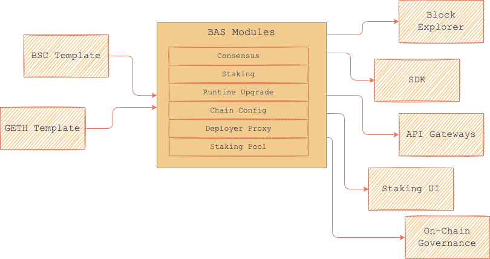

# BAS Architecture

BAS is a modular framework for creating BSC-compatible sidechains. 

It defines requirements for integration with the BSC ecosystem and brings development-ready EVM-compatible features like staking, RPC-API, and smart contracts. Since BSC doesn’t rely on the BAS security model, there is no default embedded production-ready bridge solution between the BSC and BAS networks. Instead, BAS can provide protocols and standards for integrating third-party bridges that can be managed by the BAS validator set of other projects like AnySwap or Celer Network cBridge, of course, if they trust the BAS development team.

## BAS structure & integration

BAS specifies the primary structure and configuration of the blockchain, using special templates. A **template** is a ready-made blockchain solution that is **already integrated into the BSC infrastructure**. With this integration, developers automatically get access to products like a ready-made staking system, block explorer, SDK, API gateways, interfaces for governance, etc. 

After applying templates, BAS can be customized using programmable and configurable **modules**.

&nbsp;

