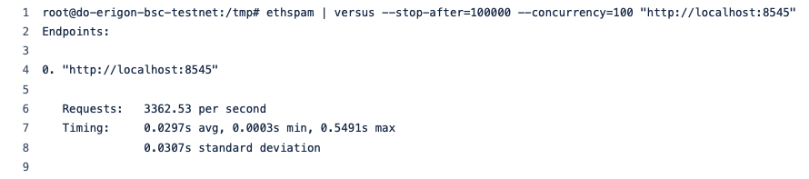
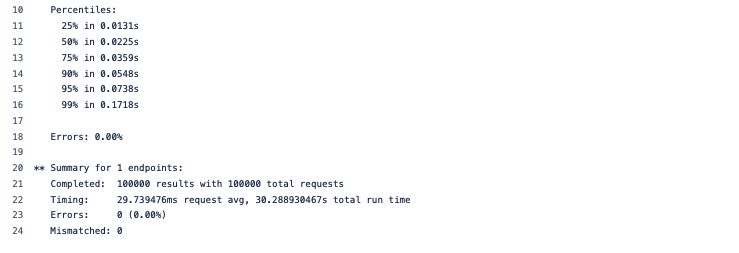
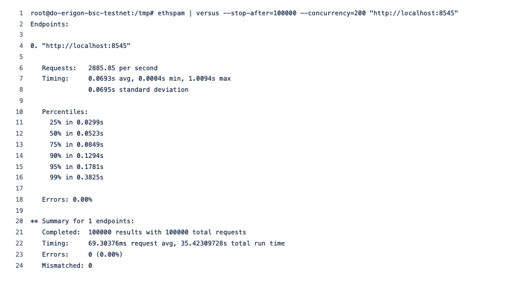
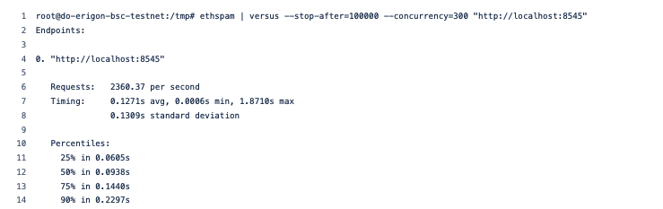
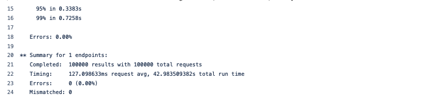
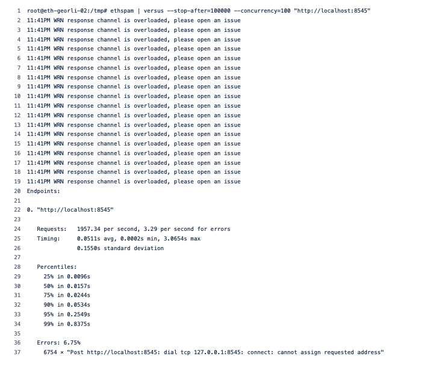

# Initial testing of the Erigon BNB Chain Testnet Archive Node

This is a description of our process and initial results running Erigon BNB Chain for Testnet. 
The Mainnet is still being synchronized and details will be published shortly.

:::note
We intentionally ran a low spec server from Digital Ocean to demonstrate the high performance of Erigon for BNB Chain. 
:::

## 00 Hardware Setup
* Processor: 4 vCPU
* Memory: 8 GB
* OS: 160 GB
* Storage: 1TB disk for BNB Chain Testnet Archive Data

## 01 Synchronization Process
The Testnet synchronization process starts from the very beginning:

and proceeds all the way to the latest height at:

:::tip
The synchronization process took **25 hours and 10 minutes**. 

It is worth considering that Erigon for BNB Chain was only using a single CPU processor. 
We estimate that the sync process could 4-5 times faster than our trial. 

It is also worth considering that this synchronization speed is still significantly faster than currrent Geth based clients. 
:::

## 02 RPC Benchmarking
We used `ethspam` and `versus` to benchmark performance of the Erigon Client. We conducted tests with **100**, **200**, **300** requests concurrently.

Erigon displayed results that outperformed Geth clients every time AND without a single error.

If you compare the results below wit

1. Erigon with 100 concurrent requests

2. Erigon with 200 concurrent requests

3. Erigon with 300 concurrent requests

4. GETH Goerli Testnet with 100 concurrent requests

## 03 Future Work 
Our focus going forward is to progress our collaboration with the BNB Chain team with the following aims:

1. Continue to improve the performance of Erigon for BNB Chain by utilizing full multi-core CPU capacity.
2. Enable Validator mode.

    