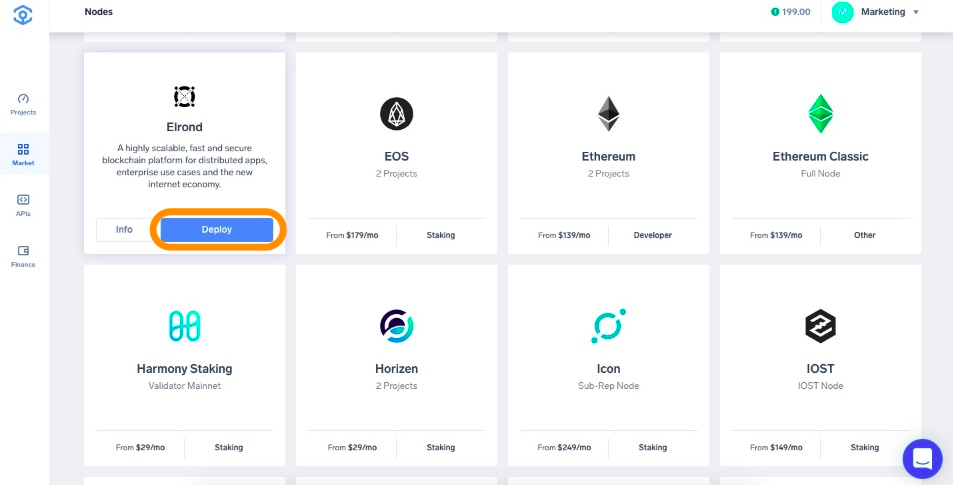
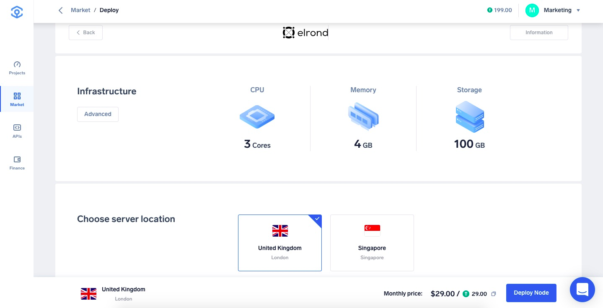
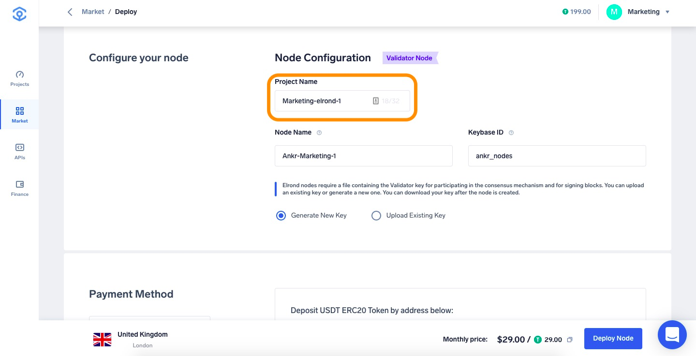
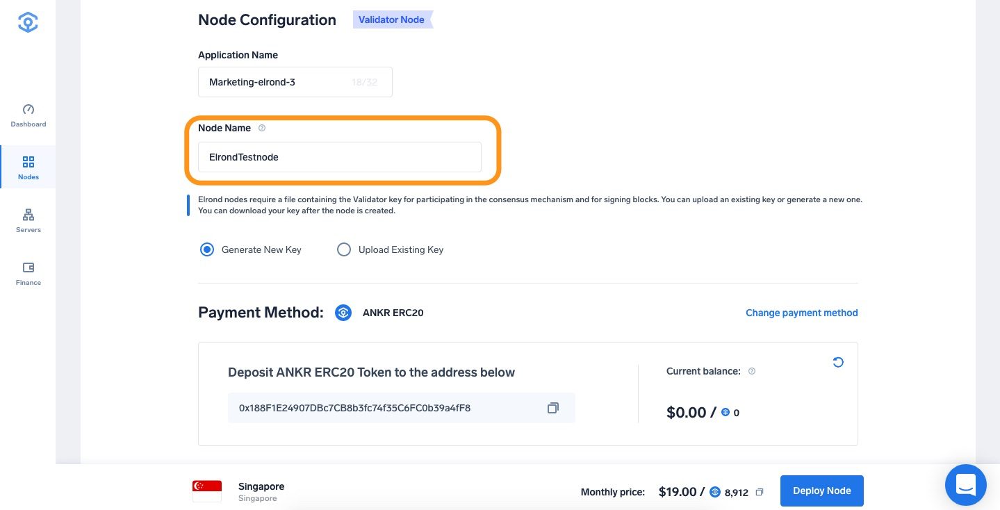
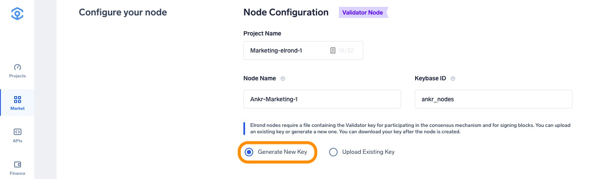
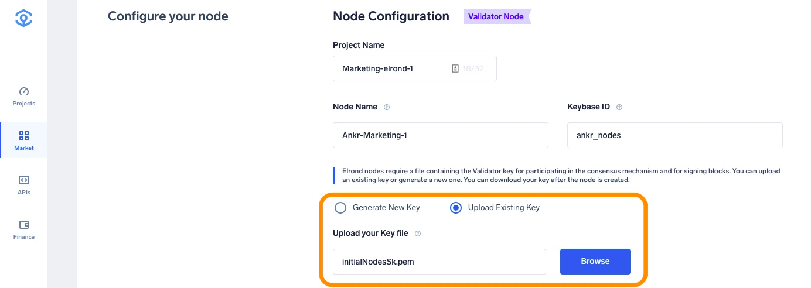
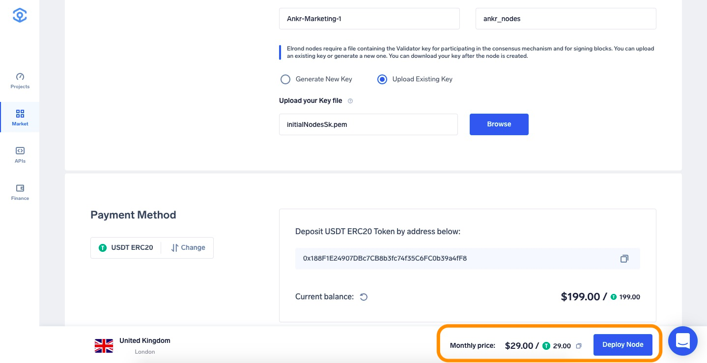
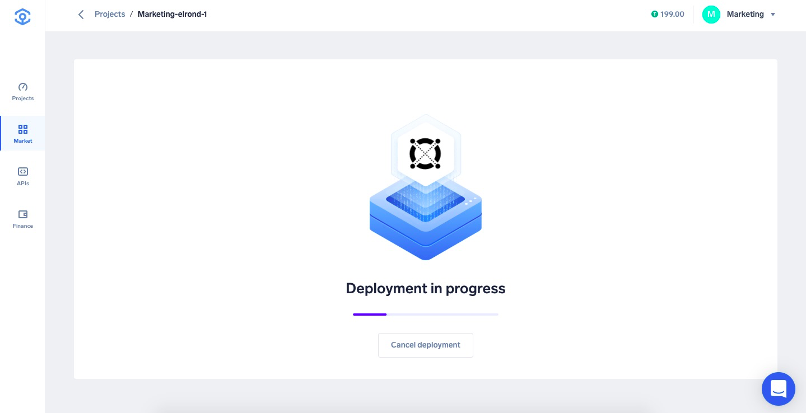
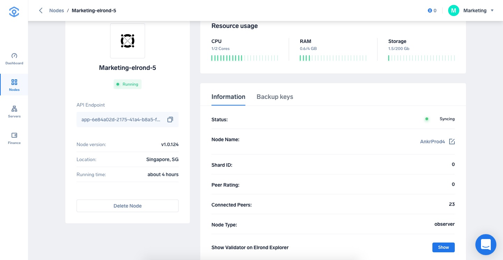
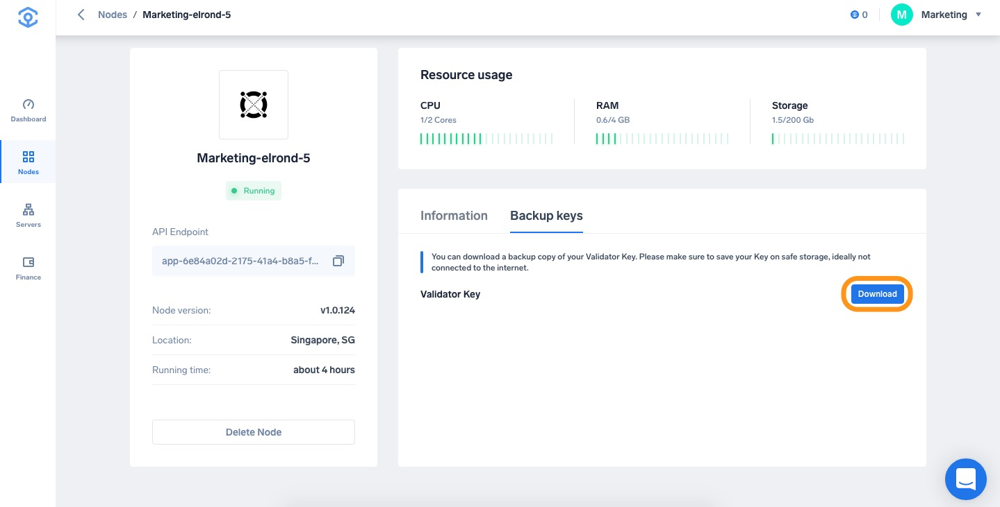

# Run a Staking Node on Ankr

1. Head to [app.ankr.com](https://app.ankr.com/) to deploy and click the **Deploy A Node** button.
    
2. Search or scroll down to find the Elrond card, hover over it and press **Deploy** underneath the Participation Node.
    
3. Now you are taken to the configuration page. The hardware configuration is already set at the optimal system requirements, but you are allowed to increase the specifications if you wish to do so.
    
    The platform also recommends a cluster, which is usually the one that has the most freely available resources. In this particular case, the recommended cluster is the United Kingdom cluster, but another cluster may be recommended depending on your location.
    
4. The **Project name** for use in the Ankr application is pre-filled. You can change it if you want.
    
5. Provide your Node Name, you are able to search the [Elrond Explorer](https://explorer.elrond.com/) in order to get realtime Node statistics.
    
6. We offer two possibilities:
   * Generate a New Key
   * Upload an Existing Key 
   
   **Generate New Key**
   
   Elrond nodes require a file containing the Validator key for participating in the consensus mechanism and for signing blocks. For your convenience Ankr can generate a New Key and you can download the Key once the node is deployed.
     
   **Upload Existing Key**
   
   If you already have a existing key you can upload your own key and proceed.    
   
7. Select the Payment Method, choose the number of months you want to run the node by moving the slider. The price and discount will increase when you extend the run time.

   If later on, you want to extend the node’s run time, you can add funds at any time
8. Click **Proceed to payment**.
   
9. Select payment method (USDT, ANKR erc20 or add your credit card).
10. For this tutorial we will choose **Add New Credit Card**.
     
11. Provide all requested information and click **Pay with Credit Card**.
   
12. If all information is provided successfully the deployment will of the node will start which will take approximately 5/10 minutes.
   
      
13. Once your node is deployed you will be re-directed to the **Information** page.  
   
   You can also see your validator on the Elrond Explorer using [this link](https://explorer.elrond.com/validators/00ae39925d40643178186f069987334a567475bc34702cfed4272dbe43ee011f473cbede55163bf646e7b7144c6eea18a596c17b1ea9d5865e30e02af3c295a1c97264180e1d05e5fd8c44c4c10ed6aa1395b40eb5eca6a5fc52634cc41b620f).  
   
   Each node needs to stake 2.500.000 ERD to become a **Validator** and is rewarded for its service. Nodes without a stake are called **Observers** — they are connected to the network and relay information, but they have no role in processing transactions and thus do not earn rewards. Initially your node will be of type **Observer**.
   
14. You can download a backup copy of your Validator Key. Please make sure to save your validator key in a safe place, ideally not connected to the internet.
   :::note   
   Ankr will not store this information anywhere, so make sure to back up this information safely!
   :::
   
15. Follow the [official instructions](https://docs.elrond.com/validators/staking/staking) shared by Elrond to become a validator and start collecting rewards.