# Run a Harmony Staking Node on Ankr

## Deploy

Deploy a Harmony staking node on Ankr:

1. Head to [app.ankr.com](https://app.ankr.com/) to deploy and select **Deploy A Node**.
    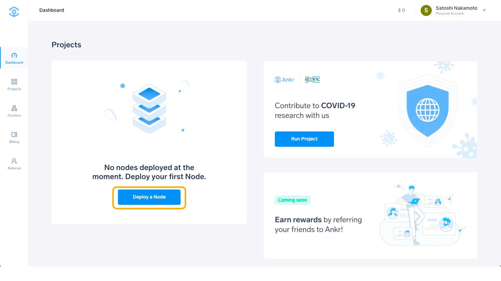
2. Scroll down to find the Harmony card, hover over it and press **Deploy**.
    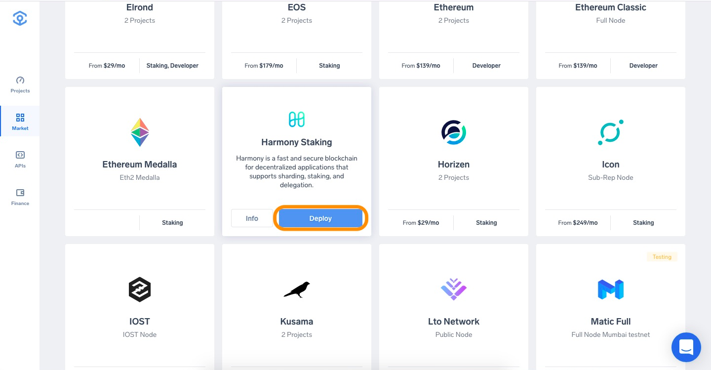
3. The hardware configuration is already set at the optimal system requirements. The platform also recommends a cluster, which is usually the one that has the most freely available resources. In this particular case, the recommended cluster is Singapore cluster, but another cluster may be recommended depending on your location.
     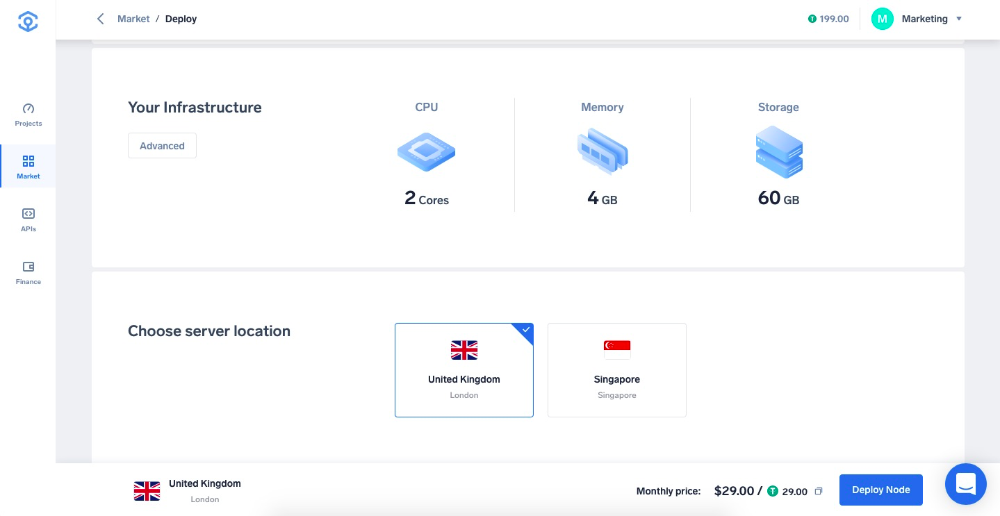
4. The project name is prefilled. You may want to change it to a custom one.
5. Next, you need to insert a node name in order to identify and get realtime stats of the node on the Harmony Validator Explorer, once your node is elected as a Validator.
6. In order to deploy the Node, Ankr will generate a BLS Key and a Harmony Wallet for you. For security reasons, these two keys will be encoded with a password that must be set in the Encryption Password field. Please make sure to write this password somewhere safe in order to regain access to your keys.
    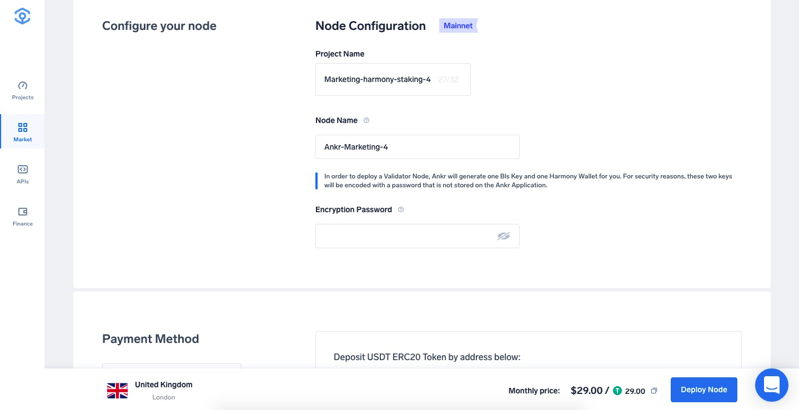
7. Select the Payment Method, choose the number of months you want to run the node by moving the slider. The price and discount will increase when you extend the run time. If later on, you want to extend the node’s run time, you can add funds at any time.
8. Click **Proceed to payment**.
    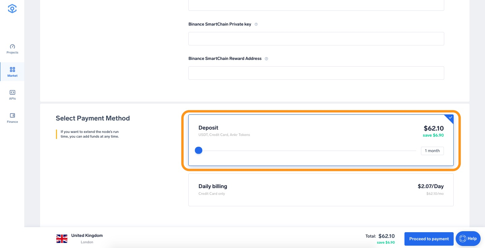
9. Select payment method (USDT, ANKR erc20 or add your credit card).
10. For this tutorial we will choose **Add New Credit Card**.
    
11. Provide all requested information and click **Pay with Credit Card**.
    
12. If all information is provided successfully the deployment will of the node will start.
    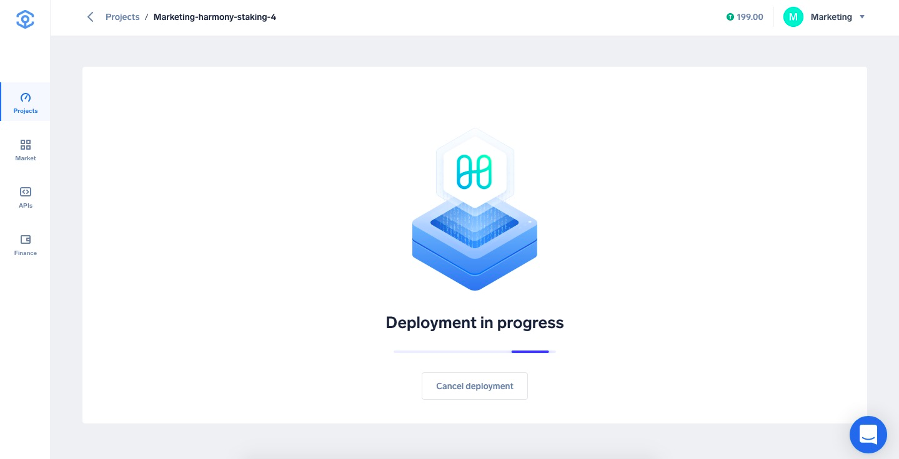
13. In order for your node to be eligible for a validator you will need at least 10.000 ONE Mainnet native tokens in your wallet on Shard 0 and the Node should be synched.
    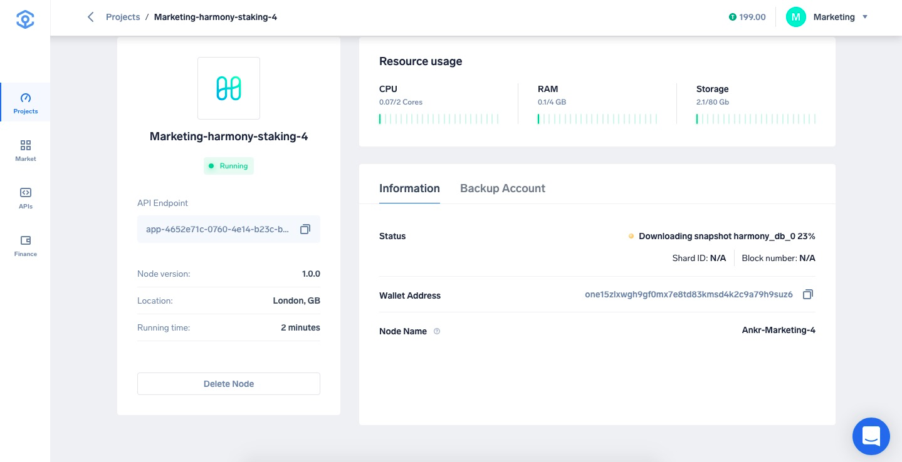
14. You can click on the the Manage tab to find the amount of tokens available in your wallet.
    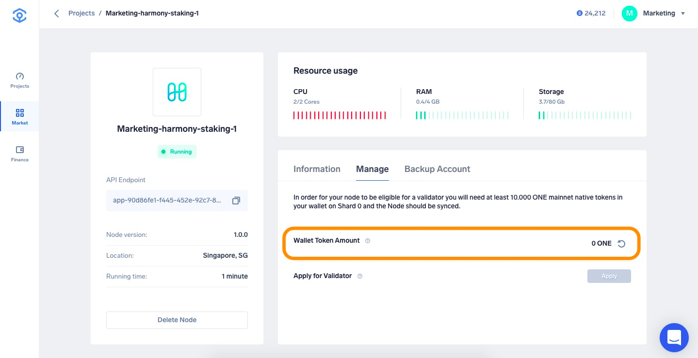
15. Once the ONE tokens are visible in your token wallet, you can **Apply** for a Validator spot.
    :::note
    The **Apply** Button will be grayed out until the node is fully synced and the wallet token balance is higher than 0.
    :::
    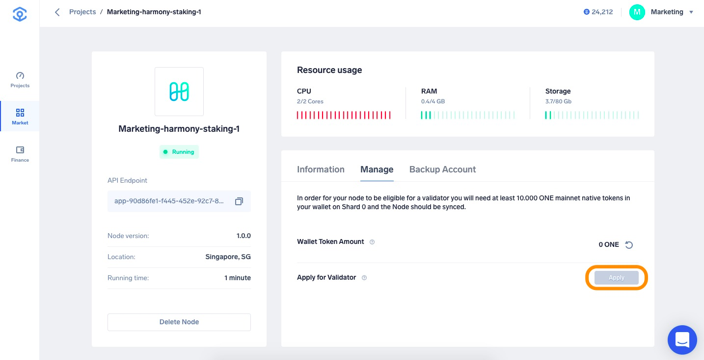
16. After clicking **Apply** re-confirm in the pop-up by clicking **Apply**.
    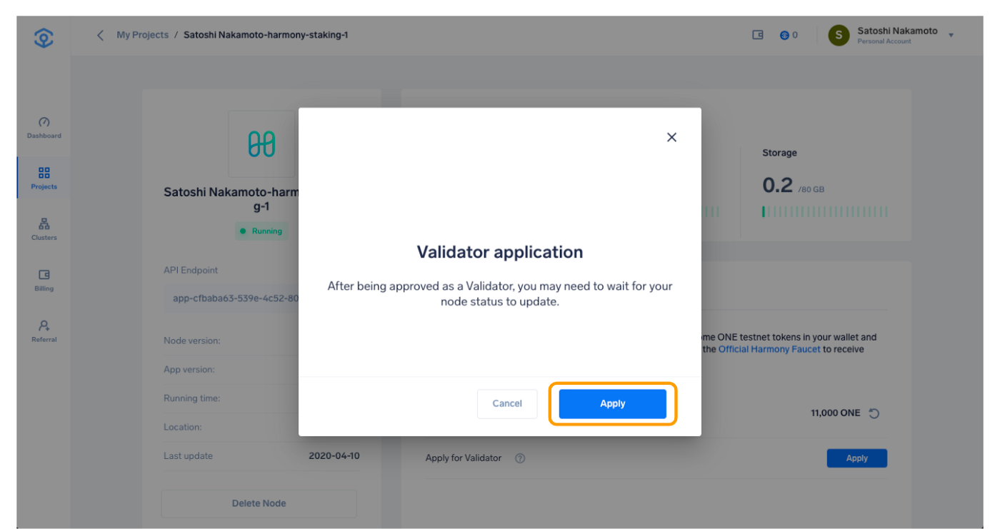
17. When the Validator is approved, you see the **Node Type** field updated to **Validator** status.
    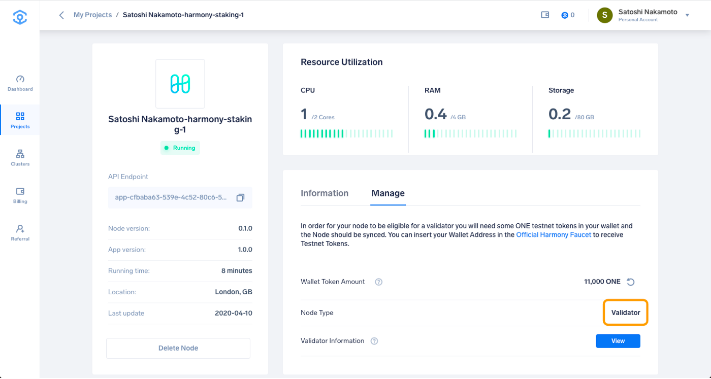
18. You can check your Validator Information on the Harmony Validator Explorer by clicking the **View** Button.
    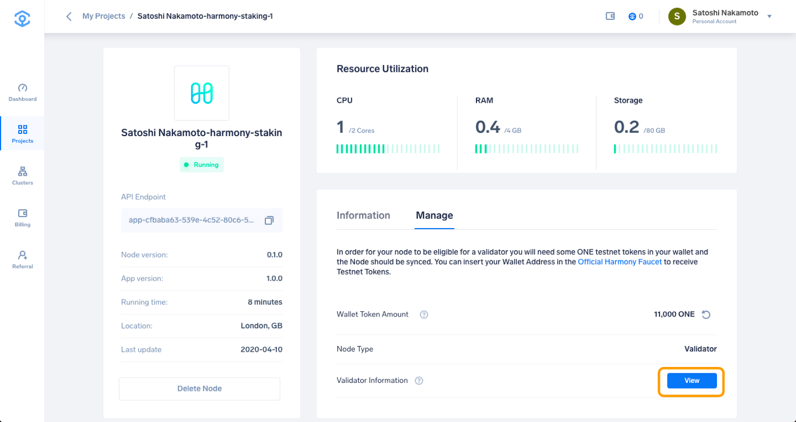
    The **View** button will bring you to page below with more information about your node.
    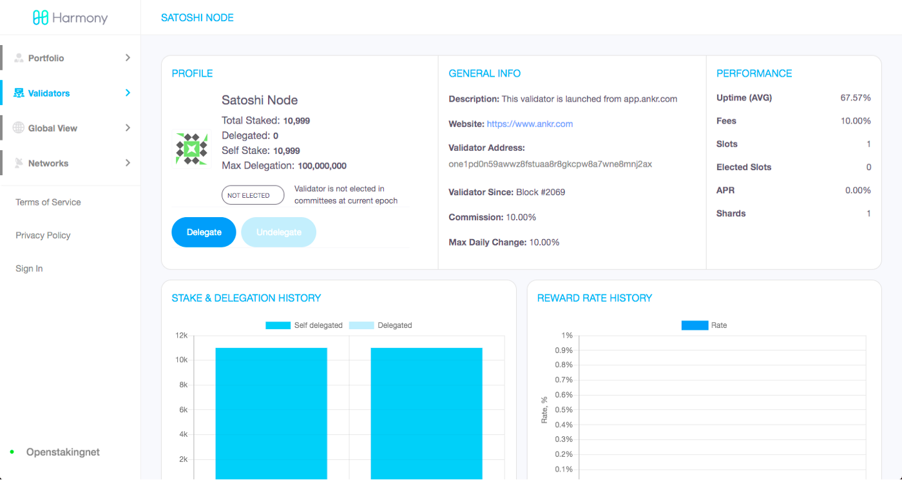
    You are now running a Harmony Validator node.
    :::note
    Before you close the Ankr app please make sure to **backup** and **safely store** your Bls Keystore and Harmony Wallet Keystore generated by Ankr. You can find these details on the **Backup Account** tab.
    :::
    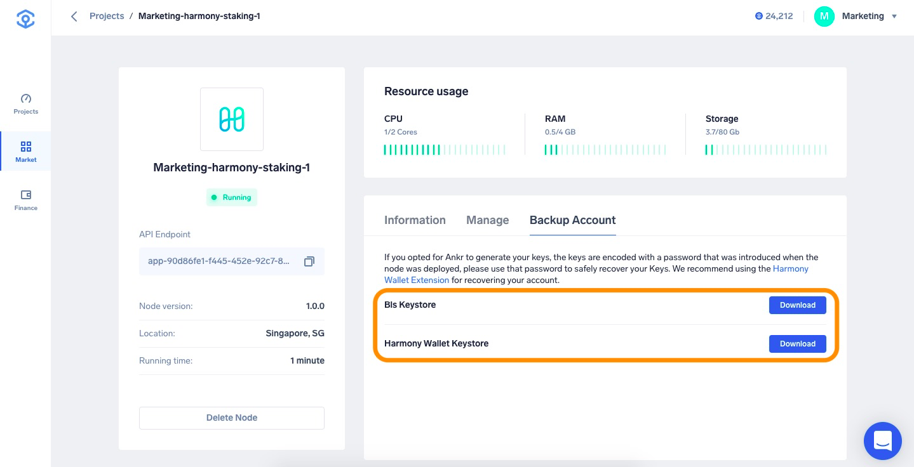
