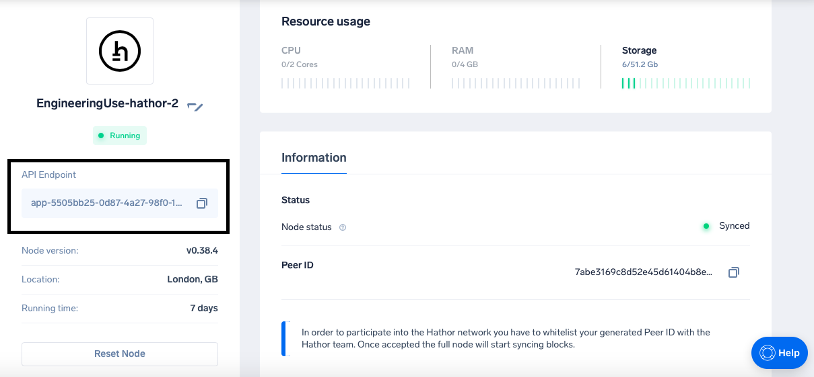

# Endpoints

## Access node endpoint

### Get the Endpoint URL
After successfully deploying an endpoint for Ankr you can get the endpoint from the Application details section as seen below:

The endpoint URL will have the following format: `http://<your_app_id>.ankr.com`.

For example: `http://app-5505bb25-0d87-4a27-98f0-13de2d2ae8d3.cls-dec3c32b-4f06-462f-b827-dee931d39a72.ankr.com`.



## /status

### Parameters
None

### Returns
Information about the connected node

### Example
```
//Request
curl "http://<your-app-id>.ankr.com/v1a/status" 

//Response
{
    "server": {
        "id": "7abe3169c8d52e45d61404b8edee562b548478f56762e5f1087ce37905793d84",
        "app_version": "Hathor v0.38.4",
        "state": "READY",
        "network": "mainnet",
        "uptime": 592105.9469923973,
        "entrypoints": []
    },
    "peers_whitelist": [
        "42839c1d0b8561675242d0b9d27b619a4a5a5fbedc5b5727bebcb0936dcffa0e",
        "30fa3625eb33fa1d7376cca622634ed95fffe78303b64c90efdba0f2ab4c2550",
        "3c38ec36d9ca88999201828365ba6d4ca3087f9a45396865553ba0198a0088d6",
        "579ef6ed969fc62376f6979a036e2f7e5a7e940a0b1d4e6e33c77ea28c377a3e",
        "532a8bc013483b75e8003f2cc2bfc64b13790134521c75fecf8cbdff535c652e",
        "a0e0ef4e5e61f08ac1402a57444a2e6842ecabd65e93a98be9041e15d4d2fd94",
        "c3a1835ddc9ec89b2abedb1ca3d0d0f6c64507cf4728845cf45ffdbe03e82c7e",
        "7181d232a16ba95001de22d3151b027ed31677c8cd6dc7eb88d538b250186bbf",
        "0469157d0bf995f60e3ccfea2495ec0a042706bb44159dde840e4f33a5bcc9fa",
        "7f5ef82cda5f01c0fd2adeef4704b8fe9576a094e83de07b2d0aa85e09129e3c",
        "41f7d8a313c2d6eae3f9dc2b4e0f8ad0f8ee75d29f934116f9b3b1588b18ea02",
        "1f8bd99b5a7475cfffd8d03ad703c1ac3b4a8d1d2b63eb47f3c731a2e4e9635b",
        "21101120bef959fba4744d7963882cc20938f68e65e1b6989569272ce5ba0098",
        "18f846cbd143f91da810862099b932244ae4158970d097596623d38e501ea185",
        "e23aa2828ba073b02261a07d1bbf62d4792aa92a19ec89203abbc28190db833c",
        "7a72cc43b7e8a13f3ac97677c57cd9fcb1b13ba4e8ea09b64ef2c1d03c8b3b38",
        "95ad39e88654ae6784a11063abe37e8b2b61becfd2e107a74da297577a532199",
        "5a14f918f6250047b000ed36e4cba9b429f2219545fe5649101678d62cef4035",
        "007ab0594ffed5f0142f54b4245af9cbe451ec725d92b690b7ecb4cf8eff5092",
        "34284dc82ea238a59c53a9e441c9f45695e21e37243c8f653475234f93dcd575",
        "16144ce4b965a6dfc9aeacf9aea45fe91854ae43ee6716d69d072473668b5323",
        "cf8d374ae343eb47fda52d7f274e1437ef73a60ad8ad5a4783490a9a692e086f",
        "cfc404224a6d008e06a05a885637912d8311463b7581670ddd0a839655df2481",
        "eac8bc51b15c9fddc888875d9336e1784be619421f7aaf762943ad9e7888e1b7",
        "8291872162c31737f2ab17c325bf0494a9657b8a8fbe3c33b450b93d0f16ba8a",
        "6be7d3e67d52f6ba79bcce74f76ca81d465408c2c207681539c54875927a0127",
        "a538684d8f2913f8af68e180f224795bb573304c6cd27a89e389631f31240329",
        "413cbe26b2968d22b2dd3d19c08da7b5c89228698c02d298c2995cd1183b0ce6",
        "7011637909f74382ca298b6b7b1953d0c9a0fd118a4946ba3de626e882a653a7",
        "1f8bef383ed8be8c75a81785ef69137867fe329f07a5463f9fbca8cdded8c88f",
        "2d97c53d8bfef28736a64986893aad05eba674d1065c35fca78cc8736221d21c",
        "9c8687d9ac04f1f0f633f06793cdf8ba07a510f2a98dbff5675d59fe00d908e2",
        "d200ac951743b925a7534d80ec258e851e30cdcaa150af7516384b3fc52ce8d8",
        "17cdc51b4fa452e6b242acda161e0b302c72813ce303d03ce3d63a26bf70619d",
        "c83ebf67afd8f943168e224457f8d9df11aafc735210741088d1bba7f9c6c939",
        "1ab3665b4409834ddcb0fff25bccd83014a5cfece90a2ea1127053870883e042",
        "ec6b4f5ebae5ac2b7f69df00ecfd7548a6ac7a1c14eb9c9aec41dcb443996c4f",
        "e68d6b6b7f452d34abfb1bee59f2065a51ebc04c503f66a838f4eb01a116de6f",
        "083ff2ab543ca5bc00f5e20233ab343de9f600dc8405ff605f3a913f50e9ab8a",
        "638cf753cd8b7b147cc516475ae8f8b3082bdd7e949b3445a957e1d51b61fc5f",
        "8598edb621eb48d313262a704ce2608bc09457d3c094309c1f3f867f994c93fa",
        "1647d6e161673d0a6742d2f890454f15666bd75c226978e5577404a7bcb12c5a",
        "1ba45f948775d5276947fd6bcde1f512cd5761038a5f334ca2b2ac4cb75b17d6",
        "4d37200677e53dae99b6b4201fa373e30490dce8f35d671ce0a2a1aad9327f7f",
        "6357b155b0867790bd92d1afe3a9afe3f91312d1ea985f908cac0f64cbc9d5b2",
        "4a8957be8e735970b8a23ed5fb88ce60967f8efe9de1a7b86f1261a7ff46fc23",
        "c6f14c675a96e14656811e8d9e6edb775be9d5d046f461fe1214212c03ac486a",
        "55d23ab0effd490d093fa3c841dccef7a22d45a1efa78331a3a658c7e7a781a9",
        "d1e8a4715770c5236aa23f3898f8e17bca0b962d7497a345c1cb4501ca6c8163",
        "b5d183cbd72f527f26e2630a6cf71b0f92cc5e6eacb10318733b121262e23414",
        "10be54e349d642ccde658322fd3edfda0bba043682f01ebcd3173eebd897cfeb",
        "249ee4168b26934a4e0d5d1f57fab4a73fdf0f2e221ce84362503a01dc501b30",
        "ddcb3bd8bd25a1c72221de9a5e9587b3522621aded8b23c3d56c9fabaf4dee83",
        "e3aa23e99c365d78755c5d59a5b703033bf79b22344c067a00c0e9bf6e04b187",
        "cd04a73875c100a351ad06fc98ae9d9c24bb420b94befd0dd95265c63addde11",
        "f69602ec3ba62f135698903a847b1b4425b7667e26295b2897dce1eb08d285f3",
        "572c2dc800bc6badff72b3f6bec63412626bf4ee6eaa1b0a8a10e8e257168f78",
        "89c39fc6ba59c3e2888d2aab1533486983af48377e9595651c679a3c7d7e1abe",
        "c679f09ae4f4cec534784b84342c8966dfa97229c4e1d3309feb4e5dc76a68b3",
        "8a5a75c70161d5e670d3e0be33690b6c9a93f8de275ae6daab87a3a16bd2a565",
        "29bd6ba17fd9fac515680d30aed3b00884b39e37026829e10469acc4a0bc8cc6",
        "7ae1ef350c34e31c2fc70c122927b05636f44791a9695714e56da68e970fb519",
        "3a1a62028c5c7cc647e08ae4b97e0117888cd681553013f34264e07a8d269441",
        "f8f81cbdd70dc03987f6b2aeadc95b064394a5ba407beadd9bde31c766756522",
        "acb11be7477b5f755637801bb16f3a917f09d84a012e7dad88a98be0c534db3f",
        "7abe3169c8d52e45d61404b8edee562b548478f56762e5f1087ce37905793d84",
        "4a18fdaf0baa7441592c00ea9167ffc2254bd6d4a07f031d9b30aeb132443631",
        "de2376ede04e5ef47d6bbab24372644b82bc91dd00376d1de2e607faa84b9104",
        "8801235f3148a42cf7576b5f6a679959c83f1ce8cce55807711b189efa1d6161"
    ],
    "known_peers": [
        {
            "id": "1f8bd99b5a7475cfffd8d03ad703c1ac3b4a8d1d2b63eb47f3c731a2e4e9635b",
            "entrypoints": [
                "tcp://3.238.33.245:40403"
            ],
            "flags": []
        }
    ],
    "connections": {
        "connected_peers": [
            {
                "id": "1f8bd99b5a7475cfffd8d03ad703c1ac3b4a8d1d2b63eb47f3c731a2e4e9635b",
                "app_version": "Hathor v0.38.0",
                "uptime": 591640.4701750278,
                "address": "3.238.33.245:40403",
                "state": "READY",
                "last_message": 0.008815765380859375,
                "plugins": {
                    "node-sync-timestamp": {
                        "latest_timestamp": 1617632878,
                        "synced_timestamp": 1617632878
                    }
                },
                "warning_flags": [
                    "no_peer_id_url"
                ]
            }
        ],
        "handshaking_peers": [],
        "connecting_peers": []
    },
    "dag": {
        "first_timestamp": 1578075305,
        "latest_timestamp": 1617632878
    }
```

## /version

### Parameters
None

### Returns
Information about the connected node

### Example
```
//Request
curl "http://<your-app-id>.ankr.com/v1a/version" 

//Response
{
    "version": "0.38.4",
    "network": "mainnet",
    "min_weight": 14,
    "min_tx_weight": 14,
    "min_tx_weight_coefficient": 1.6,
    "min_tx_weight_k": 100,
    "token_deposit_percentage": 0.01,
    "reward_spend_min_blocks": 300,
    "max_number_inputs": 255,
    "max_number_outputs": 255
```

## /websockets_stats

### Parameters
None

### Returns
Information about the connected node

### Example
```
//Request
curl "http://<your-app-id>.ankr.com/v1a/websocket_stats" 

//Response
{
    "connections": 0,
    "subscribed_addresses": 0
}
```

## /get_block_template

### Parameters
None

### Returns
Information about the connected node

### Example
```
//Request
curl "http://<your-app-id>.ankr.com/v1a/get_block_template" 

//Response
{"timestamp":1617634881,"version":0,"weight":64.39881034264872,"parents":["000000000000000076d2662862e8e5ec53544b807417c0719a22d393acf9f8f5","0000000033caeec4c757b528795997e07c136b8f4e17b348906fe061bde26970","000000009109de077bc4e9d1957cdb114a3e2acc7824ed554ea5e404314834f0"],"outputs":[{"value":3200,"token_data":0,"script":""}],"metadata":{"hash":null,"spent_outputs":[],"received_by"
```