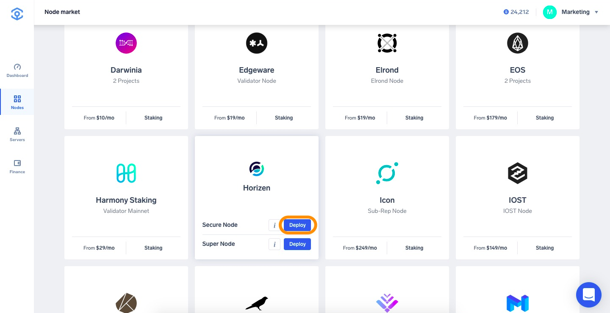
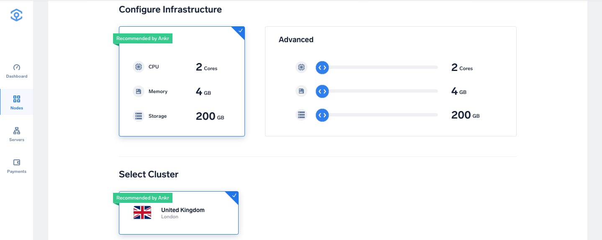
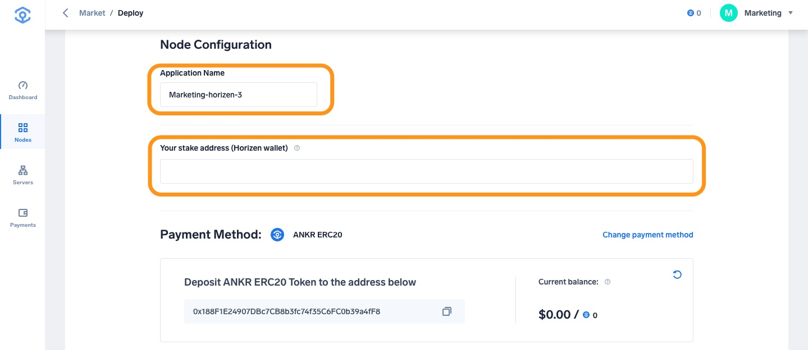
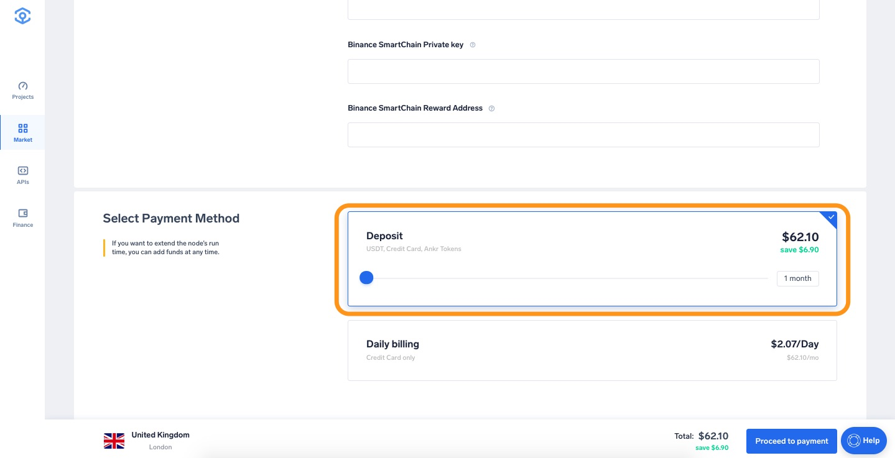
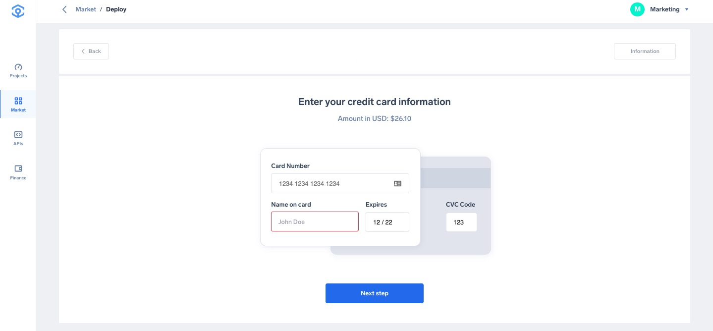
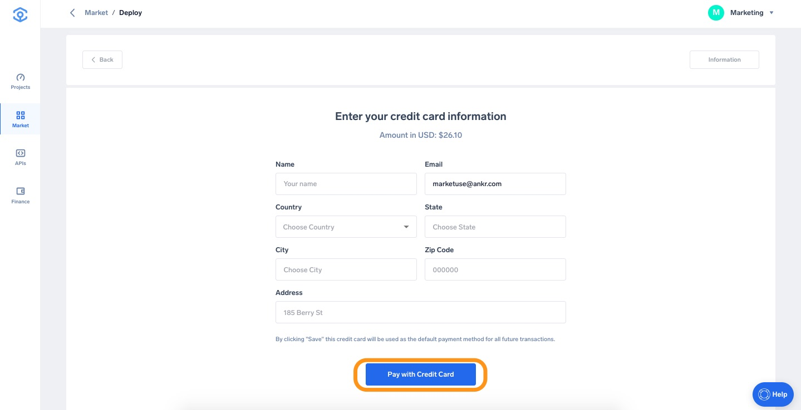
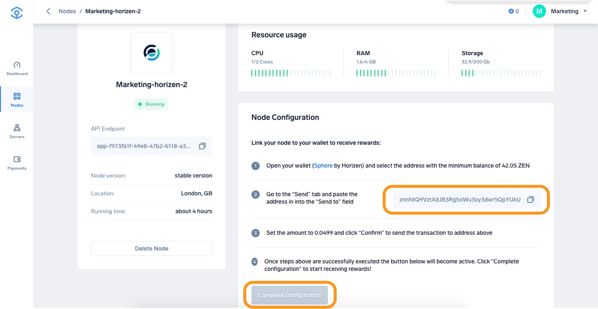

# Run a Horizon secure or super node

The tutorial for running a secure or super node is the same.

1. Head to [app.ankr.com](https://app.ankr.com/) to deploy and click the **Deploy A Node** button.
   
2. Search or scroll down to find the Horizen card, hover over it, choose **Secure Node** or **Super Node** at your discretion, and press **Deploy**.
   
3. The hardware configuration is already set at the optimal system requirements. The platform also recommends a cluster, which is usually the one that has the most freely available resources. In this particular case, the recommended cluster is UK cluster, but another cluster may be recommended depending on your location.
   
4. The application name is pre-filled. You can change it if you want. Provide a name for your node, with this name you can recognize the node in Ankr app.
5. Enter the Horizen wallet address that you use to stake the minimal amount of 42.5 ZEN.
   
6. Select the Payment Method, choose the number of months you want to run the node by moving the slider. The price and discount will increase when you extend the run time.  
   
   If later on, you want to extend the node’s run time, you can add funds at any time
7. Click **Proceed to payment**.
   
8. Select payment method (USDT, ANKR erc20 or add your credit card).
9. For this tutorial we will choose **Add New Credit Card**.
     
10. Provide all requested information and click **Pay with Credit Card**.
   
11. If all information is provided successfully the deployment will of the node will start.
12. After deployment is completed you will be directed to the following page, where you can connect your Horizen wallet to your node to start receiving rewards.
13. Open your Horizen wallet with minimum amount of 42.05 ZEN
14. Copy the address and in the Horizen wallet send an amount of 0.00499 ZEN to the copied address.
15. Once steps above executed successfully the “Complete configuration“ button will become active, click the button and your node is completely setup and you will start receiving rewards!
   
16. You are all set. The information page will show information about your node.
   