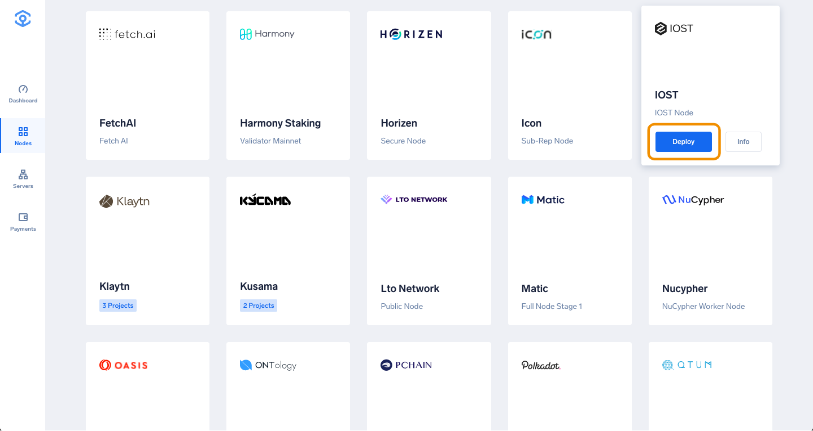
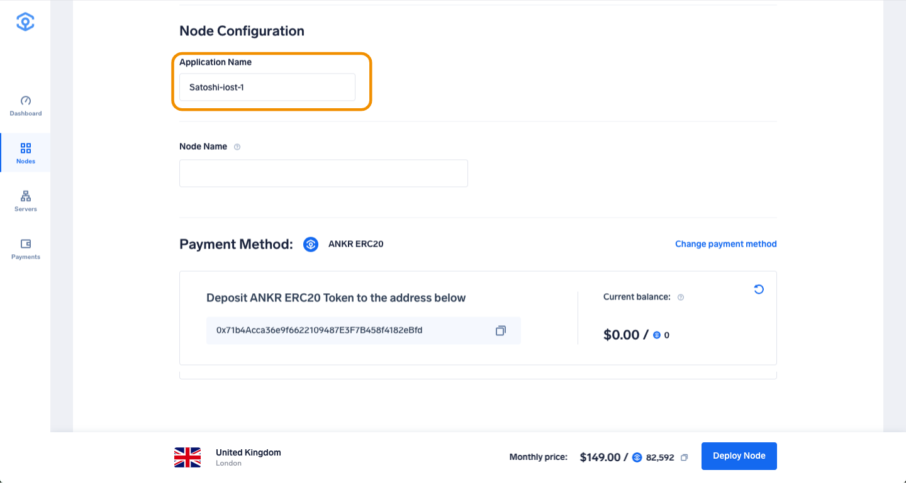
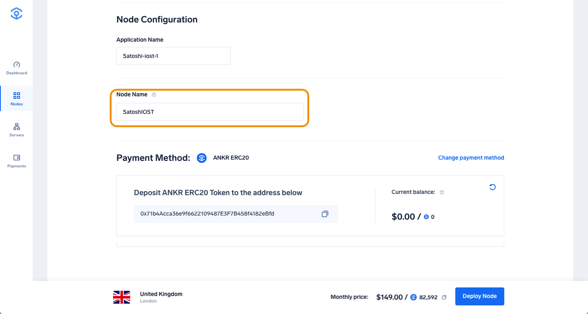

# Run an IOST Node on Ankr

1. Head to [app.ankr.com](https://app.ankr.com/) to deploy and click the **Deploy A Node** button.
   
2. Search or scroll down to find the IOST card, hover over it, and press **Deploy**.
   
3. Now you are taken to the configuration page. The hardware configuration is already set at the optimal system requirements, but you are allowed to increase the specifications if you wish to do so.  
   
   The platform also recommends a cluster, which is usually the one that has the most freely available resources. In this particular case, the recommended cluster is UK cluster, but another cluster may be recommended depending on your location.
   
4. The application name is pre-filled. You can change it if you want. 
   
5. Choose a name for your node. Once the node is running, this name will appear in the [IOST explorer](https://www.iostabc.com/).
   
6. Select the Payment Method, choose the number of months you want to run the node by moving the slider. The price and discount will increase when you extend the run time.  
   If later on, you want to extend the node’s run time, you can add funds at any time
7. Click **Proceed to payment**.
   
8. Select payment method (USDT, ANKR erc20 or add your credit card).
9. For this tutorial we will choose **Add New Credit Card**.
     
10. Provide all requested information and click **Pay with Credit Card**.
   
11. If all information is provided successfully the deployment will of the node will start.
12. After deployment is completed you will be directed to the following page, where you can check the status and details of your node.
13. 