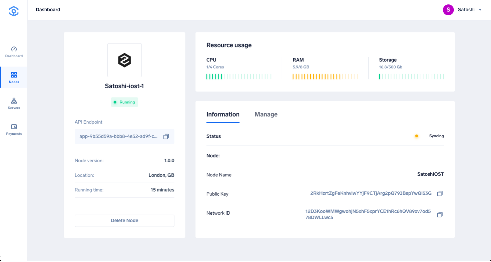
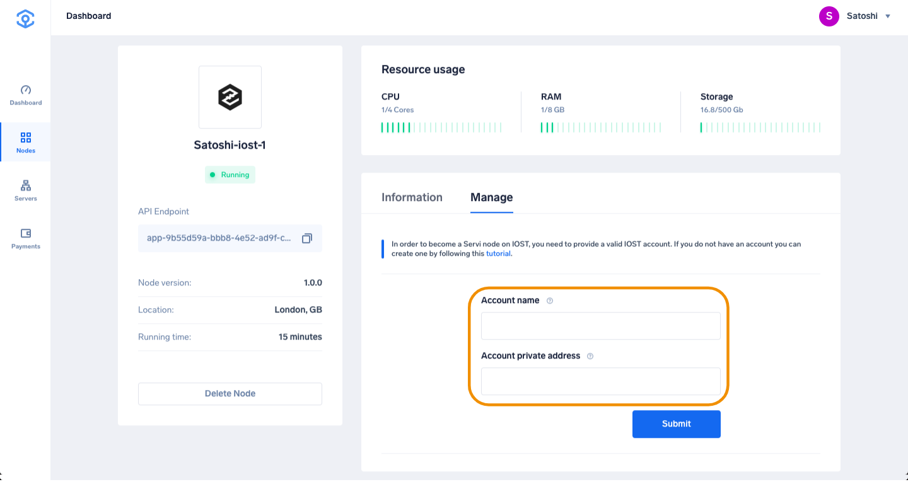
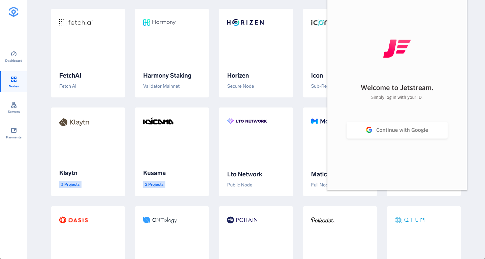
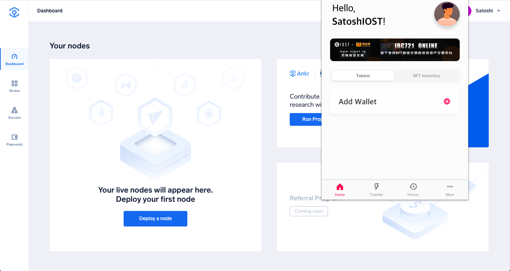
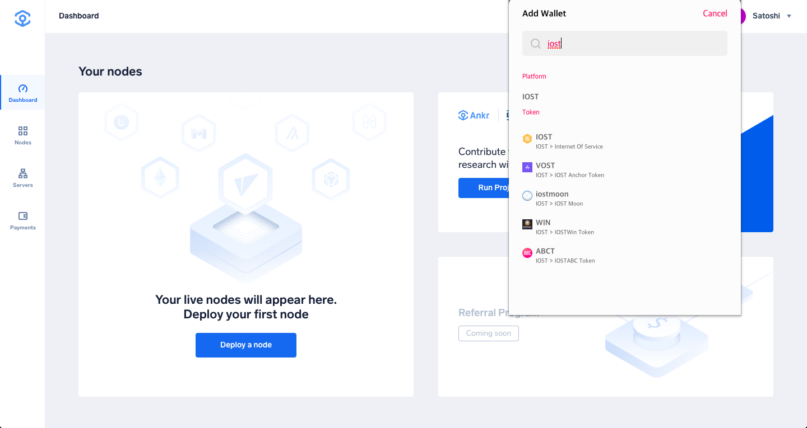
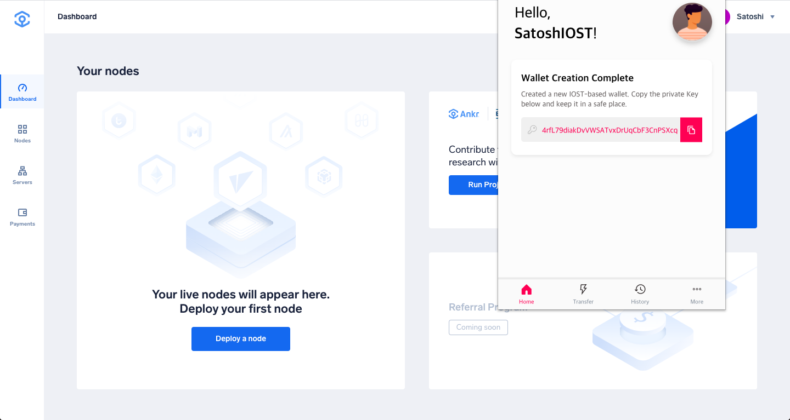
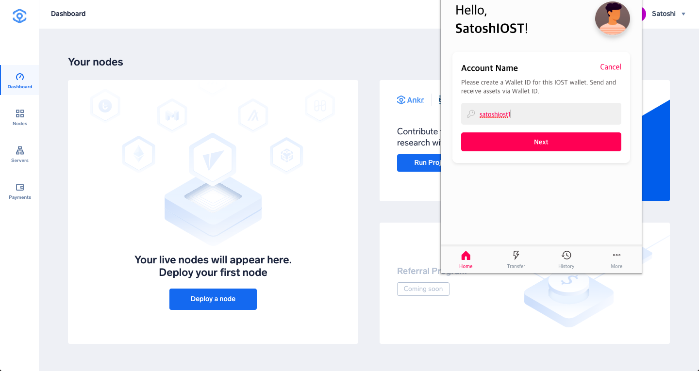
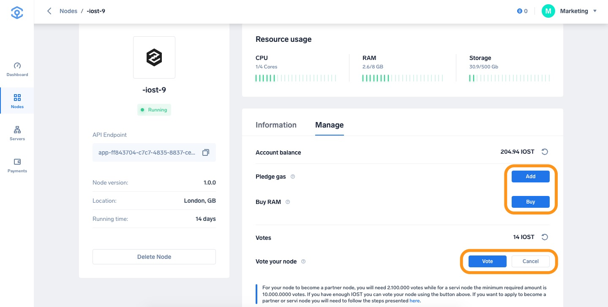
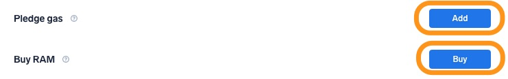
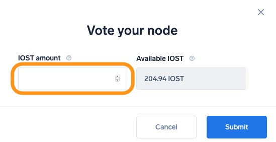

# Run an IOST Node on Ankr

1. Head to [app.ankr.com](https://app.ankr.com/) to deploy and click the **Deploy A Node** button.
   
2. Search or scroll down to find the IOST card, hover over it, and press **Deploy**.
   
3. Now you are taken to the configuration page. The hardware configuration is already set at the optimal system requirements, but you are allowed to increase the specifications if you wish to do so.  
   
   The platform also recommends a cluster, which is usually the one that has the most freely available resources. In this particular case, the recommended cluster is UK cluster, but another cluster may be recommended depending on your location.
   
4. The application name is pre-filled. You can change it if you want. 
   
5. Choose a name for your node. Once the node is running, this name will appear in the [IOST explorer](https://www.iostabc.com/).
   
6. Select the Payment Method, choose the number of months you want to run the node by moving the slider. The price and discount will increase when you extend the run time.  
   If later on, you want to extend the node’s run time, you can add funds at any time
7. Click **Proceed to payment**.
   
8. Select payment method (USDT, ANKR erc20 or add your credit card).
9. For this tutorial we will choose **Add New Credit Card**.
     
10. Provide all requested information and click **Pay with Credit Card**.
   
11. If all information is provided successfully the deployment will of the node will start.
12. After deployment is completed you will be directed to the following page, where you can check the status and details of your node.
   
13. In order to perform node operations, you navigate to the **Manage** tab. To bind your account to the node, you need to input the account name and private address of your IOST account. You can find a tutorial on how to create an IOST mainnet account and wallet [here](https://medium.com/iost/easy-3-steps-tutorial-iost-mainnet-account-creation-and-wallet-activation-guide-aac89ce35c6f).
   

   :::note   
   Step 8–13 are only required in case you do not yet have an IOST account. If you already have an IOST account you can enter your account name and private address and continue with step 14.
   :::
14. Setup the IOST account. For this tutorial we use JetStream Google Chrome extension, which you can download and install [here](https://chrome.google.com/webstore/detail/jetstream/ijancdlmlahmfgcimhocmpibadokcdfc?hl=en).
   
15. Once you have installed the extension to your browser, it appears in the upper right corner. You can use your Google account to login, and click on **Add wallet**.
   
16. Now select the **IOST** wallet.
   
17. Click **Create New Wallet** and when ready, copy your private key.
   
   :::note
   It is very important to make sure you copy and back up your private key since you won’t be able to retrieve it once the account has been created.
   :::
18. Now you can choose your account name and click **Next** to complete your account registration.
     
   In the IOST network the account name works as a payment address and it will also be necessary in order to bind your account to your node. This is the account name required in the Ankr app. Please note that the account name only support low-case characters and numbers.
19. Navigate back to the **Manage** tab in your deployed node in the Ankr web application and submit your **Account name** and **Account private address** to start performing node operations. After submitting, all node related operations will become available.
     
   For any operation on the node in the IOST network, you first need to pledge Gas and buy network RAM. Please read [this article](https://medium.com/iost/what-are-igas-and-iram-learn-how-you-can-utilize-the-iost-network-8fa30f7362ff) with more information on how Gas and RAM work on IOST.
20. In order to pledge Gas or RAM, click the **Add** button and specify how many tokens you would like to spend.
   :::warning
   The amount represents the number of IOST tokens you want to spend, not the amount of RAM you wish to purchase.
   :::
     
   Voting is the IOST terminology for staking tokens to your node. The process is similar to pledging gas and buying RAM.
21. Click the **Vote** button.
   
22. Specify the amount you want to stake (vote) while making sure the amount is less than or equal to your available balance.
     
   If you wish to withdraw your staked tokens you can click the Cancel button
     

If you have any more questions, do not hesitate to contact the admins in our official [Telegram node support group](https://t.me/AnkrNodeSupport).