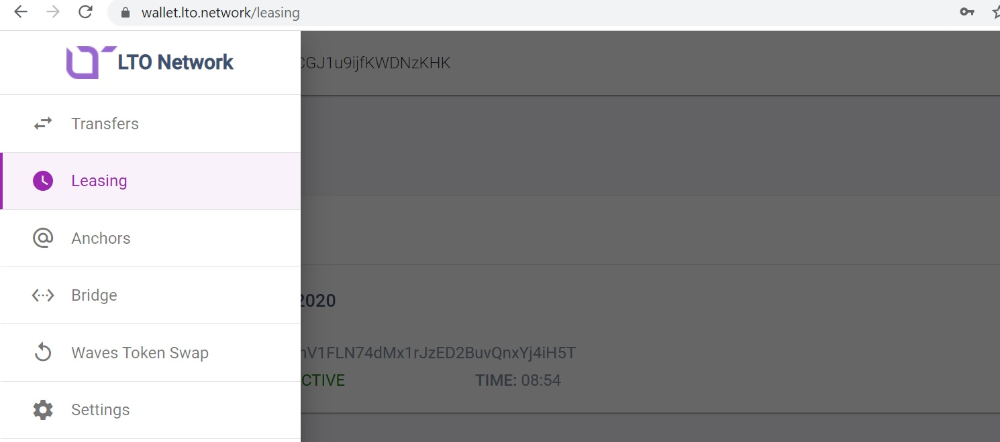

# Run an LTO node

## Lease

### Step 1: Wallets
If you don’t have an LTO Network wallet you can create one at [LTO Wallet](https://wallet.lto.network).
The wallet you just created is (will be) your personal wallet. We’ll want another wallet which we’ll use just for staking. This new wallet will also receive earnings. Go ahead and create another wallet. We’ll use the lease function of the LTO Network to lease your tokens from your personal wallet to the 2nd wallet.

### Step 2: Leasing
The next step is creating your lease. You will want to lease your tokens from your personal wallet (Wallet #1) to your 2nd wallet (the wallet we’ll use for the node).

Click the **Start lease** button and:

* Specify the recipient:
* Specify the amount (max = balance minus fee)

Click **Start lease** and confirm to activate.

All done, now you can use the backup phrase of your staking wallet to deploy a node on [app.ankr.com](https://app.ankr.com/).