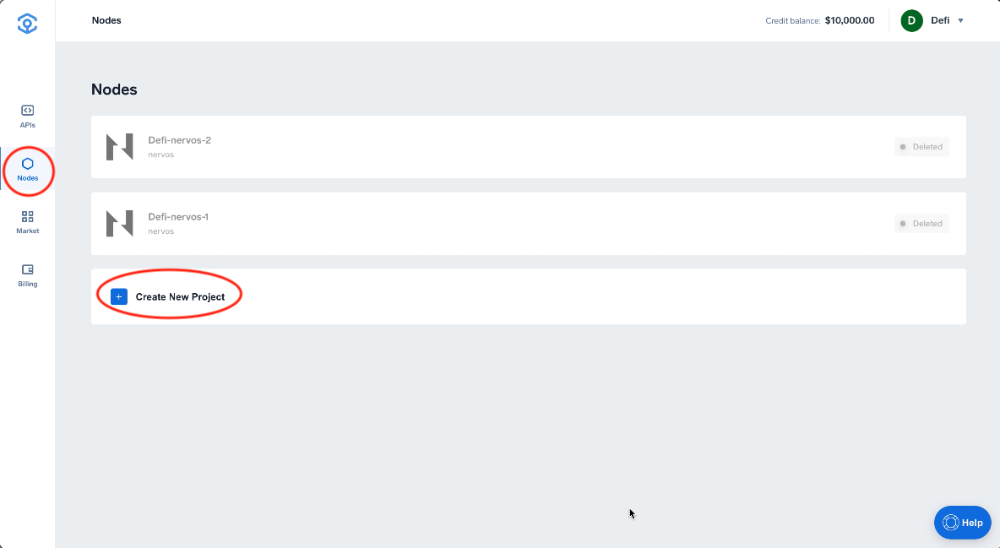
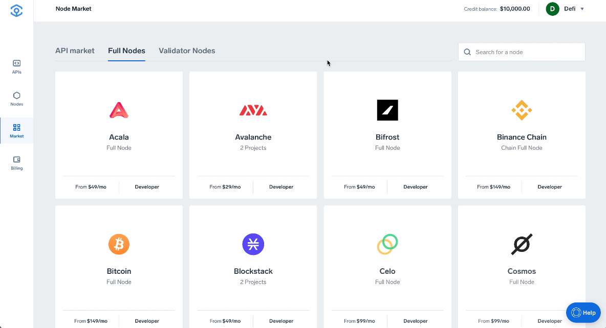
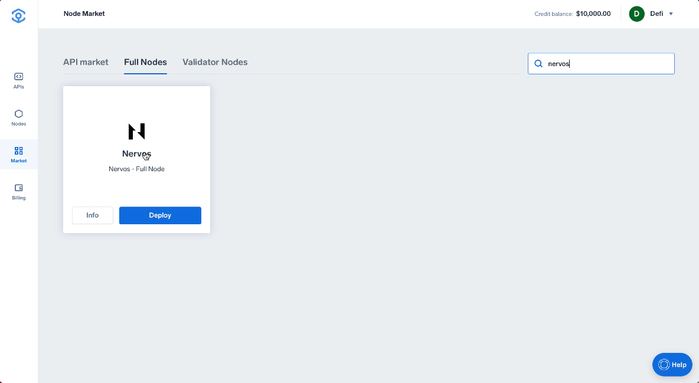
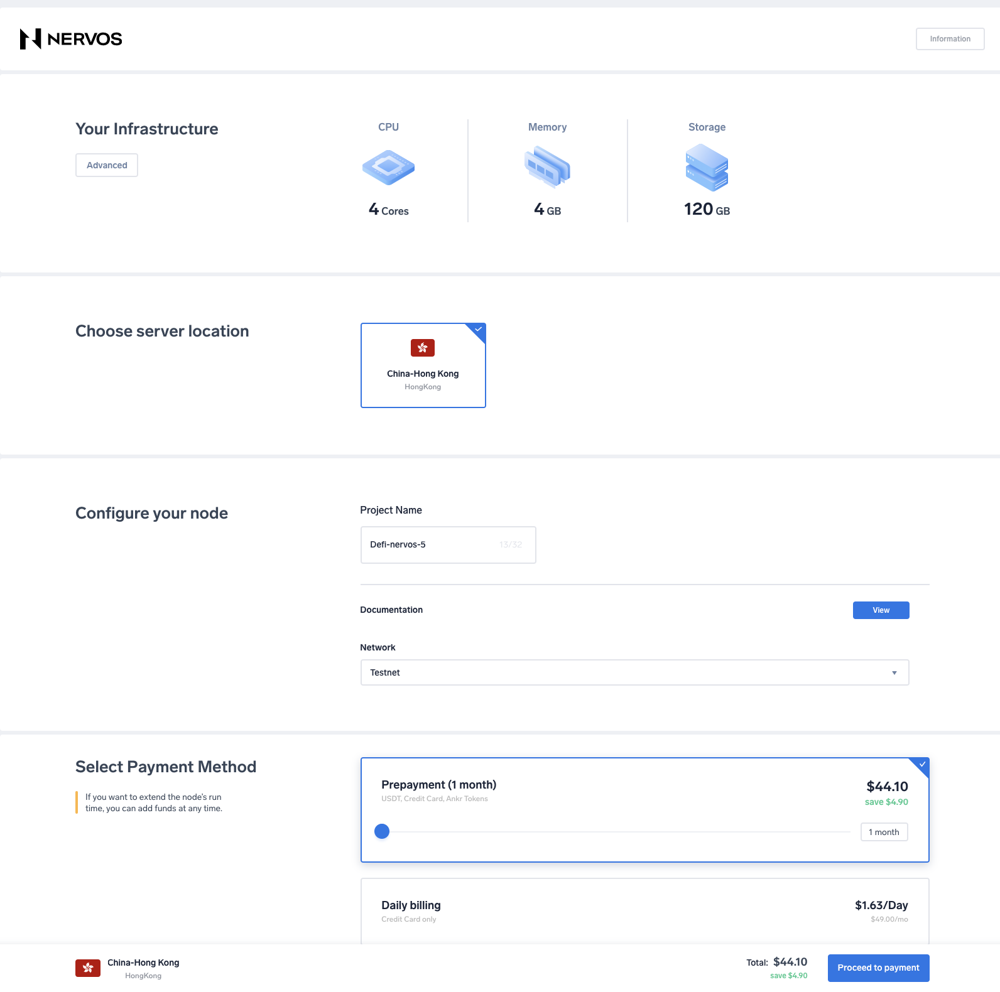
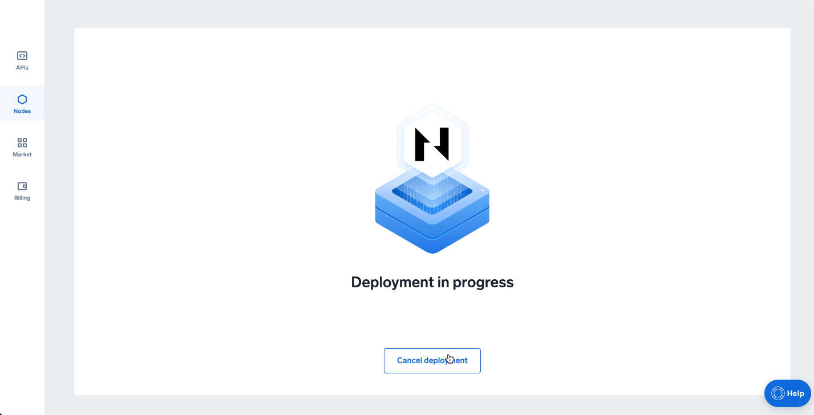
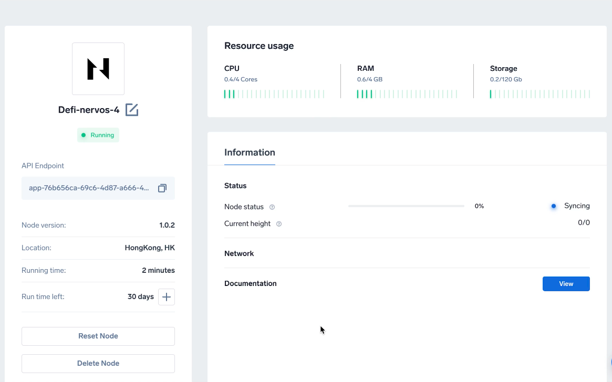

# Run a Nervos Node

1. 1. Head to [app.ankr.com](https://app.ankr.com/) to select **Nodes**, then **Create New Project**.
   
2. Search or scroll down to find the Nervos card, hover over it, and press **Deploy**.
   
   
3. Now you are taken to the configuration page. The hardware configuration is already set at the optimal system requirements, but you are allowed to increase the specifications if you wish to do so.
4. Assign a **Project Name** and **Choose a Network**. 
   
5. Click **Proceed to payment**.
   
6. Select payment method (USDT, ANKR erc20 or add your credit card).
7. For this tutorial we will choose **Add New Credit Card**.
     
8. Provide all requested information and click **Pay with Credit Card**.
   
9. If all information is provided successfully the deployment will of the node will start.
   
10. After deployment is completed you will be directed to the node detail page, where you can check the status and details of your node.
   

