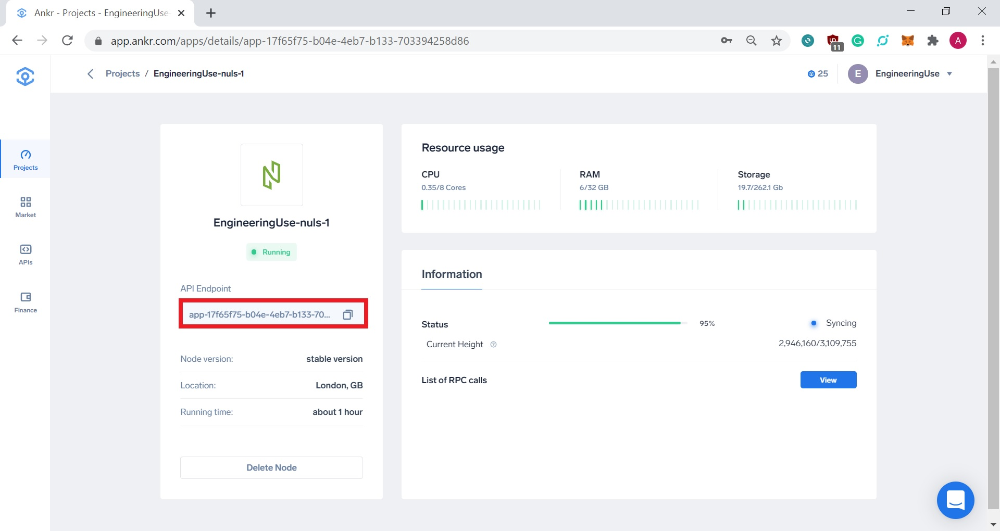

# Endpoints

## Ankr endpoint

After successfully deploying an Ankr Full node, the End-point can be found on the application details, on the left side of the screen:



The RPC endpoint will have the following format:
`http://<your-app-id>.ankr.com`

Example (as shown in the image above):
`https://app.ankr.com/apps/details/app-17f65f75-b04e-4eb7-b133-703394258d86`

### Simple JSON-RPC request

```
// Request:
curl -s -X POST -H 'Content-Type: application/json' --data '{"jsonrpc":"2.0","method":"getInfo","params":[1], "id":1234}' http://<your-app-id>.ankr.com

// Result:

{
  "jsonrpc": "2.0",
  "id": "1234",
  "result": {
    "networkHeight": 41493,
    "isRunSmartContract": true,
    "chainId": 1,
    "agentAsset": {
      "symbol": "NULS",
      "chainId": 1,
      "assetId": 1,
      "decimals": 8
    },
    "localHeight": 41493,
    "magicNumber": 20191222,
    "defaultAsset": {
      "symbol": "NULS",
      "chainId": 1,
      "assetId": 1,
      "decimals": 8
    },
    "isRunCrossChain": true
  }
}
```

In the next sections, we will describe some of the RPC requests. 
Most of them can be found in the official documentation for [NULS API Service](https://docs.nuls.io/Docs/i_nuls-api_JSONRPC.html) or [Public service API](https://docs.nuls.io/Docs/i_public_service.html), both of which we currently support.

## Nuls API service

Provides the external rpc interface to query information about the block, transaction, account, etc.
To access the NULS API service /jsonrpc has to be appended to the RPC endpoint: http://ankr.com/jsonrpc

### info

Get information about the chain, where the consensus asset is the asset that needs to be used when creating a consensus node transaction and creating a delegation consensus transaction for this chain.

#### Example

```
// Request
curl -s -X POST -H 'Content-Type: application/json' --data '{"jsonrpc":"2.0","method":"info","params":[], "id":1234}' http://<your-app-id>.ankr.com/jsonrpc

// Result
{
    "jsonrpc": "2.0",
    "id": "1234",
    "result": {
        "agentChainId": 1,
        "inflationAmount": 41095890410959,
        "agentAssetId": 1,
        "commissionMin": 20000000000000,
        "chainId": 1,
        "assetId": 1,
        "addressPrefix": "NULS",
        "symbol": "NULS"
    }
}
```


## Public service API

Public service provides users an easy method to query and obtain historical blockchain data and related statistics via JSON Remote Procedure Call.

### getTx

Get transaction details.

#### Example 

```
// Requestcurl -s -X POST -H 'Content-Type: application/json' --data '{"jsonrpc":"2.0","method":"getTx","params":[1,"37d55ef078dae885f1c9c17569592f2aa0123073652f99c04ff56a2cb87ce302"], "id":1234}' http://.ankr.com​// Result{  "jsonrpc": "2.0",  "id": "1234",  "result": {    "hash": "37d55ef078dae885f1c9c17569592f2aa0123073652f99c04ff56a2cb87ce302",    "type": 1,    "height": 37,    "size": 12,    "fee": {      "chainId": 1,      "assetId": 1,      "symbol": "NULS",      "value": 0    },    "createTime": 1568209860,    "remark": null,    "txDataHex": null,    "txData": {      "roundIndex": 1574,      "packageIndex": 2,      "agentId": "b87ce302"    },    "txDataList": null,    "coinFroms": [],    "coinTos": [],    "value": 0,    "status": 1  }}
```

### getBlockByHeight

Get block by height.

#### Example

```
// Requestcurl -s -X POST -H 'Content-Type: application/json' --data '{"jsonrpc":"2.0","method":"getBlockByHeight","params":[1,1], "id":1234}' http://.ankr.com​// Result{  "jsonrpc": "2.0",  "id": "1234",  "result": {    "header": {      "hash": "5081aa5784dd23712fce61534a8a1eb14e672487c75ac9f6799a73e9d8d1569f",      "height": 1,      "preHash": "8221e980cc9707b4fcf05ac79e70b8ac75f00550bb7da9292e6d6432a716ea88",      "merkleHash": "57afb759f438f56165bcbe233a33cf2f6788a37bbc2ff022b9758e1beef6e9c4",      "createTime": 1568209450,      "agentHash": null,      "agentId": "NULSd6Hge7xHDnvsSpnzbR2gWHd31zJ1How11",      "packingAddress": "NULSd6Hge7xHDnvsSpnzbR2gWHd31zJ1How11",      "agentAlias": null,      "txCount": 1,      "roundIndex": 1566,      "totalFee": 0,      "reward": 0,      "size": 287,      "packingIndexOfRound": 5,      "scriptSign": "210203c1f03fd991bda28aa0e18db03728437b1b82c1ca4482f4d1fb1fb5ed33ecd3473045022100e1fdb07c82464980848167a0c214020f7f63c357e01e5714afa810e436e83d46022067f37084ec9da67bd0cb0983e849417b3d9c26b51b5285031448f901b40308aa",      "txHashList": [        "57afb759f438f56165bcbe233a33cf2f6788a37bbc2ff022b9758e1beef6e9c4"      ],      "roundStartTime": 1568209400,      "agentVersion": 1,      "seedPacked": true    },    "txList": [      {        "hash": "57afb759f438f56165bcbe233a33cf2f6788a37bbc2ff022b9758e1beef6e9c4",        "type": 1,        "height": 1,        "size": 12,        "fee": {          "chainId": 1,          "assetId": 1,          "symbol": "NULS",          "value": 0        },        "createTime": 1568209450,        "remark": null,        "txDataHex": null,        "txData": null,        "txDataList": null,        "coinFroms": [],        "coinTos": [],        "value": 0,        "status": 1      }    ],    "blockHexInfo": {      "height": 1,      "blockHex": "8221e980cc9707b4fcf05ac79e70b8ac75f00550bb7da9292e6d6432a716ea8857afb759f438f56165bcbe233a33cf2f6788a37bbc2ff022b9758e1beef6e9c42afa785d01000000010000005c1e0600000500f8f9785d0500010001003c64002056e81f171bcc55a6ff8345e692c0f86e5b48e01b996cadc001622fb5e363b42100000000000000000000000000000000000000000000000000000000000000009d6046c7a66bf89a210203c1f03fd991bda28aa0e18db03728437b1b82c1ca4482f4d1fb1fb5ed33ecd3473045022100e1fdb07c82464980848167a0c214020f7f63c357e01e5714afa810e436e83d46022067f37084ec9da67bd0cb0983e849417b3d9c26b51b5285031448f901b40308aa01002afa785d000002000000",      "contractHashList": []    }  }}
```

### getBestBlockHeader

Get latest block header. 

#### Example

```
// Requestcurl -s -X POST -H 'Content-Type: application/json' --data '{"jsonrpc":"2.0","method":"getBestBlockHeader","params":[1], "id":1234}' http://.ankr.com​// Result{  "jsonrpc": "2.0",  "id": "1234",  "result": {    "hash": "8ce9cf8a1d40a5bc0e6689db18e88b076966e07bb4d0a0a80c11a44e6a74d9f2",    "height": 42323,    "preHash": "e10ef58762b8d9986e204763a1f431e8e671d3081241b7634babbe0306e87fdb",    "merkleHash": "12a1855a456a8bb4a169bcbf42c41c717f69c366a7eebeffd5d6060f56b30c4f",    "createTime": 1568635760,    "agentHash": "360d72af0f8df855042b57ba3ce260cc5a81b73adc367b3dc51009f8841b8201",    "agentId": "841b8201",    "packingAddress": "NULSd6HgZXvCq2N3oeFqFw83ghQ93Exh1f6oZ",    "agentAlias": null,    "txCount": 1,    "roundIndex": 2688,    "totalFee": 0,    "reward": 151704413,    "size": 1037,    "packingIndexOfRound": 46,    "scriptSign": "2102ea3aff2fd2db2b148d83768fc3496f734f5243f949b9687e03e0adb12de8663e473045022100eeb4ebffb966d93a3cfb31cb156ffd11fed8f53b6f93171b86f8b6d6a740ac2a02203f8b7e6b37ea6ccbc46f06bb9d8e256e58cf62a75a7e2c0d3844aa2dc82899c1",    "txHashList": [      "12a1855a456a8bb4a169bcbf42c41c717f69c366a7eebeffd5d6060f56b30c4f"    ],    "roundStartTime": 1568635300,    "agentVersion": 1,    "seedPacked": false  }}
```

### getInfo

Get general information after running the change.

#### Example

```
// Requestcurl -s -X POST -H 'Content-Type: application/json' --data '{"jsonrpc":"2.0","method":"getInfo","params":[1], "id":1234}' http://.ankr.com​// Result{  "jsonrpc": "2.0",  "id": "1234",  "result": {    "networkHeight": 41493,    "isRunSmartContract": true,    "chainId": 1,    "agentAsset": {      "symbol": "NULS",      "chainId": 1,      "assetId": 1,      "decimals": 8    },    "localHeight": 41493,    "magicNumber": 20191222,    "defaultAsset": {      "symbol": "NULS",      "chainId": 1,      "assetId": 1,      "decimals": 8    },    "isRunCrossChain": true  }}
```

### getChainInfo

Get chain information.

#### Example

```
// Request:curl -s -X POST -H 'Content-Type: application/json' --data '{"jsonrpc":"2.0","method":"getChainInfo","params":[], "id":1234}' http://.ankr.com​// Result:{ "jsonrpc":"2.0", "id":"1234", "result": {      "chainId":1,      "chainName":"nuls",      "defaultAsset": {          "key":"1-1",          "chainId":1,          "assetId":1,          "symbol":"NULS",          "decimals":8,          "initCoins":0,          "address":null,          "status":1},      "assets": [          {               "key":"1-1",               "chainId":1,               "assetId":1,               "symbol":"NULS",               "decimals":8,               "initCoins":0,               "address":null,               "status":1           }       ],       "seeds": [               "NULSd6Hge7xHDnvsSpnzbR2gWHd31zJ1How11",               "NULSd6Hgc5VNP4rF4wxdiXEQKpBKUE4w5RS22",               "NULSd6HgeQwXLdre69ArkqVZNDqMLU4CaAz33",               "NULSd6HgcjAKAgq8jjXgBCcNLEJUvJEYcoj44",               "NULSd6HgiDdTjcuvhqzm3bomyBFZmosV3ei55"       ],       "status":1,       "new":false       }   }
```

