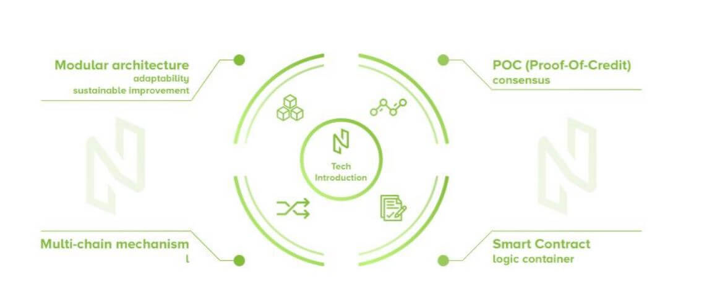

# Nuls

The Nuls blockchain development platform divides the blockchain into several modules such as network, account, ledger, storage, consensus, and smart contract. 
Every module will perform independently, ignoring the change of other modules. 
The modules of Nuls cooperate through the service bus and event bus. 
The microkernel manages the service bus and event bus.

The default consensus mechanism of Nuls is Proof-of-Credit (POC). The nodes of the consensus meeting should pack blocks by turns, and every node only packs one block per round. Sub-chains on the Nuls platform can use other mechanisms by replacing the consensus module.

## Endpoints
* [Nuls API Service official endpoint](https://api.nuls.io/jsonrpc)
* [Nuls Public Service official endpoint](https://public1.nuls.io)