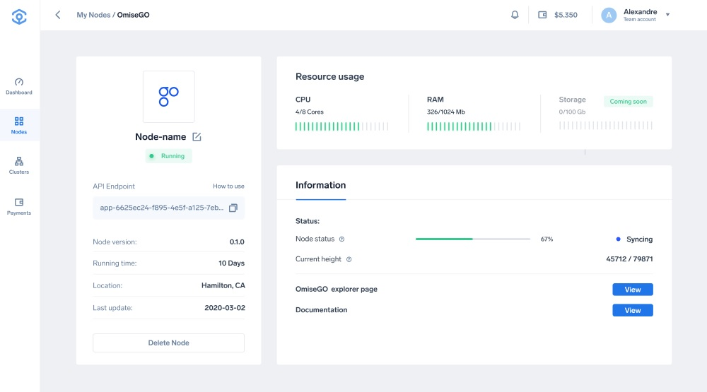

# Endpoints

## Ankr Json-RPC endpoint

How to obtain the Ankr End-Point and execute a simple request.

### Obtain Ankr endpoint
After successfully deploying an Ankr Full node, the endpoint can be found on the application details, on the left side of the screen.


The RPC endpoint will have the following format:
`http://<your-app-id>.ankr.com`

Example (as shown in the image above):

`app-36563e5b-a1f5-4e44-8b47-796734c5bf04.cls-a91a7dbc-1a23-42f6-a66f-876094349f03.ankr.com`

### Simple JSON-RPC request

```
// Request
curl -X POST "http://<your-app-id>.ankr.com/status.get" -H "accept: application/json"​// Result{  "data": {    "byzantine_events": [      {        "details": {          "available_inputs": [            {              "address": "0x0dc8e240d90f3b0d511b6447543b28ea2471401a",              "index": 0            }          ],          "available_outputs": [            {              "address": "0x0dc8e240d90f3b0d511b6447543b28ea2471401a",              "index": 1            }          ],          "name": "piggyback_available",          "txbytes": "0xf8b101e1a00000000000000000000000000000000000000000000000000000bc44dfe31800f86af401f2948b63bb2b829813ece5c2f378d47b2862be271c6c9400000000000000000000000000000000000000008711c37937e08000f401f2940dc8e240d90f3b0d511b6447543b28ea2471401a9400000000000000000000000000000000000000008711a8304c88a00080a00000000000000000000000000000000000000000000000000000000000000000"        },        "event": "piggyback_available"      }    ],    "contract_addr": {      "erc20_vault": "0x18e15c2cdc003b845b056f8d6b6a91ab33d3f182",      "eth_vault": "0x895cc6f20d386f5c0deae08b08ccfec9f821e7d9",      "payment_exit_game": "0x08c569c5774110eb84a80b292e6d6f039e18915a",      "plasma_framework": "0x96d5d8bc539694e5fa1ec0dab0e6327ca9e680f9"    },    "eth_syncing": false,    "in_flight_exits": [      {        "eth_height": 7907328,        "piggybacked_inputs": [],        "piggybacked_outputs": [          0        ],        "txbytes": "0xf8b101e1a00000000000000000000000000000000000000000000000000000bc44dfe31800f86af401f2948b63bb2b829813ece5c2f378d47b2862be271c6c9400000000000000000000000000000000000000008711c37937e08000f401f2940dc8e240d90f3b0d511b6447543b28ea2471401a9400000000000000000000000000000000000000008711a8304c88a00080a00000000000000000000000000000000000000000000000000000000000000000",        "txhash": "0xb4e8d1b7a04bf49753a0bf757e4f2b9f3c06b5ef628f99e30892a209da6455ec"      }    ],    "last_mined_child_block_number": 4089000,    "last_mined_child_block_timestamp": 1602153779,    "last_seen_eth_block_number": 8836677,    "last_seen_eth_block_timestamp": 1602156853,    "last_validated_child_block_number": 4089000,    "last_validated_child_block_timestamp": 1602153779,    "services_synced_heights": [      {        "height": 8836673,        "service": "block_getter"      },      {        "height": 8836661,        "service": "challenges_responds_processor"      },      {        "height": 8836663,        "service": "competitor_processor"      },      {        "height": 8836663,        "service": "depositor"      },      {        "height": 8836663,        "service": "exit_challenger"      },      {        "height": 8836663,        "service": "exit_finalizer"      },      {        "height": 8836663,        "service": "exit_processor"      },      {        "height": 8836661,        "service": "ife_exit_finalizer"      },      {        "height": 8836663,        "service": "in_flight_exit_processor"      },      {        "height": 8836659,        "service": "piggyback_challenges_processor"      },      {        "height": 8836661,        "service": "piggyback_processor"      },      {        "height": 8836675,        "service": "root_chain_height"      }    ]  },
```

## Watcher's information API

### /transaction.get
Gets a transaction with the given id.

#### Example:
```
// Request
curl -H "Content-Type: application/json"  -d '{"id": "0x4a4411a8700da32d2a9c8b923f3cfc8063e5d9a513a7d761bfc6e789e0c9ef81"}' http://<your-app-id>.ankr.com/transaction.get

// Result
{
  "service_name": "watcher_info",
  "version": "1.0.0+abcdefa",
  "success": true,
  "data": {
    "txindex": 5113,
    "txtype": 1,
    "txhash": "0x5df13a6bf96dbcf6e66d8babd6b55bd40d64d4320c3b115364c6588fc18c2a21",
    "metadata": "0x00000000000000000000000000000000000000000000000000000048656c6c6f",
    "txbytes": "0x5df13a6bee20000...",
    "inserted_at": "2020-02-10T12:07:32Z",
    "updated_at": "2020-02-15T04:07:57Z",
    "block": {
      "timestamp": 1540365586,
      "hash": "0x0017372421f9a92bedb7163310918e623557ab5310befc14e67212b660c33bec",
      "eth_height": 97424,
      "blknum": 68290000,
      "inserted_at": "2020-02-10T12:07:32Z",
      "updated_at": "2020-02-15T04:07:57Z"
    },
    "inputs": [
      {
        "blknum": 1000,
        "txindex": 111,
        "oindex": 0,
        "otype": 1,
        "utxo_pos": 1000001110000,
        "owner": "0xb3256026863eb6ae5b06fa396ab09069784ea8ea",
        "currency": "0x0000000000000000000000000000000000000000",
        "amount": 10,
        "creating_txhash": "0x40d65df1c3b1156d813d6bf96d5bd3b5bcf6e6588fc18c2a2ba564c6a64d4320",
        "spending_txhash": "0x5df13a6bf96dbcf6e66d8babd6b55bd40d64d4320c3b115364c6588fc18c2a21",
        "inserted_at": "2020-02-10T12:07:32Z",
        "updated_at": "2020-02-15T04:07:57Z"
      }
    ],
    "outputs": [
      {
        "blknum": 68290000,
        "txindex": 5113,
        "oindex": 0,
        "otype": 1,
        "utxo_pos": 68290000051130000,
        "owner": "0xae8ae48796090ba693af60b5ea6be3686206523b",
        "currency": "0x0000000000000000000000000000000000000000",
        "amount": 2,
        "creating_txhash": "0x5df13a6bf96dbcf6e66d8babd6b55bd40d64d4320c3b115364c6588fc18c2a21",
        "spending_txhash": null,
        "inserted_at": "2020-02-10T12:07:32Z",
        "updated_at": "2020-02-15T04:07:57Z"
      },
      {
        "blknum": 68290000,
        "txindex": 5113,
        "oindex": 1,
        "otype": 1,
        "utxo_pos": 68290000051130000,
        "owner": "0xb3256026863eb6ae5b06fa396ab09069784ea8ea",
        "currency": "0x0000000000000000000000000000000000000000",
        "amount": 7,
        "creating_txhash": "0x5df13a6bf96dbcf6e66d8babd6b55bd40d64d4320c3b115364c6588fc18c2a21",
        "spending_txhash": null,
        "inserted_at": "2020-02-10T12:07:32Z",
        "updated_at": "2020-02-15T04:07:57Z"
      }
    ]
  }
}
```

### /transaction.all

Gets all transactions (can be limited with various filters).

#### Example

```
// Request
curl -H "Content-Type: application/json"  -d '{"page":1, "limit":100}' http://<your-app-id>.ankr.com/transaction.all

// Result
{
  "service_name": "watcher_info",
  "version": "1.0+abcdefa",
  "success": true,
  "data": [
    {
      "block": {
        "timestamp": 1540365586,
        "hash": "0x0017372421f9a92bedb7163310918e623557ab5310befc14e67212b660c33bec",
        "eth_height": 97424,
        "blknum": 68290000,
        "inserted_at": "2020-02-10T12:07:32Z",
        "updated_at": "2020-02-15T04:07:57Z"
      },
      "txindex": 0,
      "txtype": 1,
      "txhash": "0x5df13a6bf96dbcf6e66d8babd6b55bd40d64d4320c3b115364c6588fc18c2a21",
      "metadata": "0x00000000000000000000000000000000000000000000000000000048656c6c6f",
      "txbytes": "0x5df13a6bee20000...",
      "inserted_at": "2020-02-10T12:07:32Z",
      "updated_at": "2020-02-15T04:07:57Z",
      "inputs": [
        {
          "blknum": 1000,
          "txindex": 111,
          "otype": 1,
          "oindex": 0,
          "utxo_pos": 1000001110000,
          "owner": "0xb3256026863eb6ae5b06fa396ab09069784ea8ea",
          "currency": "0x0000000000000000000000000000000000000000",
          "creating_txhash": "0x40d65df1c3b1156d813d6bf96d5bd3b5bcf6e6588fc18c2a2ba564c6a64d4320",
          "spending_txhash": "0x5df13a6bf96dbcf6e66d8babd6b55bd40d64d4320c3b115364c6588fc18c2a21",
          "amount": 20000000,
          "inserted_at": "2020-02-10T12:07:32Z",
          "updated_at": "2020-02-15T04:07:57Z"
        }
      ],
      "outputs": [
        {
          "blknum": 68290000,
          "txindex": 5113,
          "otype": 1,
          "oindex": 0,
          "utxo_pos": 68290000051130000,
          "owner": "0xae8ae48796090ba693af60b5ea6be3686206523b",
          "currency": "0x0000000000000000000000000000000000000000",
          "amount": 15000000,
          "creating_txhash": "0x5df13a6bf96dbcf6e66d8babd6b55bd40d64d4320c3b115364c6588fc18c2a21",
          "spending_txhash": null,
          "inserted_at": "2020-02-10T12:07:32Z",
          "updated_at": "2020-02-15T04:07:57Z"
        },
        {
          "blknum": 68290000,
          "txindex": 5113,
          "otype": 1,
          "oindex": 1,
          "utxo_pos": 68290000051130000,
          "owner": "0xb3256026863eb6ae5b06fa396ab09069784ea8ea",
          "currency": "0x0000000000000000000000000000000000000000",
          "amount": 5000000,
          "creating_txhash": "0x5df13a6bf96dbcf6e66d8babd6b55bd40d64d4320c3b115364c6588fc18c2a21",
          "spending_txhash": null,
          "inserted_at": "2020-02-10T12:07:32Z",
          "updated_at": "2020-02-15T04:07:57Z"
        }
      ]
    }
  ],
  "data_paging": {
    "page": 1,
    "limit": 200
  }
}
```

### /block.all

#### Example

```
// Request
curl -H "Content-Type: application/json"  -d '{"page":2, "limit":100}' http://<your-app-id>.ankr.com/block.all

// Result
{
  "data": [
    {
      "blknum": 3989000,
      "eth_height": 8796815,
      "hash": "0x3d557af7c027123489d91989295912687b43028e2bf73615284b4263b6009f4a",
      "inserted_at": "2020-10-01T21:02:32Z",
      "timestamp": 1601586127,
      "tx_count": 2,
      "updated_at": "2020-10-01T21:02:32Z"
    },
    {
      "blknum": 3988000,
      "eth_height": 8796034,
      "hash": "0x97a5fd1ad723e950ed5893b32b1e60bcf695f3cafd14edf5b2b0480f68edaaef",
      "inserted_at": "2020-10-01T18:19:36Z",
      "timestamp": 1601576342,
      "tx_count": 2,
      "updated_at": "2020-10-01T18:19:36Z"
    },
    {
      "blknum": 3987000,
      "eth_height": 8795933,
      "hash": "0x54bec11409aac24742816cd40c9efcc476972b897e750faebf037d771c282a46",
      "inserted_at": "2020-10-01T17:55:05Z",
      "timestamp": 1601574883,
      "tx_count": 2,
      "updated_at": "2020-10-01T17:55:05Z"
    },
    {
      "blknum": 3986000,
      "eth_height": 8795930,
      "hash": "0xba0d2bb38acf997e6b4da5e5e931bed2f0f42a063e1c399bc3852d5ce4f0910a",
      "inserted_at": "2020-10-01T17:54:15Z",
      "timestamp": 1601574818,
      "tx_count": 2,
      "updated_at": "2020-10-01T17:54:15Z"
    },
    {
      "blknum": 3985000,
      "eth_height": 8795928,
      "hash": "0xfca4c361a5b1773f7dcc93f2342a21f9969a94064a12e0cc0e03d36e0769584d",
      "inserted_at": "2020-10-01T17:53:51Z",
      "timestamp": 1601574803,
      "tx_count": 2,
      "updated_at": "2020-10-01T17:53:51Z"
    },
    {
      "blknum": 3984000,
      "eth_height": 8795910,
      "hash": "0x28892a954e32ca3670ed2e6ac12c87d49bd2f24f15f2366634a8ece483574a75",
      "inserted_at": "2020-10-01T17:50:48Z",
      "timestamp": 1601574589,
      "tx_count": 2,
      "updated_at": "2020-10-01T17:50:48Z"
    },
    {
      "blknum": 3983000,
      "eth_height": 8794167,
      "hash": "0x1f108be1d49afa0130a1f0a686a50fd5dbf26d3e43c10084582770027be390fc",
      "inserted_at": "2020-10-01T11:33:33Z",
      "timestamp": 1601551944,
      "tx_count": 2,
      "updated_at": "2020-10-01T11:33:33Z"
    },
    {
      "blknum": 3982000,
      "eth_height": 8794080,
      "hash": "0xa3efb8e9f2aa62f050b64e706361208db8edf9062e6e51285789a65388d89814",
      "inserted_at": "2020-10-01T11:13:17Z",
      "timestamp": 1601550765,
      "tx_count": 2,
      "updated_at": "2020-10-01T11:13:17Z"
    },
    {
      "blknum": 3981000,
      "eth_height": 8794067,
      "hash": "0xf16e5a917bec4d22f0481f6fa4105f4a26c405d9e35c9c4a14a9ae81637945a6",
      "inserted_at": "2020-10-01T11:11:05Z",
      "timestamp": 1601550533,
      "tx_count": 2,
      "updated_at": "2020-10-01T11:11:05Z"
    },
    {
      "blknum": 3980000,
      "eth_height": 8792113,
      "hash": "0xdac56b48c6cc1347df36f6e8ddab83c49047e1317c744dc57c2e5a1d4a3a1446",
      "inserted_at": "2020-10-01T04:28:58Z",
      "timestamp": 1601526513,
      "tx_count": 2,
      "updated_at": "2020-10-01T04:28:58Z"
    },
    {
      "blknum": 3979000,
      "eth_height": 8791864,
      "hash": "0xb90772de3e0fccfa640de6a1443d93a63d5de63c56129a8762a0b4feb6521afe",
      "inserted_at": "2020-10-01T03:42:30Z",
      "timestamp": 1601523688,
      "tx_count": 2,
      "updated_at": "2020-10-01T03:42:30Z"
    },
    {
      "blknum": 3978000,
      "eth_height": 8791348,
      "hash": "0xeeaaf31848a768a0267e962e316fc15ff73a52d1dfe1a552576301565c2b81d6",
      "inserted_at": "2020-10-01T02:02:13Z",
      "timestamp": 1601517695,
      "tx_count": 2,
      "updated_at": "2020-10-01T02:02:13Z"
    },
    {
      "blknum": 3977000,
      "eth_height": 8791340,
      "hash": "0x42b61b6b1fc1a42da7fba5fb70b1c15cb38a8f5d23b131d397f08099af683b88",
      "inserted_at": "2020-10-01T02:01:00Z",
      "timestamp": 1601517590,
      "tx_count": 2,
      "updated_at": "2020-10-01T02:01:00Z"
    },
    {
      "blknum": 3976000,
      "eth_height": 8790620,
      "hash": "0x728095c8742ab8a2f53283e88c353d13dccc60538727853978f3335de9573de0",
      "inserted_at": "2020-09-30T22:56:21Z",
      "timestamp": 1601506535,
      "tx_count": 2,
      "updated_at": "2020-09-30T22:56:21Z"
    },
    {
      "blknum": 3975000,
      "eth_height": 8790601,
      "hash": "0x40d94038fd60268c90ba0dc3c8776148960143b5f98d58ea1db87106a66aa327",
      "inserted_at": "2020-09-30T22:51:56Z",
      "timestamp": 1601506260,
      "tx_count": 2,
      "updated_at": "2020-09-30T22:51:56Z"
    },
    {
      "blknum": 3974000,
      "eth_height": 8790508,
      "hash": "0x0fe8543e8d1345382decac613d6a4371aea5fc21f7c7456fbc90db6665f96679",
      "inserted_at": "2020-09-30T22:36:40Z",
      "timestamp": 1601505369,
      "tx_count": 2,
      "updated_at": "2020-09-30T22:36:40Z"
    },
    {
      "blknum": 3973000,
      "eth_height": 8789288,
      "hash": "0x9a91bc92d98b83a3f4e916d9f5468486f91bc1acf310cbea34a278369f22cb05",
      "inserted_at": "2020-09-30T18:55:06Z",
      "timestamp": 1601492081,
      "tx_count": 2,
      "updated_at": "2020-09-30T18:55:06Z"
    },
    {
      "blknum": 3972000,
      "eth_height": 8789284,
      "hash": "0xa2b07d3181c9363d92133259c893adb38d7a9fbe9eb5fa5120197667ab9a0ac8",
      "inserted_at": "2020-09-30T18:54:25Z",
      "timestamp": 1601492052,
      "tx_count": 2,
      "updated_at": "2020-09-30T18:54:25Z"
    },
    {
      "blknum": 3971000,
      "eth_height": 8789264,
      "hash": "0x39262553da4b268332b14ec39429de8c4c175afd67caeaefb98210c58eb85e13",
      "inserted_at": "2020-09-30T18:51:13Z",
      "timestamp": 1601491842,
      "tx_count": 2,
      "updated_at": "2020-09-30T18:51:13Z"
    },
    {
      "blknum": 3970000,
      "eth_height": 8789237,
      "hash": "0x01192e322b37fc823b54e95e85e0145b1ff3d154134e9b3c7b78b81e8e0d9a41",
      "inserted_at": "2020-09-30T18:47:47Z",
      "timestamp": 1601491634,
      "tx_count": 2,
      "updated_at": "2020-09-30T18:47:47Z"
    },
    {
      "blknum": 3969000,
      "eth_height": 8789228,
      "hash": "0x5c1e2d39b415c3e5369a1ce0815c63d806673046649788bfdc27721b86e2341b",
      "inserted_at": "2020-09-30T18:46:15Z",
      "timestamp": 1601491534,
      "tx_count": 2,
      "updated_at": "2020-09-30T18:46:15Z"
    },
    {
      "blknum": 3968000,
      "eth_height": 8789221,
      "hash": "0xe0b257faca8077fc079ca8efff8f254ed569aea78dd6ab37a5f101857600d68b",
      "inserted_at": "2020-09-30T18:44:53Z",
      "timestamp": 1601491468,
      "tx_count": 2,
      "updated_at": "2020-09-30T18:44:53Z"
    },
    {
      "blknum": 3967000,
      "eth_height": 8786275,
      "hash": "0x1ec13d1338e5c0bb532894915c4f1f83de8368de17438a29efb33ee93669130d",
      "inserted_at": "2020-09-30T12:24:52Z",
      "timestamp": 1601468658,
      "tx_count": 2,
      "updated_at": "2020-09-30T12:24:52Z"
    },
    {
      "blknum": 3966000,
      "eth_height": 8786253,
      "hash": "0xc2e733872ed632b30a7515c5a166ddde22548bf21b51ae8d698d29b5ee128564",
      "inserted_at": "2020-09-30T12:23:05Z",
      "timestamp": 1601468558,
      "tx_count": 2,
      "updated_at": "2020-09-30T12:23:05Z"
    },
    {
      "blknum": 3965000,
      "eth_height": 8785077,
      "hash": "0x3f368ad39909d427ff5b45cc552981a80bde6aa1ef4c22e0b57d0692d32c96ba",
      "inserted_at": "2020-09-30T10:19:05Z",
      "timestamp": 1601461125,
      "tx_count": 2,
      "updated_at": "2020-09-30T10:19:05Z"
    },
    {
      "blknum": 3964000,
      "eth_height": 8785051,
      "hash": "0xb6365c44a1fb4aeaf1950d2f8d98d7a4b49123feffb0313699e02f42523684d8",
      "inserted_at": "2020-09-30T10:16:27Z",
      "timestamp": 1601460948,
      "tx_count": 2,
      "updated_at": "2020-09-30T10:16:27Z"
    },
    {
      "blknum": 3963000,
      "eth_height": 8784943,
      "hash": "0x0bac5b0a8554ce93ed4b31104f3b3dc8463f880c4dba70f31cf2e2956a3e23d9",
      "inserted_at": "2020-09-30T10:00:31Z",
      "timestamp": 1601459995,
      "tx_count": 2,
      "updated_at": "2020-09-30T10:00:31Z"
    },
    {
      "blknum": 3962000,
      "eth_height": 8784319,
      "hash": "0x57f4f70a0e233e57fd505b1de54fc8637bfcb24932995976ed884920c0a8b5ad",
      "inserted_at": "2020-09-30T07:17:53Z",
      "timestamp": 1601450232,
      "tx_count": 2,
      "updated_at": "2020-09-30T07:17:53Z"
    },
    {
      "blknum": 3961000,
      "eth_height": 8780562,
      "hash": "0xeeff1cff713dffb337a3fda5dcd09fa88189b7a9443f60031eca97ab18f1c5df",
      "inserted_at": "2020-09-29T13:48:09Z",
      "timestamp": 1601387245,
      "tx_count": 2,
      "updated_at": "2020-09-29T13:48:09Z"
    },
    {
      "blknum": 3960000,
      "eth_height": 8780548,
      "hash": "0xd680baa0e939a05a8fb47d8831e3cea2a9d141cb0c3c9e8be71ec097d2ed44b4",
      "inserted_at": "2020-09-29T13:44:09Z",
      "timestamp": 1601386988,
      "tx_count": 1,
      "updated_at": "2020-09-29T13:44:09Z"
    },
    {
      "blknum": 3959000,
      "eth_height": 8780013,
      "hash": "0x6cf6c09ca6f35de7ee9a87ae19b46e9d072d747ee2abc9a9eda2798f120abd52",
      "inserted_at": "2020-09-29T09:49:52Z",
      "timestamp": 1601372947,
      "tx_count": 2,
      "updated_at": "2020-09-29T09:49:52Z"
    },
    {
      "blknum": 3958000,
      "eth_height": 8774178,
      "hash": "0xb0f6b92dd6a8bcfe6253ae7a26c0af40f17c16c93e79a16906670d104ede7ac5",
      "inserted_at": "2020-09-28T14:34:39Z",
      "timestamp": 1601303644,
      "tx_count": 2,
      "updated_at": "2020-09-28T14:34:39Z"
    },
    {
      "blknum": 3957000,
      "eth_height": 8774171,
      "hash": "0x9232809b3b43855c19008ac70ea5d1bde24eed8297f2a92d663a9a7e3517fc0c",
      "inserted_at": "2020-09-28T14:33:50Z",
      "timestamp": 1601303602,
      "tx_count": 2,
      "updated_at": "2020-09-28T14:33:50Z"
    },
    {
      "blknum": 3956000,
      "eth_height": 8771571,
      "hash": "0xac1dc379f8d54d5ea17b2c44c68302b3d6da17077fa4caf3cc9ff237955d33eb",
      "inserted_at": "2020-09-28T09:25:52Z",
      "timestamp": 1601285131,
      "tx_count": 2,
      "updated_at": "2020-09-28T09:25:52Z"
    },
    {
      "blknum": 3955000,
      "eth_height": 8771547,
      "hash": "0x92b86b7369024daa70a38c629b422395f86b0ed2b470fb2149c1b29670aaedc9",
      "inserted_at": "2020-09-28T09:22:09Z",
      "timestamp": 1601284885,
      "tx_count": 2,
      "updated_at": "2020-09-28T09:22:09Z"
    },
    {
      "blknum": 3954000,
      "eth_height": 8768330,
      "hash": "0x19da52740b10b2818b6c7fab4104c7d06d92ea20c311df376f8872eae77e1cec",
      "inserted_at": "2020-09-27T20:25:05Z",
      "timestamp": 1601238284,
      "tx_count": 2,
      "updated_at": "2020-09-27T20:25:05Z"
    },
    {
      "blknum": 3953000,
      "eth_height": 8768326,
      "hash": "0xd02d58551186524a50284f0f7528a84937f0006686867f536da47b344cbf472f",
      "inserted_at": "2020-09-27T20:23:35Z",
      "timestamp": 1601238177,
      "tx_count": 2,
      "updated_at": "2020-09-27T20:23:35Z"
    },
    {
      "blknum": 3952000,
      "eth_height": 8768321,
      "hash": "0xcda923d67bd461087fd8b108bbd1009030bfc465d13679723e64511ae22a23d4",
      "inserted_at": "2020-09-27T20:22:28Z",
      "timestamp": 1601238122,
      "tx_count": 2,
      "updated_at": "2020-09-27T20:22:28Z"
    },
    {
      "blknum": 3951000,
      "eth_height": 8767481,
      "hash": "0x6cb82ef79093a5b6786f17114fad3b7503d83f0d67f88f3d37186593ff98502c",
      "inserted_at": "2020-09-27T15:54:18Z",
      "timestamp": 1601222013,
      "tx_count": 2,
      "updated_at": "2020-09-27T15:54:18Z"
    },
    {
      "blknum": 3950000,
      "eth_height": 8767462,
      "hash": "0x7d5312853eeddeb8d79c631ea53aa76b16612268f463aacfb91101d8ff8f7c7d",
      "inserted_at": "2020-09-27T15:46:51Z",
      "timestamp": 1601221584,
      "tx_count": 1,
      "updated_at": "2020-09-27T15:46:51Z"
    },
    {
      "blknum": 3949000,
      "eth_height": 8767460,
      "hash": "0x6fa28199f807fc3a206c9b29b0ada605425b340aa6b5faf9ebe0cd9b235e0979",
      "inserted_at": "2020-09-27T15:45:53Z",
      "timestamp": 1601221521,
      "tx_count": 1,
      "updated_at": "2020-09-27T15:45:53Z"
    },
    {
      "blknum": 3948000,
      "eth_height": 8767452,
      "hash": "0x86e83d66726557ca9aa091107fb30f882ba53135bfa4f26265402a67265cc544",
      "inserted_at": "2020-09-27T15:43:41Z",
      "timestamp": 1601221396,
      "tx_count": 1,
      "updated_at": "2020-09-27T15:43:41Z"
    },
    {
      "blknum": 3947000,
      "eth_height": 8767449,
      "hash": "0x46b1b52061776bc71e636762c926ad0591c532d40dacdc612e05170c10bfe76d",
      "inserted_at": "2020-09-27T15:42:18Z",
      "timestamp": 1601221283,
      "tx_count": 1,
      "updated_at": "2020-09-27T15:42:18Z"
    },
    {
      "blknum": 3946000,
      "eth_height": 8767444,
      "hash": "0x28ea357a79af76b0b231540f79c55eeb2c04e93a58e2ede18c9ce18aac642796",
      "inserted_at": "2020-09-27T15:40:22Z",
      "timestamp": 1601221207,
      "tx_count": 1,
      "updated_at": "2020-09-27T15:40:22Z"
    },
    {
      "blknum": 3945000,
      "eth_height": 8767440,
      "hash": "0x359ec28ded1229a29650a82019a97447718e3b632564de3ebd9d69a55c94c922",
      "inserted_at": "2020-09-27T15:38:02Z",
      "timestamp": 1601221028,
      "tx_count": 1,
      "updated_at": "2020-09-27T15:38:02Z"
    },
    {
      "blknum": 3944000,
      "eth_height": 8767436,
      "hash": "0xa2e7cffb76ae00fd8f3358a41cf294b0a1b923ec58b7a64028f9ad4627e7b047",
      "inserted_at": "2020-09-27T15:35:58Z",
      "timestamp": 1601220916,
      "tx_count": 1,
      "updated_at": "2020-09-27T15:35:58Z"
    },
    {
      "blknum": 3943000,
      "eth_height": 8767434,
      "hash": "0x5e684cdfc906abfdd9f776015b71cb3e707501ad509e3227928d07a187531ead",
      "inserted_at": "2020-09-27T15:35:16Z",
      "timestamp": 1601220901,
      "tx_count": 1,
      "updated_at": "2020-09-27T15:35:16Z"
    },
    {
      "blknum": 3942000,
      "eth_height": 8767426,
      "hash": "0x3e8d5989e924514b46269a0d53c95188001152cfe51789b34c21998573010777",
      "inserted_at": "2020-09-27T15:33:13Z",
      "timestamp": 1601220716,
      "tx_count": 1,
      "updated_at": "2020-09-27T15:33:13Z"
    },
    {
      "blknum": 3941000,
      "eth_height": 8756482,
      "hash": "0x552a1d4a341f4380bbce2c392414f56830ff37920ed07a3544a4fb305eab50f4",
      "inserted_at": "2020-09-26T00:37:24Z",
      "timestamp": 1601080627,
      "tx_count": 2,
      "updated_at": "2020-09-26T00:37:24Z"
    },
    {
      "blknum": 3940000,
      "eth_height": 8756457,
      "hash": "0x2600862cb6e652fe97c7b4b7dcb02d4437f78207a9e94597d687845ab0094d3f",
      "inserted_at": "2020-09-26T00:31:20Z",
      "timestamp": 1601080235,
      "tx_count": 2,
      "updated_at": "2020-09-26T00:31:20Z"
    },
    {
      "blknum": 3939000,
      "eth_height": 8756416,
      "hash": "0xe78a62e30d40efeb772f81183d9d8311aae11364bb617970f1c63bef990d2d27",
      "inserted_at": "2020-09-26T00:22:29Z",
      "timestamp": 1601079717,
      "tx_count": 2,
      "updated_at": "2020-09-26T00:22:29Z"
    },
    {
      "blknum": 3938000,
      "eth_height": 8754601,
      "hash": "0x6b226c3426b8ec04d1605917349e1ee47ea37fef50fe9e73ffb11c661ae93aa6",
      "inserted_at": "2020-09-25T18:34:38Z",
      "timestamp": 1601058831,
      "tx_count": 2,
      "updated_at": "2020-09-25T18:34:38Z"
    },
    {
      "blknum": 3937000,
      "eth_height": 8754596,
      "hash": "0xbdb1cd5e594f39948abc3fc7f33854b5374e7a528ebe7475dcd6c4b04e09260a",
      "inserted_at": "2020-09-25T18:33:16Z",
      "timestamp": 1601058761,
      "tx_count": 2,
      "updated_at": "2020-09-25T18:33:16Z"
    },
    {
      "blknum": 3936000,
      "eth_height": 8753956,
      "hash": "0x5d753a147037fc0ab1d4e214481b1c6797918eee8357c6e217e71f3e54da47a6",
      "inserted_at": "2020-09-25T16:24:50Z",
      "timestamp": 1601051059,
      "tx_count": 2,
      "updated_at": "2020-09-25T16:24:50Z"
    },
    {
      "blknum": 3935000,
      "eth_height": 8753880,
      "hash": "0x5918379d5d535b540ce4ae9b9c5b4c0d3ff0a95da844a8532ba797f8499a20bd",
      "inserted_at": "2020-09-25T16:11:12Z",
      "timestamp": 1601050240,
      "tx_count": 2,
      "updated_at": "2020-09-25T16:11:12Z"
    },
    {
      "blknum": 3934000,
      "eth_height": 8753844,
      "hash": "0x4ec5c99847d6f4f8c79fa85eb1b130af474ddd5ae7fac9ff97240def4157d524",
      "inserted_at": "2020-09-25T16:04:51Z",
      "timestamp": 1601049854,
      "tx_count": 2,
      "updated_at": "2020-09-25T16:04:51Z"
    },
    {
      "blknum": 3933000,
      "eth_height": 8753844,
      "hash": "0x022834dfb99fb0aea5aa864ce8edbc76451f825439be9388c4a6293233e4079f",
      "inserted_at": "2020-09-25T16:04:51Z",
      "timestamp": 1601049854,
      "tx_count": 2,
      "updated_at": "2020-09-25T16:04:51Z"
    },
    {
      "blknum": 3932000,
      "eth_height": 8753781,
      "hash": "0xf25f24f4b545787f46d8ff1cef928813eb040abc8c65983713ba7166057f86af",
      "inserted_at": "2020-09-25T15:53:33Z",
      "timestamp": 1601049187,
      "tx_count": 1,
      "updated_at": "2020-09-25T15:53:33Z"
    },
    {
      "blknum": 3931000,
      "eth_height": 8753634,
      "hash": "0x50eb1b066e6819e72273430519181c59b1cca4d686430177900c083ff7bf47b2",
      "inserted_at": "2020-09-25T15:23:30Z",
      "timestamp": 1601047385,
      "tx_count": 2,
      "updated_at": "2020-09-25T15:23:30Z"
    },
    {
      "blknum": 3930000,
      "eth_height": 8753632,
      "hash": "0xf9252fddde12f1d8fa6d1fcabfd3ab219bf37a644adaf229e73e308a91c77619",
      "inserted_at": "2020-09-25T15:23:22Z",
      "timestamp": 1601047330,
      "tx_count": 2,
      "updated_at": "2020-09-25T15:23:22Z"
    },
    {
      "blknum": 3929000,
      "eth_height": 8753627,
      "hash": "0x9929848f0c1e9629bef182ddf233481e2a1136527e35c8de4a84cfcfe136a6e5",
      "inserted_at": "2020-09-25T15:21:10Z",
      "timestamp": 1601047252,
      "tx_count": 2,
      "updated_at": "2020-09-25T15:21:10Z"
    },
    {
      "blknum": 3928000,
      "eth_height": 8753615,
      "hash": "0x601c361d1fb139216e4ae0a75d0c6f23b318a569ab494405dbb0053e1b418aae",
      "inserted_at": "2020-09-25T15:19:48Z",
      "timestamp": 1601047149,
      "tx_count": 2,
      "updated_at": "2020-09-25T15:19:48Z"
    },
    {
      "blknum": 3927000,
      "eth_height": 8753604,
      "hash": "0x17d4a945847ee19fd79471f7a1734326901be2e6e21e300c04ba504d73b93470",
      "inserted_at": "2020-09-25T15:17:51Z",
      "timestamp": 1601047035,
      "tx_count": 2,
      "updated_at": "2020-09-25T15:17:51Z"
    },
    {
      "blknum": 3926000,
      "eth_height": 8753568,
      "hash": "0x67347c6dbd1d50f2c9829078795b16abb00c583b09e403968575d79977c531d3",
      "inserted_at": "2020-09-25T15:12:05Z",
      "timestamp": 1601046711,
      "tx_count": 2,
      "updated_at": "2020-09-25T15:12:05Z"
    },
    {
      "blknum": 3925000,
      "eth_height": 8753566,
      "hash": "0x3885f1d5f312020cda34443c938075c6f3a67f05a38b9826294e7714cb1487fd",
      "inserted_at": "2020-09-25T15:12:05Z",
      "timestamp": 1601046700,
      "tx_count": 2,
      "updated_at": "2020-09-25T15:12:05Z"
    },
    {
      "blknum": 3924000,
      "eth_height": 8751144,
      "hash": "0x57ab1df5ad8805b4be280a4ac6a419fd064b5408e855ec43951fd35a2650750d",
      "inserted_at": "2020-09-25T07:17:47Z",
      "timestamp": 1601018187,
      "tx_count": 2,
      "updated_at": "2020-09-25T07:17:47Z"
    },
    {
      "blknum": 3923000,
      "eth_height": 8750137,
      "hash": "0xcb9342da7f863b61266b9fadd300e0bca4c822c0cf6414b7f2e4d5d3f5f142c9",
      "inserted_at": "2020-09-25T04:37:44Z",
      "timestamp": 1601008629,
      "tx_count": 2,
      "updated_at": "2020-09-25T04:37:44Z"
    },
    {
      "blknum": 3922000,
      "eth_height": 8750134,
      "hash": "0xe23e17e55941cd78dc7153e55e231016b53d9315681fc50535f372816bb7abc3",
      "inserted_at": "2020-09-25T04:37:18Z",
      "timestamp": 1601008612,
      "tx_count": 2,
      "updated_at": "2020-09-25T04:37:18Z"
    },
    {
      "blknum": 3921000,
      "eth_height": 8750055,
      "hash": "0xa56e74d4a87e0db80cdcee0cb52dc234a3360e0f2da1171ce8bbf64703fb2e78",
      "inserted_at": "2020-09-25T04:26:26Z",
      "timestamp": 1601007957,
      "tx_count": 2,
      "updated_at": "2020-09-25T04:26:26Z"
    },
    {
      "blknum": 3920000,
      "eth_height": 8750047,
      "hash": "0xb363576eecd1b70514739b7ad41e8898a4043dd31f5f8e7bc93f2c577f917b15",
      "inserted_at": "2020-09-25T04:25:28Z",
      "timestamp": 1601007879,
      "tx_count": 2,
      "updated_at": "2020-09-25T04:25:28Z"
    },
    {
      "blknum": 3919000,
      "eth_height": 8750046,
      "hash": "0x6af8a1704c8632025651684293637c4d8fcee270184c5f4125aeae7c2799bef0",
      "inserted_at": "2020-09-25T04:25:12Z",
      "timestamp": 1601007861,
      "tx_count": 2,
      "updated_at": "2020-09-25T04:25:12Z"
    },
    {
      "blknum": 3918000,
      "eth_height": 8749989,
      "hash": "0xc279409f20ab2e9c3942718f0d5bbea9456ac54137a80ac2955c5fca4e0dbaa9",
      "inserted_at": "2020-09-25T04:16:31Z",
      "timestamp": 1601007370,
      "tx_count": 2,
      "updated_at": "2020-09-25T04:16:31Z"
    },
    {
      "blknum": 3917000,
      "eth_height": 8749987,
      "hash": "0x1a998e32ac313542c06f5b49da3e141e709c9ed4909b937dfa3b206269d68673",
      "inserted_at": "2020-09-25T04:16:23Z",
      "timestamp": 1601007358,
      "tx_count": 2,
      "updated_at": "2020-09-25T04:16:23Z"
    },
    {
      "blknum": 3916000,
      "eth_height": 8749850,
      "hash": "0xa899a02611a73139922211376bdcb09da9dec5f8009c677cc8ba953ccb67a71e",
      "inserted_at": "2020-09-25T03:57:45Z",
      "timestamp": 1601006249,
      "tx_count": 2,
      "updated_at": "2020-09-25T03:57:45Z"
    },
    {
      "blknum": 3915000,
      "eth_height": 8749847,
      "hash": "0xbd29461fec1313a1cebe23c2dfa7ec9c87234bde5b072aa2f53f6264370fd77c",
      "inserted_at": "2020-09-25T03:57:37Z",
      "timestamp": 1601006240,
      "tx_count": 2,
      "updated_at": "2020-09-25T03:57:37Z"
    },
    {
      "blknum": 3914000,
      "eth_height": 8748985,
      "hash": "0xe239a6a2fc618d6ea7eebbe8e966eb26c2d6eabd19c686d26b91b35405711245",
      "inserted_at": "2020-09-25T01:16:02Z",
      "timestamp": 1600996541,
      "tx_count": 2,
      "updated_at": "2020-09-25T01:16:02Z"
    },
    {
      "blknum": 3913000,
      "eth_height": 8748418,
      "hash": "0xb7280ed7b98ddb93643bddee84a966cd31fbe21c53a73ff8c89072b4b48f2193",
      "inserted_at": "2020-09-24T23:04:21Z",
      "timestamp": 1600988617,
      "tx_count": 2,
      "updated_at": "2020-09-24T23:04:21Z"
    },
    {
      "blknum": 3912000,
      "eth_height": 8748340,
      "hash": "0x05b5e606f29ef3e1746d64b872609576ab5c9a8391361c4cf71f1879322ca165",
      "inserted_at": "2020-09-24T22:49:38Z",
      "timestamp": 1600987744,
      "tx_count": 2,
      "updated_at": "2020-09-24T22:49:38Z"
    },
    {
      "blknum": 3911000,
      "eth_height": 8747965,
      "hash": "0x83821b2140003e7c3c135f185994f7f0b3d6d659a636c2d3b94ba7b698a8e281",
      "inserted_at": "2020-09-24T21:38:28Z",
      "timestamp": 1600983469,
      "tx_count": 2,
      "updated_at": "2020-09-24T21:38:28Z"
    },
    {
      "blknum": 3910000,
      "eth_height": 8747957,
      "hash": "0xf7f115895df83610e4d8aa0f264d7aad0764ec2cf30d53ad36cd407591921f15",
      "inserted_at": "2020-09-24T21:36:40Z",
      "timestamp": 1600983369,
      "tx_count": 1,
      "updated_at": "2020-09-24T21:36:40Z"
    },
    {
      "blknum": 3909000,
      "eth_height": 8747944,
      "hash": "0xf1804107a8fb603bf3b37483098386c302a46825fbb9f7f3d97d17d58fde5dae",
      "inserted_at": "2020-09-24T21:35:10Z",
      "timestamp": 1600983297,
      "tx_count": 2,
      "updated_at": "2020-09-24T21:35:10Z"
    },
    {
      "blknum": 3908000,
      "eth_height": 8747924,
      "hash": "0x5a976a119035426132bad2758425f6dd4b5fc44d850fb227fadaa7b088f6576f",
      "inserted_at": "2020-09-24T21:30:29Z",
      "timestamp": 1600982998,
      "tx_count": 2,
      "updated_at": "2020-09-24T21:30:29Z"
    },
    {
      "blknum": 3907000,
      "eth_height": 8747911,
      "hash": "0x5c7a07ea8af0dff18c8faf59aef1a30e3347e887082408dfc50a5026146a5d07",
      "inserted_at": "2020-09-24T21:28:42Z",
      "timestamp": 1600982885,
      "tx_count": 1,
      "updated_at": "2020-09-24T21:28:42Z"
    },
    {
      "blknum": 3906000,
      "eth_height": 8747902,
      "hash": "0xe2ffc447cf335bc888741616bfbb646dfafee3eb43b1615b459a95cae73c0783",
      "inserted_at": "2020-09-24T21:27:03Z",
      "timestamp": 1600982790,
      "tx_count": 1,
      "updated_at": "2020-09-24T21:27:03Z"
    },
    {
      "blknum": 3905000,
      "eth_height": 8747897,
      "hash": "0x258e57eca5306088b70eb506a35f193ff31c5843f4edd29048668cdc63239f06",
      "inserted_at": "2020-09-24T21:25:56Z",
      "timestamp": 1600982735,
      "tx_count": 1,
      "updated_at": "2020-09-24T21:25:56Z"
    },
    {
      "blknum": 3904000,
      "eth_height": 8747881,
      "hash": "0x23ec9f3a9df7e9392a99857ff96930276fc80913c85a877ef06183bc0b09a7d8",
      "inserted_at": "2020-09-24T21:23:03Z",
      "timestamp": 1600982553,
      "tx_count": 2,
      "updated_at": "2020-09-24T21:23:03Z"
    },
    {
      "blknum": 3903000,
      "eth_height": 8743455,
      "hash": "0x9cf816f113391390bbb6bb4eff84ac06d4776c5e6c224e507d16b118072f86fe",
      "inserted_at": "2020-09-24T06:22:28Z",
      "timestamp": 1600928430,
      "tx_count": 2,
      "updated_at": "2020-09-24T06:22:28Z"
    },
    {
      "blknum": 3902000,
      "eth_height": 8743321,
      "hash": "0x4a8e37760e1973be947d0c9798dd59d2a35bdeb0f31043936e5c90219a01f6e2",
      "inserted_at": "2020-09-24T05:56:01Z",
      "timestamp": 1600926939,
      "tx_count": 2,
      "updated_at": "2020-09-24T05:56:01Z"
    },
    {
      "blknum": 3901000,
      "eth_height": 8741663,
      "hash": "0x8c2cbb5430764e4c4b522f2898bb6c3dee95992146fddb6e42594d253c5fa972",
      "inserted_at": "2020-09-23T20:46:11Z",
      "timestamp": 1600893903,
      "tx_count": 2,
      "updated_at": "2020-09-23T20:46:11Z"
    },
    {
      "blknum": 3900000,
      "eth_height": 8741608,
      "hash": "0x619219a4bca7de49638ffe0415657aab4d2da0a0b3854b900fe5575badd0d7d1",
      "inserted_at": "2020-09-23T20:33:31Z",
      "timestamp": 1600893188,
      "tx_count": 2,
      "updated_at": "2020-09-23T20:33:31Z"
    },
    {
      "blknum": 3899000,
      "eth_height": 8741606,
      "hash": "0x3676a4fbf99a71ad82aec73bda0fb9abb995d98ae9be8a9d9f6a38169dc90084",
      "inserted_at": "2020-09-23T20:32:33Z",
      "timestamp": 1600893131,
      "tx_count": 2,
      "updated_at": "2020-09-23T20:32:33Z"
    },
    {
      "blknum": 3898000,
      "eth_height": 8741493,
      "hash": "0x434a563d5fb9b0624bdba670fe61847cf7d698aa8a381e780511d0f856f1e11d",
      "inserted_at": "2020-09-23T20:13:15Z",
      "timestamp": 1600891960,
      "tx_count": 2,
      "updated_at": "2020-09-23T20:13:15Z"
    },
    {
      "blknum": 3897000,
      "eth_height": 8741472,
      "hash": "0x4571aab8db044d68ac0e5b65917864488228efa161e49006538a97e5baefae0f",
      "inserted_at": "2020-09-23T20:09:48Z",
      "timestamp": 1600891769,
      "tx_count": 2,
      "updated_at": "2020-09-23T20:09:48Z"
    },
    {
      "blknum": 3896000,
      "eth_height": 8741455,
      "hash": "0xb3e0c9406e16df5f87763eec8a1bb717d90e7187a2248d9b72072e57924ed8f3",
      "inserted_at": "2020-09-23T20:08:26Z",
      "timestamp": 1600891680,
      "tx_count": 1,
      "updated_at": "2020-09-23T20:08:26Z"
    },
    {
      "blknum": 3895000,
      "eth_height": 8740508,
      "hash": "0x4feba29c6d3b2e9fc958aeddf7376f938db546f185cfd6d0a69e6e701e15a351",
      "inserted_at": "2020-09-23T16:49:18Z",
      "timestamp": 1600879722,
      "tx_count": 2,
      "updated_at": "2020-09-23T16:49:18Z"
    },
    {
      "blknum": 3894000,
      "eth_height": 8739885,
      "hash": "0x475473802dcda99e79fbfe7b885b7ee70cdd9620d175d5358b44b8ac89bc26cf",
      "inserted_at": "2020-09-23T14:09:58Z",
      "timestamp": 1600870160,
      "tx_count": 2,
      "updated_at": "2020-09-23T14:09:58Z"
    },
    {
      "blknum": 3893000,
      "eth_height": 8739883,
      "hash": "0x46a645fa90635d6180ed6008fa77fc9c1fb4a05eb365b74571c8fbdd9a4cde46",
      "inserted_at": "2020-09-23T14:08:43Z",
      "timestamp": 1600870093,
      "tx_count": 2,
      "updated_at": "2020-09-23T14:08:43Z"
    },
    {
      "blknum": 3892000,
      "eth_height": 8739875,
      "hash": "0xf8d3896008dc48dd54d6b4751057d03a7277e65996aa740362aa981f31e03164",
      "inserted_at": "2020-09-23T14:07:37Z",
      "timestamp": 1600870035,
      "tx_count": 2,
      "updated_at": "2020-09-23T14:07:37Z"
    },
    {
      "blknum": 3891000,
      "eth_height": 8739870,
      "hash": "0x00ba030b28d1a1adc8185c5278e8c2aa43293ba34d857a9e6c3b620677aafccc",
      "inserted_at": "2020-09-23T14:06:55Z",
      "timestamp": 1600869985,
      "tx_count": 2,
      "updated_at": "2020-09-23T14:06:55Z"
    },
    {
      "blknum": 3890000,
      "eth_height": 8739862,
      "hash": "0x26c0f29308b9cd0835a99a78b7358af893a570158b7c1c617bac808a45ab88cc",
      "inserted_at": "2020-09-23T14:05:41Z",
      "timestamp": 1600869916,
      "tx_count": 2,
      "updated_at": "2020-09-23T14:05:41Z"
    }
  ],
  "data_paging": {
    "limit": 100,
    "page": 2
  },
  "service_name": "watcher_info",
  "success": true,
  "version": "1.0.4+5f599c2"
}
```

### /block.get

#### Example 

```
// Request
curl -H "Content-Type: application/json" -d '{"blknum":3721000}' http://<your-app-id>.ankr.com/block.get

// Result
{
  "service_name": "watcher_info",
  "version": "1.0.0+abcdefa",
  "success": true,
  "data": {
    "timestamp": 1540365586,
    "hash": "0x0017372421f9a92bedb7163310918e623557ab5310befc14e67212b660c33bec",
    "eth_height": 97424,
    "blknum": 68290000,
    "tx_count": 2,
    "inserted_at": "2020-02-10T12:07:32Z",
    "updated_at": "2020-02-15T04:07:57Z"
  }
}
```