# Run a Pchain node

1. Head to [app.ankr.com](https://app.ankr.com/) to deploy and click the **Create Nww Project** button.
   
2. Search or scroll down to find the Stafi card, hover over it, and press **Deploy**.
   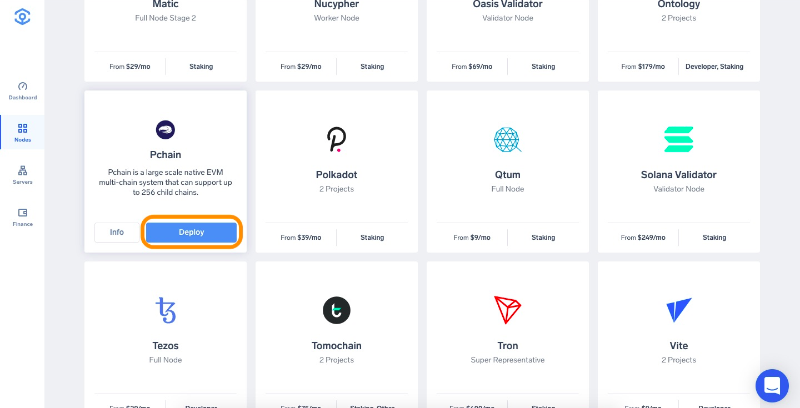
3. Now you are taken to the configuration page. The hardware configuration is already set at the optimal system requirements, but you are allowed to increase the specifications if you wish to do so.  
   
   The platform also recommends a cluster, which is usually the one that has the most freely available resources. In this particular case, the recommended cluster is UK cluster, but another cluster may be recommended depending on your location.
   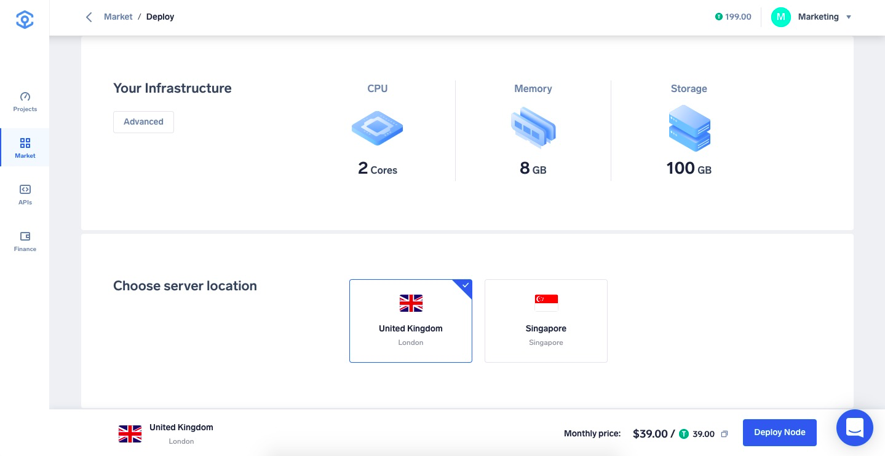
4. The application name is pre-filled. You can change it if you want. 
   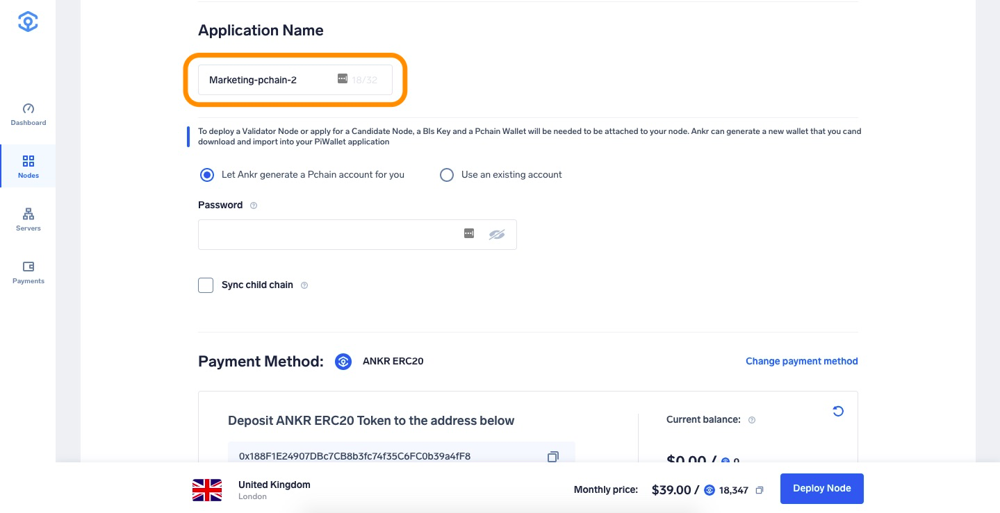
5. To deploy a Validator Node or apply for a Candidate Node, a Bls Key and a Pchain Wallet will be needed to be attached to your node. Ankr can generate a new wallet that you can download and import into your PiWallet application. Or you can use your own Pchain account.  
   Make your selection:
   1. Let Ankr generate a Pchain account for you - the newly generated account information will be available after the node is deployed. IMPORTANT: Ankr does not offer a password retrieval mechanism so please make sure to backup your password
   2. Upload your own Pchain account by providing your Keystore and password. For information on how to download and install your own PCHAIN wallet and to create an account please consult the official documentation [here](https://pchaindoc.readthedocs.io/en/latest/wallet/GettingStart.html).  
   By default only the main chain will be synced but you can explicitly choose to sync Pchain’s child chain at this stage by ticking the box.
   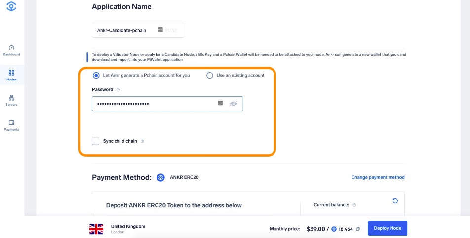
6. Select the Payment Method, choose the number of months you want to run the node by moving the slider. The price and discount will increase when you extend the run time.  
   If later on, you want to extend the node’s run time, you can add funds at any time
7. Click **Proceed to payment**.
   
8. Select payment method (USDT, ANKR erc20 or add your credit card).
9. For this tutorial we will choose **Add New Credit Card**.
     
10. Provide all requested information and click **Pay with Credit Card**.
    
11. If all information is provided successfully the deployment will of the node will start. 
12. If all information is provided successfully the deployment will of the node will start. 
   Pchain have 12 epochs per year, and in each epoch there are 4 phases. On the Information page you can see current Epoch period.
   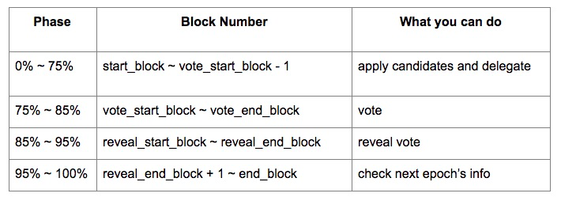
   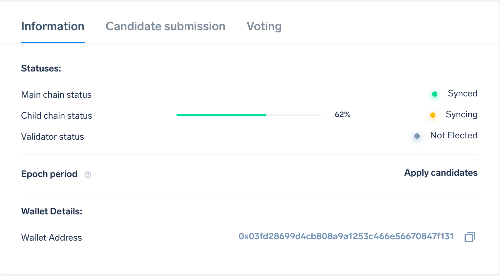
   :::note
   If you choose to let Ankr generate a Pchain account for you - the newly generated account information should be downloaded and securely stored using the Download button.
   
   :::
13. Switch to Candidate submission tab to apply for becoming a candidate.
   :::note
   To become a candidate you need to hold at least 10,005 PI for your candidate submission to be successful.
   :::
   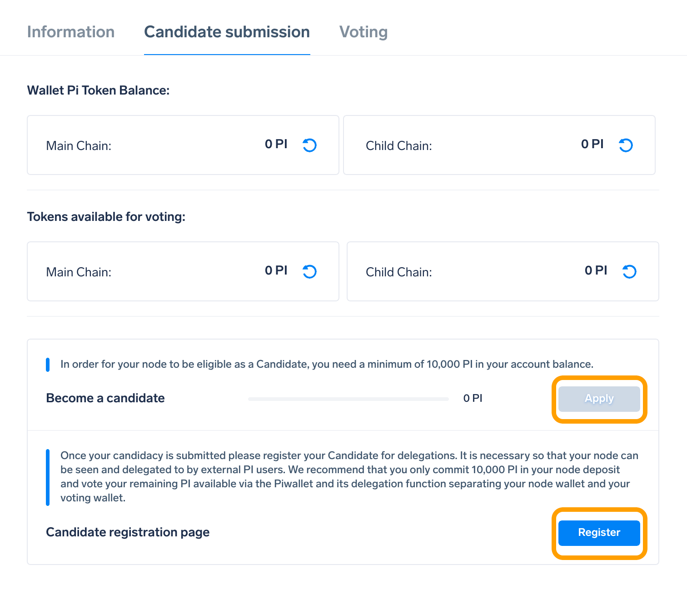
14. You can verify your account balance and Apply to become a candidate and provide the necessary information.
   :::info
   Explanation of Commission (delegators): 

   The Commission represents a percentage of all the rewards that the validator keeps for itself and is not available to split among the delegators. For example if you set a commission of 10 this means that 10% of the rewards are kept by the validator while 90% of the rewards will be split amongst delegators.
   :::
   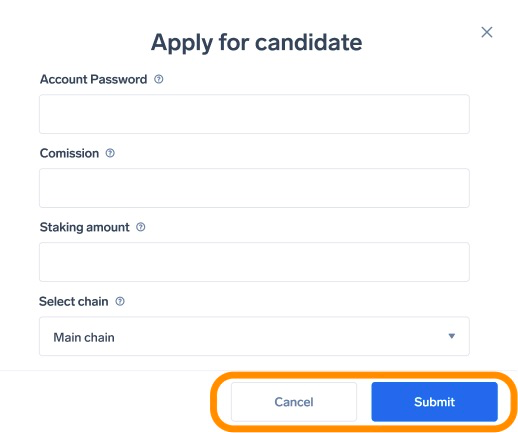  
   After you submit your application you need to register your node to receive delegation by clicking the register button which takes you to the PChain register node page.
15. In order to become a validator you need to switch to the Voting tab and Vote.
   :::note
   To become a validator you need to hold at least 100,000 PI in your own balance or have the same amount delegated to your candidate. Delegated amounts will be displayed in the Tokens Available for voting balance.
   :::
   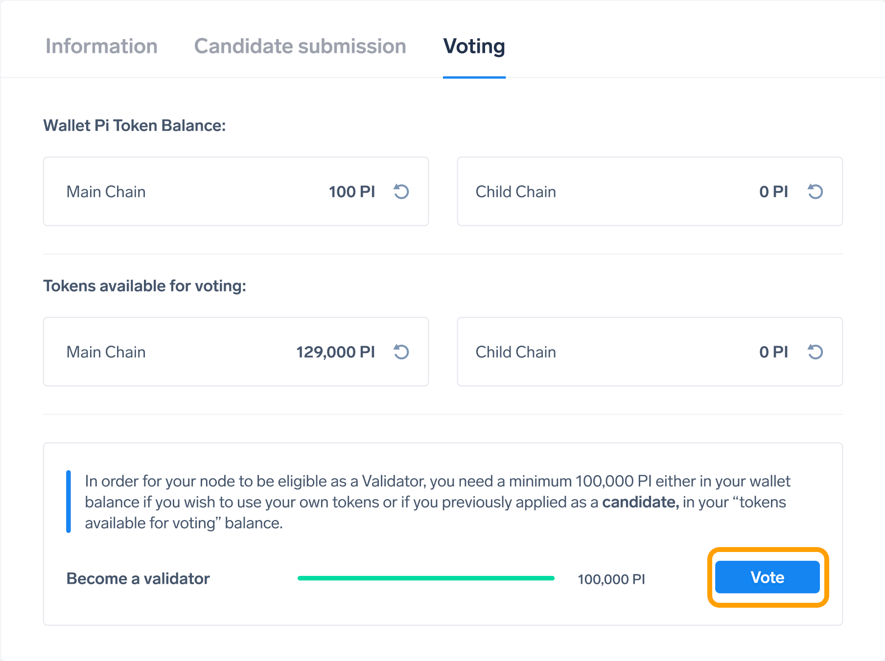
   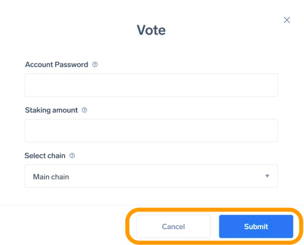
16. To reveal votes you can click **Reveal**.
       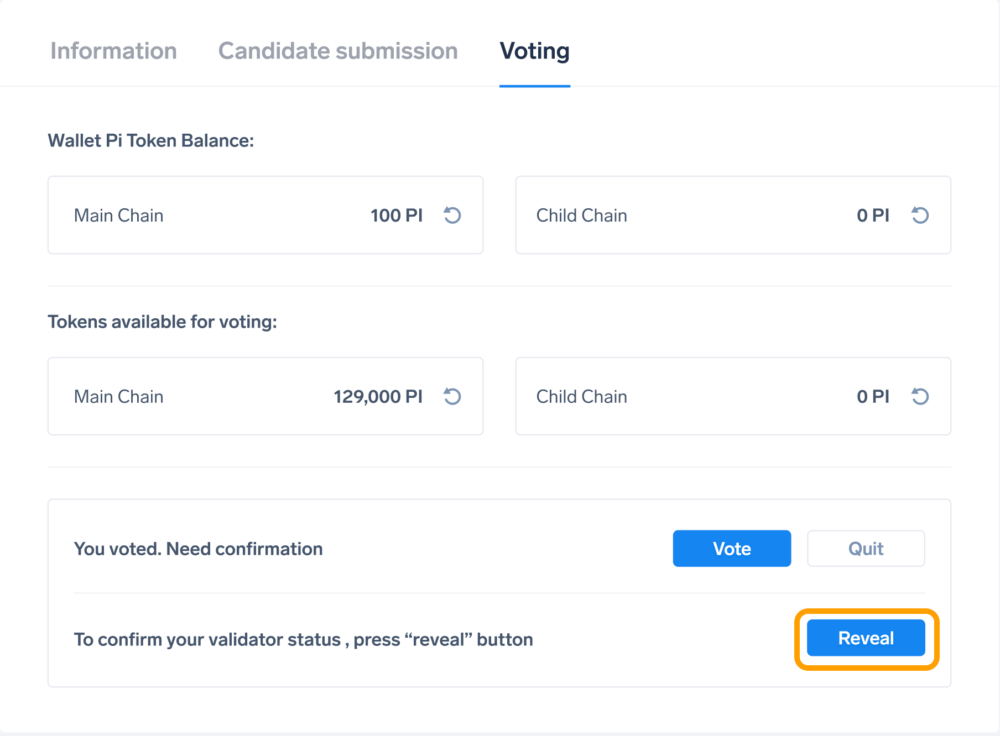
17. Enter your Account Password and click **Submit**.
   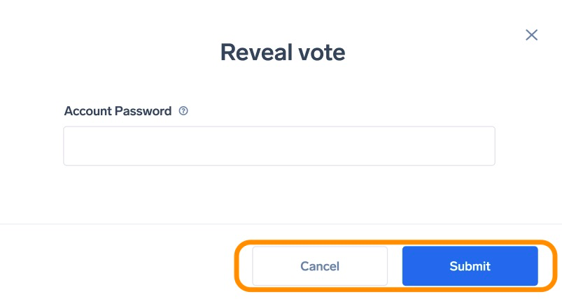

:::info
In case you require more detailed information about the operations you can perform with your node please consult the official documentation [here](https://pchaindoc.readthedocs.io/en/latest/introduction/introduction.html).
:::