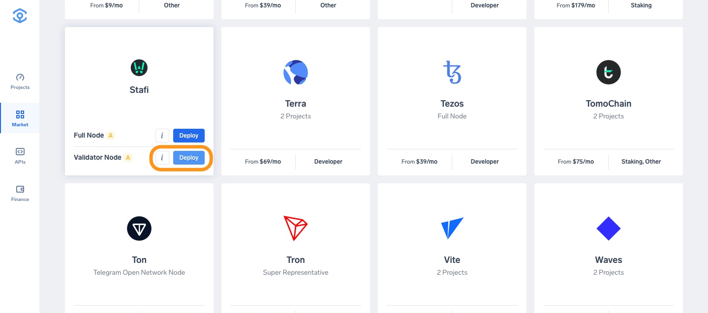
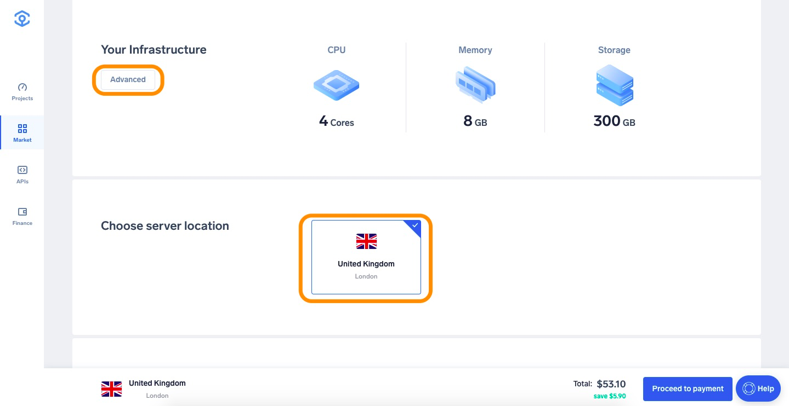
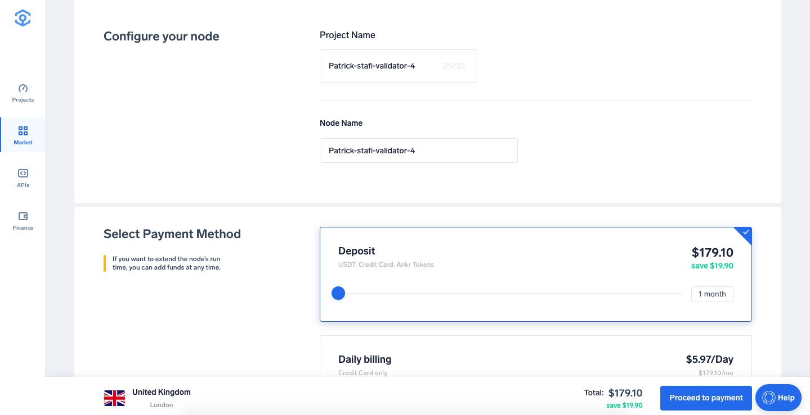
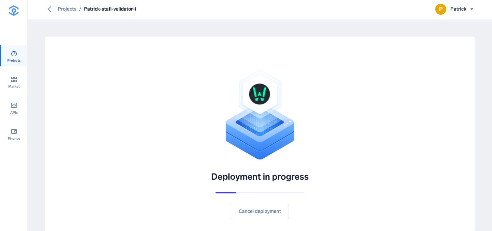
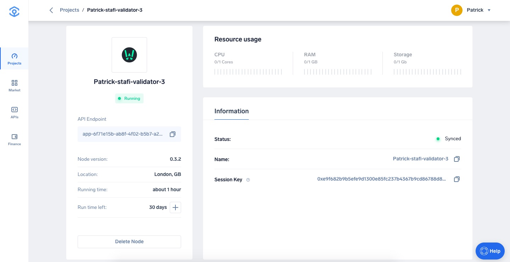
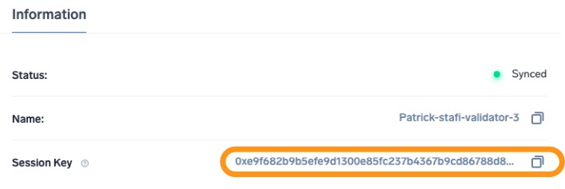
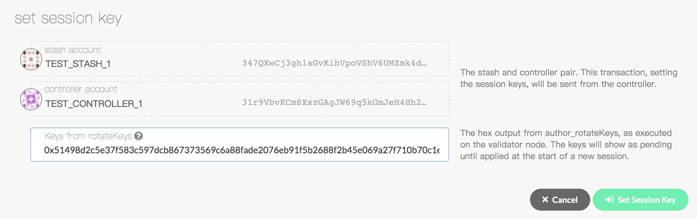

# Run a Stafi validator node

1. Head to [app.ankr.com](https://app.ankr.com/) to deploy and click the **Create Nww Project** button.
   
2. Search or scroll down to find the Stafi card, hover over it, and press **Deploy**.
   
3. Now you are taken to the configuration page. The hardware configuration is already set at the optimal system requirements, but you are allowed to increase the specifications if you wish to do so.  
   
   The platform also recommends a cluster, which is usually the one that has the most freely available resources. In this particular case, the recommended cluster is UK cluster, but another cluster may be recommended depending on your location.
   
4. The application name is pre-filled. You can change it if you want. 
   
5. Choose a name for your node.
7. Select the Payment Method, choose the number of months you want to run the node by moving the slider. The price and discount will increase when you extend the run time.  
   If later on, you want to extend the node’s run time, you can add funds at any time
8. Click **Proceed to payment**.
   
9. Select payment method (USDT, ANKR erc20 or add your credit card).
10. For this tutorial we will choose **Add New Credit Card**.
      
11. Provide all requested information and click **Pay with Credit Card**.
   
12. If all information is provided successfully the deployment will of the node will start. 
   
13. Once node is deployed and fully synced, you are redirected to the node details page.
   
14. Now that your node is up and running, [apply for a validator status](https://docs.stafi.io/). Namely,
    1. When your node is fully synced, you can set the session keys. Your node is running in validator mode.
    2. You need to tell the chain your Session keys . This is what associates your validator with your Controller account.
    3. On [Stafi Portal](https://apps.stafi.io/#/explorer), go to **Staking** > **Account Actions**, and click "Set Session Key" on the bonding account. Copy the Session Key from the Ankr app in the field and click "Set Session Key".
       
       
    4. Now you are reading for validating.
       Verify that your node is live and synchronized, head to Telemetry in Stafi Portal and find your node. Note that this will show all nodes on the Stafi network, which is why it is important to select a unique name in the Ankr app.  
    5. If everything looks good, go ahead and click on "Validate" in Stafi-apps. Payment preferences - You can specify the percentage of the rewards that will get paid to you. The remaining will be split among your nominators.  
       If you go to the "Staking" tab, you will see a list of active validators currently running on the network. At the top of the page, it shows the number of validator slots that are available as well as the number of nodes that have signaled their intention to be a validator. You can go to the "Waiting" tab to double check to see whether your node is listed there.  
       The validator set is refreshed every era. In the next era, if there is a slot available and your node is selected to join the validator set, your node will become an active validator. Until then, it will remain in the waiting queue. If your validator is not selected to become part of the validator set, it will remain in the waiting queue until it is. There is no need to re-start if you are not selected for the validator set in a particular era. However, it may be necessary to increase the number of FIS tokens staked or seek out nominators for your validator in order to join the validator set.  
       Congratulations! If you have followed all of these steps, and been selected to be a part of the validator set, you are now running a Stafi validator and start earning rewards!