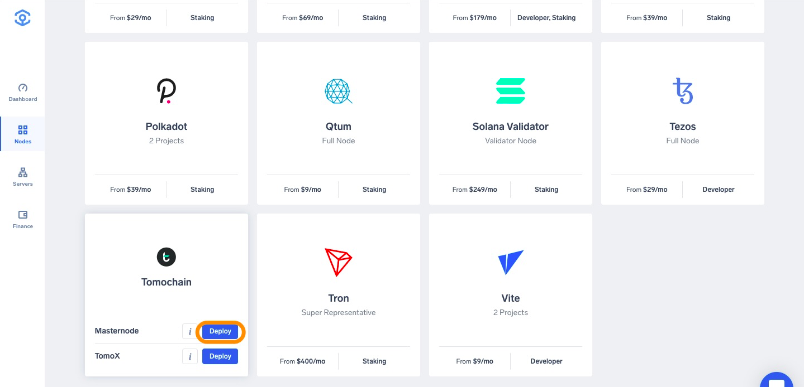
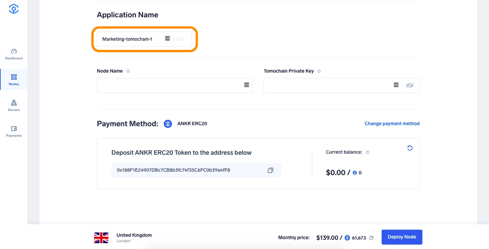

# Run a TomoChain master node

1. Head to [app.ankr.com](https://app.ankr.com/) to deploy and click the **Create Nww Project** button.
   
2. Search or scroll down to find the TomoChain card, hover over it, and press **Deploy** under TomoX.
   
3. Now you are taken to the configuration page. The hardware configuration is already set at the optimal system requirements, but you are allowed to increase the specifications if you wish to do so.  
   
   The platform also recommends a cluster, which is usually the one that has the most freely available resources. In this particular case, the recommended cluster is UK cluster, but another cluster may be recommended depending on your location.
   
4. The application name is pre-filled. You can change it if you want. 
   
5. Choose a name for your node.
6. Provide your Tomochain Private Key. For security measures, we advise using a new wallet. In order to obtain a new TomoChain Wallet, you can follow [this guide](https://docs.tomochain.com/general/how-to-connect-to-tomochain-network/tomowallet).
   
9. Select payment method (USDT, ANKR erc20 or add your credit card).
10. For this tutorial we will choose **Add New Credit Card**.
      
11. Provide all requested information and click **Pay with Credit Card**.
   
12. If all information is provided successfully the deployment will of the node will start. 
13. Your TomoChain Masternode is now in the process of being deployed, this process can take approximately 2-3 hours until completion.
14. Once node is fully synced you can [apply to become a master node candidate](https://docs.tomochain.com/masternode-and-dex/masternode/apply-your-node).
