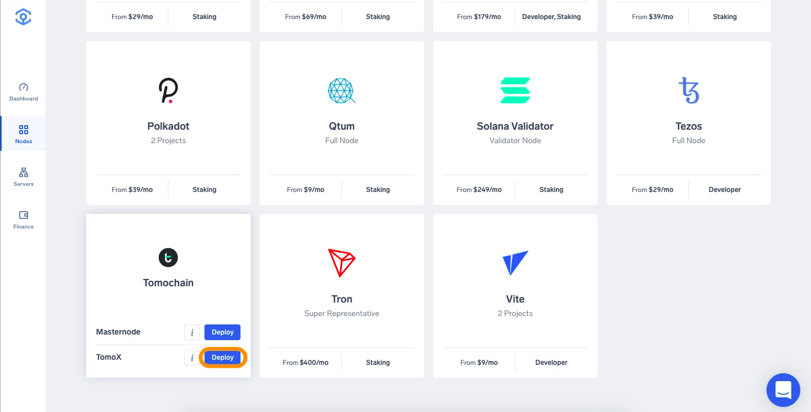
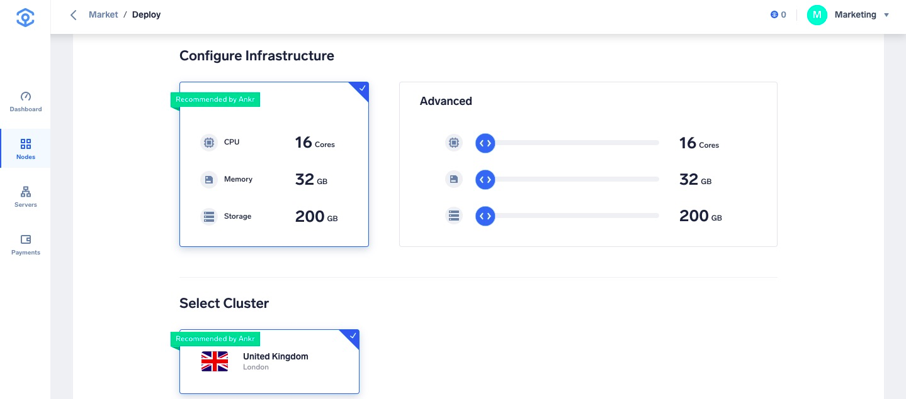
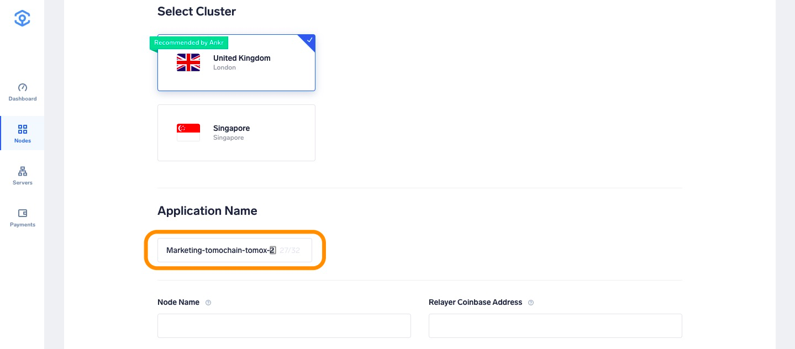
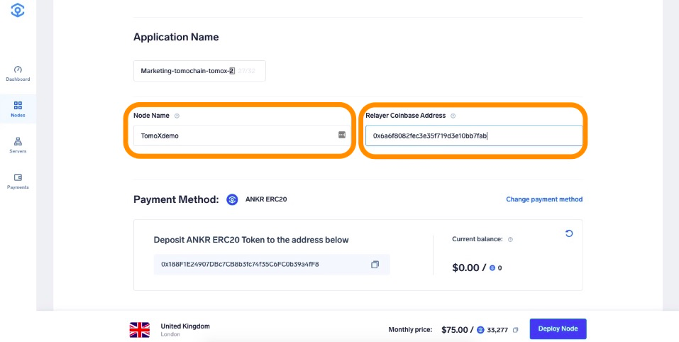
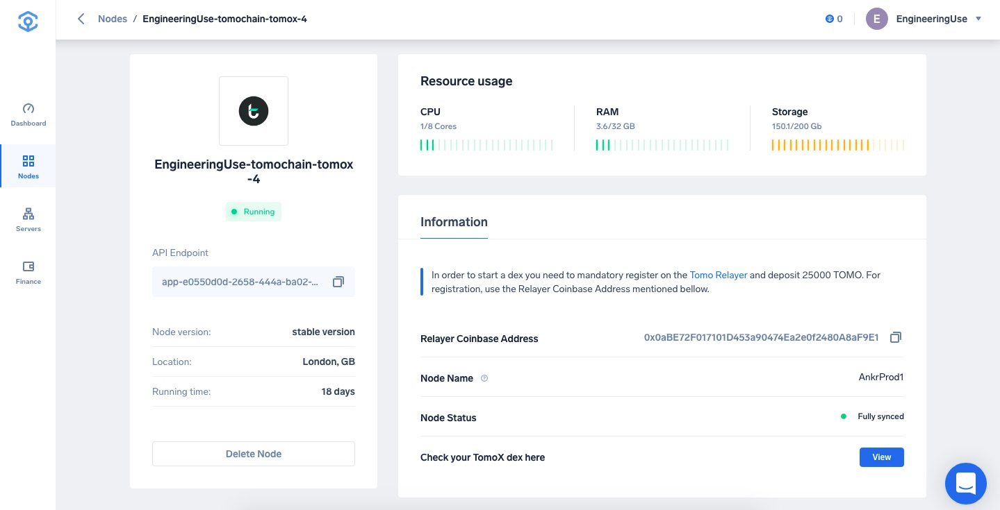
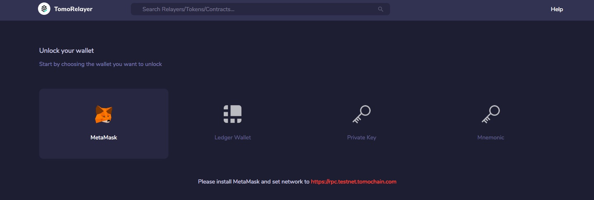
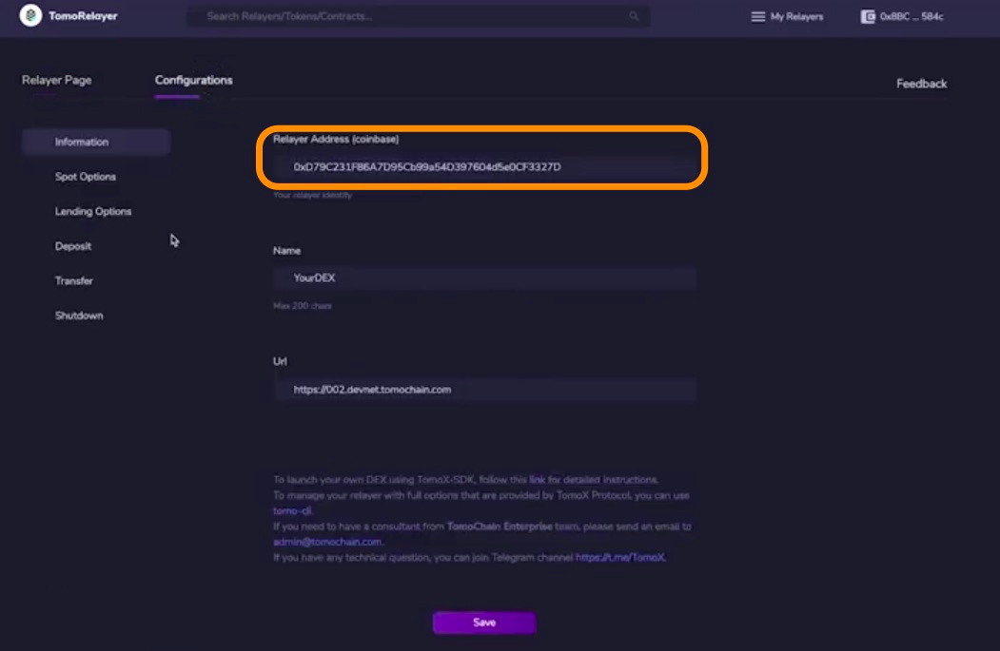
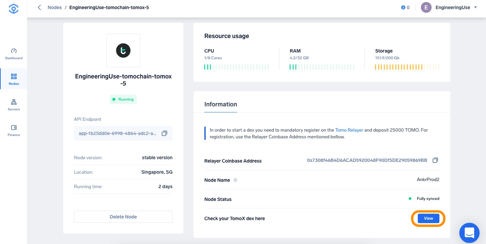
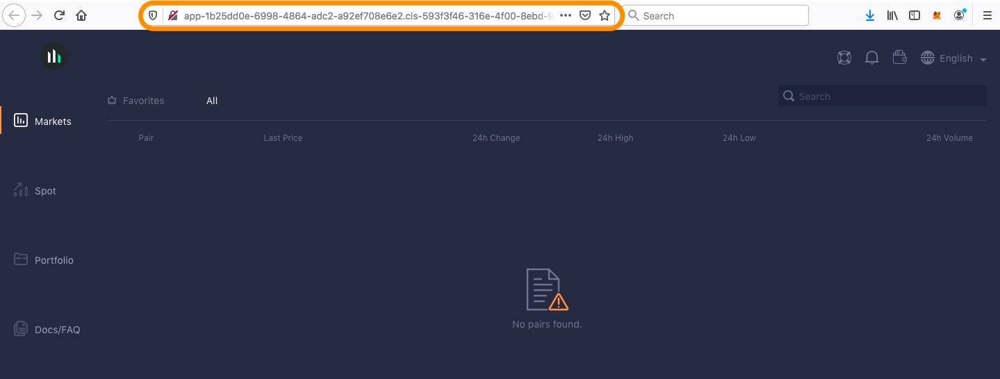
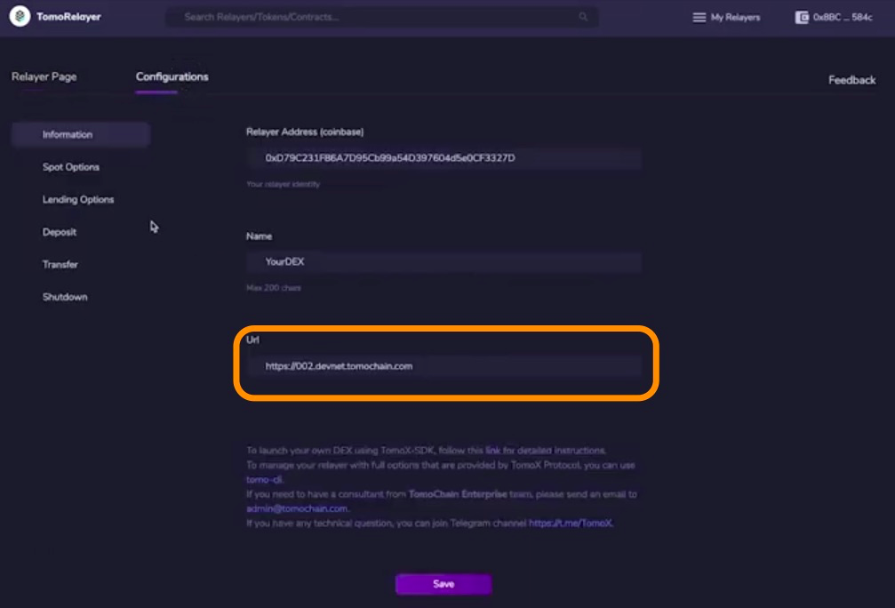

# Run a TomoX Node on Ankr

1. Head to [app.ankr.com](https://app.ankr.com/) to deploy and click the **Create Nww Project** button.
   
2. Search or scroll down to find the TomoChain card, hover over it, and press **Deploy** under TomoX.
   
3. Now you are taken to the configuration page. The hardware configuration is already set at the optimal system requirements, but you are allowed to increase the specifications if you wish to do so.  
   
   The platform also recommends a cluster, which is usually the one that has the most freely available resources. In this particular case, the recommended cluster is UK cluster, but another cluster may be recommended depending on your location.
   
4. The application name is pre-filled. You can change it if you want. 
   
5. Choose a name for your node. 
   
6. For security reasons we advise to set up a new Tomochain wallet using [this guide](https://docs.tomochain.com/general/how-to-connect-to-tomochain-network/tomowallet). Insert the public address of TomoWallet into the Relayer Coinbase Address field from the Ankr App.
   
7. Select the Payment Method, choose the number of months you want to run the node by moving the slider. The price and discount will increase when you extend the run time.  
   If later on, you want to extend the node’s run time, you can add funds at any time
8. Click **Proceed to payment**.
   
9. Select payment method (USDT, ANKR erc20 or add your credit card).
10. For this tutorial we will choose **Add New Credit Card**.
      
11. Provide all requested information and click **Pay with Credit Card**.
   
12. If all information is provided successfully the deployment will of the node will start. Your TomoX Node is now in the process of being deployed, this process can take approximately 2-3 hours until completion.
13. After deployment is completed you will be directed to the Node details page, where you can check the status and details of your node.
   
14. After the node has fully synced we can register our DEX, go to [Tomochain Relayer](https://relayer.testnet.tomochain.com/login).
   :::note
   Please note: there is a minimum amount of 25000 TOMO required to be eligible to start your own DEX.
   :::
   
15. For more information about registration process watch [Register an Exchange with TomoRelayer](https://www.youtube.com/watch?time_continue=74&v=9aSqUQjzNFg&feature=emb_logo).
16. To see if your Coinbase Relayer Address was successfully registered, you can use the [following link](https://scan.tomochain.com/relayers) for validation.
17. After registration, the Coinbase Relayer Address needs to be added.
   
18. The ANKR DEX URL should be added to the Relayer Configurations page. In order to obtain it, go to your Tomochain TomoX node on Ankr. Click on the **View** button.
   
19. Copy the URL of the DEX.
   
20. Copy URL in the Relayer Configuration.
   

Everything is set up now. In case you want to have your own more friendly URL you can register a new domain name and forward it to the URL of the your DEX.