# Vite supernode

In this tutorial, we will show you how to deploy a Vite Supernode on Ankr and stake 1,000,000 VITE tokens.

We will also guide you on how to move an existing Vite Supernode from your current provider to the Ankr cloud.

## Deploy a Vite Supernode on Ankr
1. Head to [app.ankr.com](http://app.ankr.com/) to deploy and click the **Deploy A Node** button.
   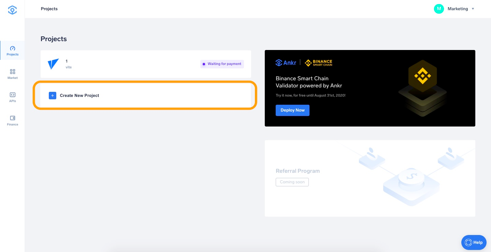
2. Scroll down to find the Vite card, hover over it and press **Deploy** on Vite Supernode.
   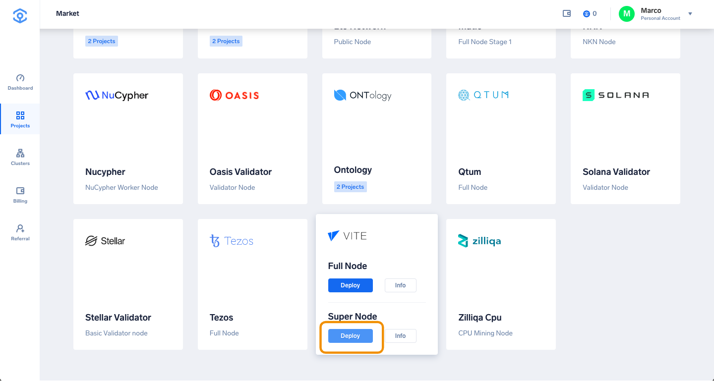
3. The hardware configuration is already set at the optimal system requirements. 

   The platform also recommends a cluster, which is usually the one that has the most freely available resources. 
   In this particular case, the recommended cluster is UK cluster, but another cluster may be recommended depending on your location.
   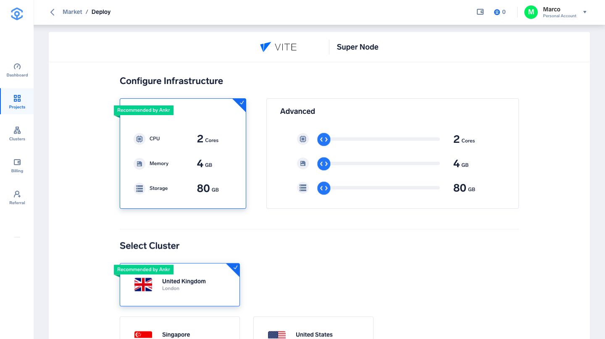
4. Select the Payment Method, choose the number of months you want to run the node by moving the slider. The price and discount will increase when you extend the run time.

     
   If later on, you want to extend the node’s run time, you can add funds at any time.
5. Click **Proceed to payment**.
   
6. Select payment method (USDT, ANKR erc20 or add your credit card).
7. For this tutorial we will choose **Add New Credit Card**.
   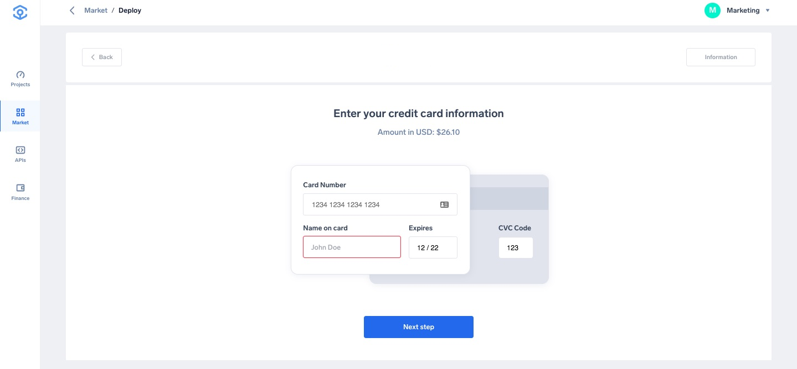
8. Provide all requested information and click **Pay with Credit Card**.
   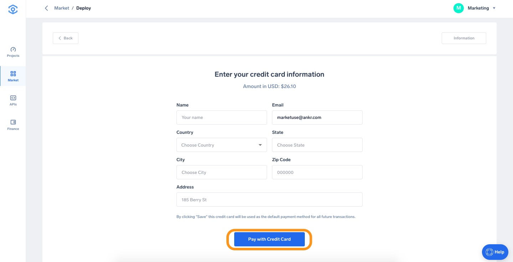
9. If all information is provided successfully the deployment will of the node will start. Deployment in progress will take about 5 minutes.
   
     
   Your Vite Supernode will now start deploying.
   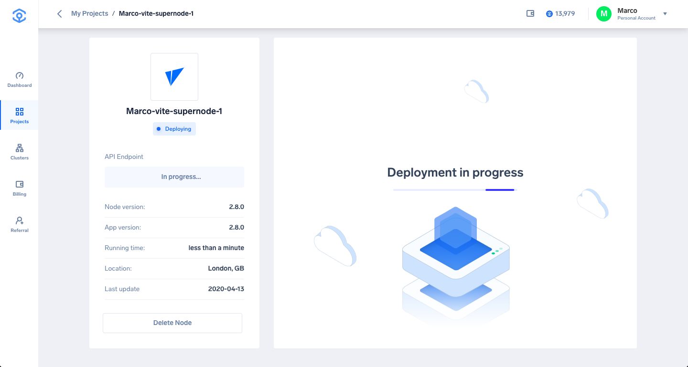

## Create a Vite wallet and stake 1,000,000 VITE tokens
In order to register a Vite Supernode and be eligible to become a Snapshot Block Producer (SBP), you need to stake 1.000.000 VITE tokens.

1. First, download the official Vite Wallet for Android or IOS here and deposit 1,000,000 VITE tokens on it.
You can buy VITE tokens on various exchanges, such as [Binance](https://www.binance.com/en/trade/pro/VITE_USDT).
   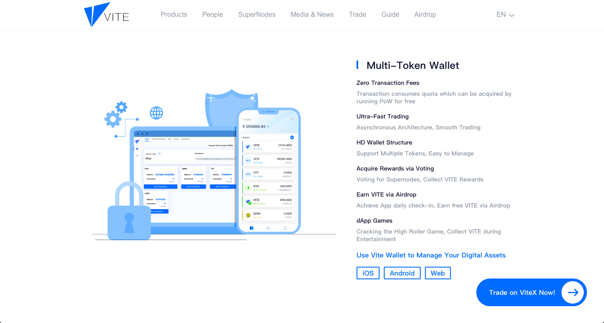
2. Once the 1,000,000 VITE tokens have arrived in your wallet, proceed with connecting the Wallet by opening the [Vite Web Application](https://wallet.vite.net/startLogin) in Google Chrome browser. Choose **ViteConnect** and scan the QR code with your mobile Vite Wallet.
   
   
     
   After scanning the QR code you should end up on the following page in your browser.
   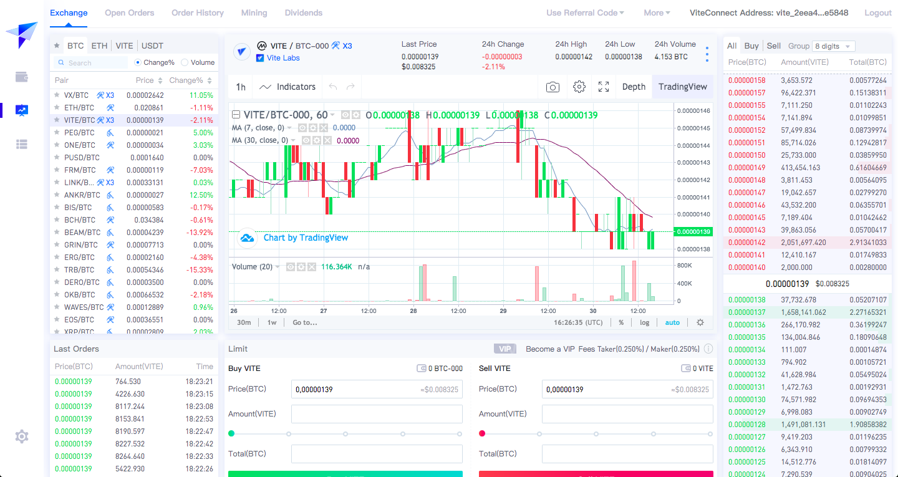

## Stake your VITE tokens to register as a Supernode
The next step is to stake the 1,000,000 VITE tokens in the [Vite Web Application](https://wallet.vite.net/startLogin).

1. Click the button shown on the screenshot below, or access via [this link](https://wallet.vite.net/walletQuota).
   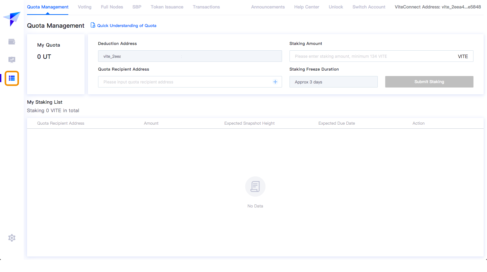
2. Open the **SBP** tab and enter a **Node Name**.
   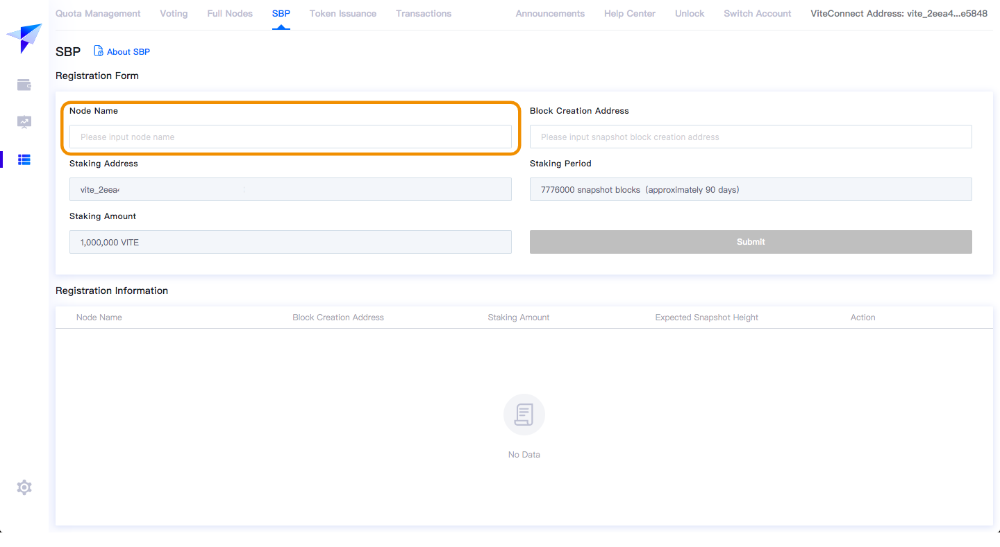
3. Copy the **Block Creation Address** from your Vite Supernode. You can find the address in by opening your Vite Supernode in the Ankr application.
   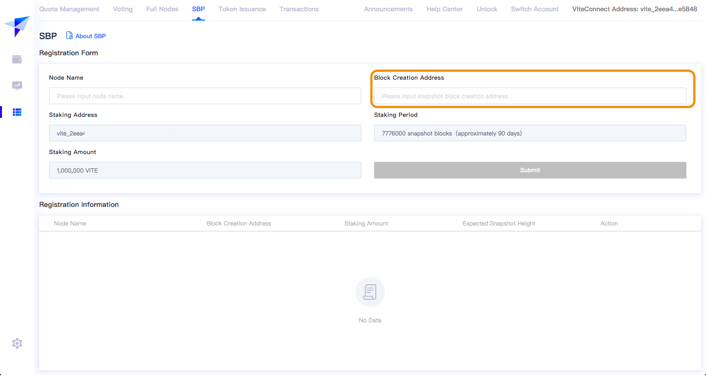
   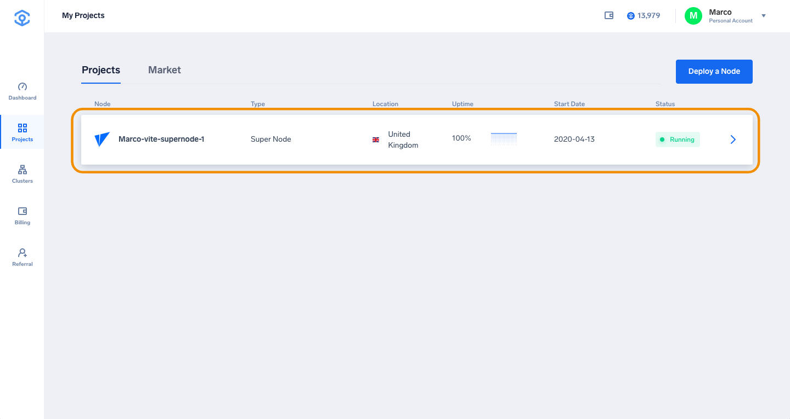
   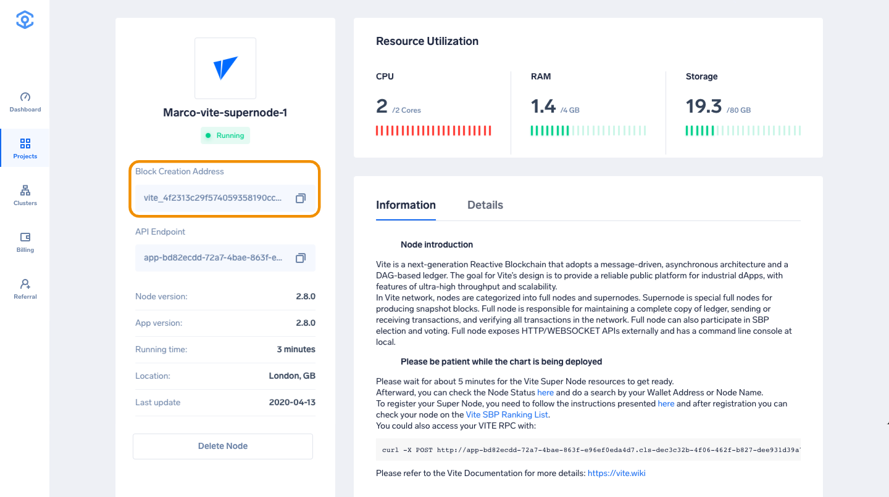
4. Once the form is completed with the Node Name and Block Creation Address, you can submit your Supernode application.
   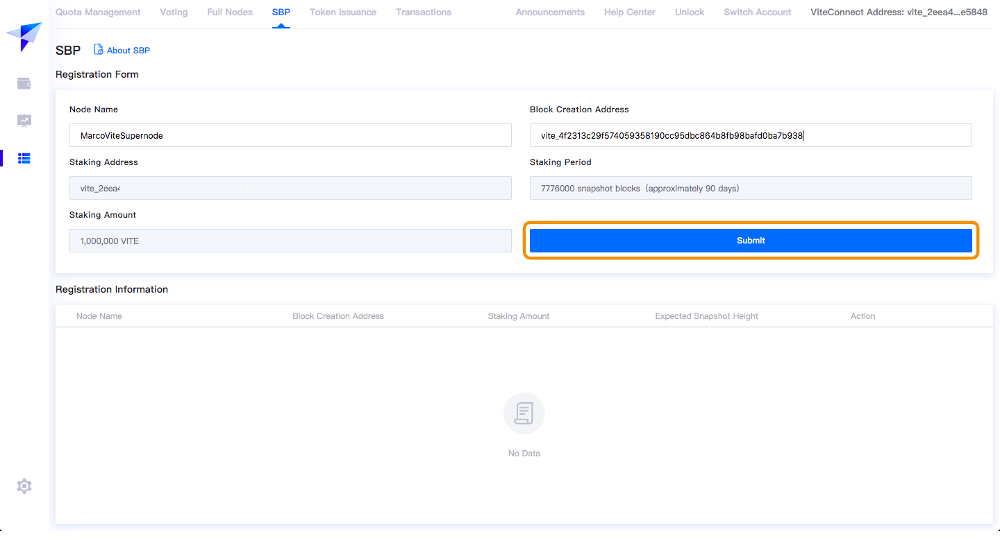
5. The next step is to confirm the transaction in your mobile Vite wallet.
   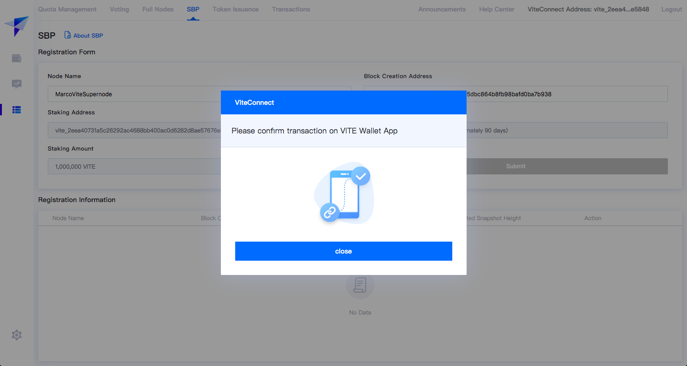 

   Once confirmed, your Vite Supernode successfully registered and ready to receive rewards. Check your node on the [Vite SBP Ranking List](https://vitescan.io/sbps).

     
   Please note that you will start receiving Supernode rewards after the node has been fully synced, which is expected to take up to 5 days.

## Move your existing Vite Supernode to Ankr

Moving your existing Vite Supernode to Ankr will have some interesting benefits:

* Hosting fee of only 29 USD per month
* 1 month of free hosting
* Receive your share of Ankr’s Supernode rewards
* Lower latency and more stability
* Pay in cryptocurrency (ANKR or USDT)

It is really easy to move your current Vite Supernode to Ankr. Please read the guide below.

The easiest way to switch a registered Vite Supernode to Ankr is by cancelling the registration of your current Supernode and registering a new Supernode on the Ankr platform.

To cancel registration for your current Supernode, please follow the steps below.

1. Open the [Vite Web Application](https://wallet.vite.net/startLogin) and scan the QR code on the ViteConnect tab with the mobile Vite wallet.
   
2. Navigate to the SBP page and click the button highlighted on the screenshot below, or access directly [this link](https://wallet.vite.net/walletSBP).
   
3. Click the **Cancel Registration button**, which will appear in the Registration Information box, in the Action column.
   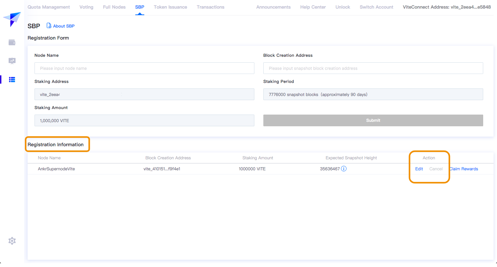
4. Now you can proceed with deploying the Vite Supernode by following the tutorial above.

