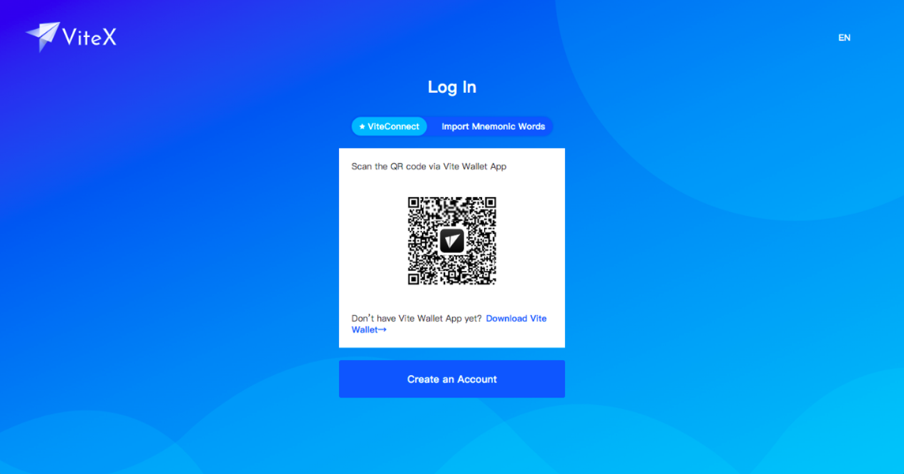
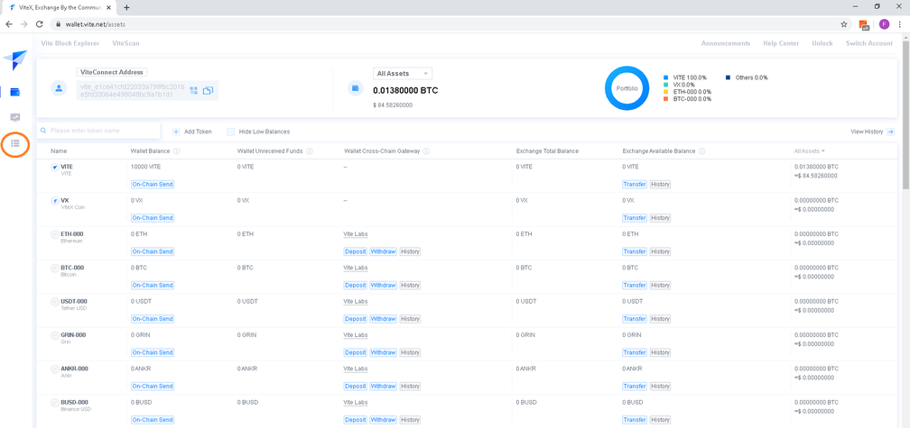
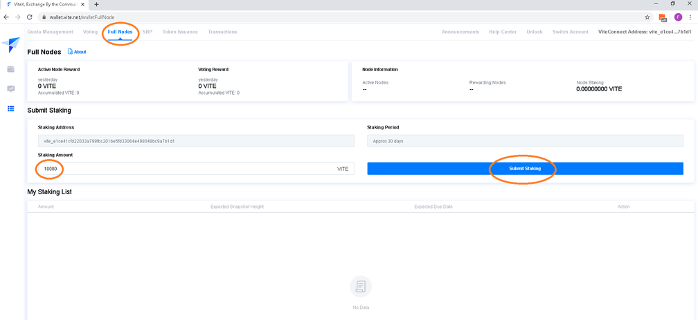
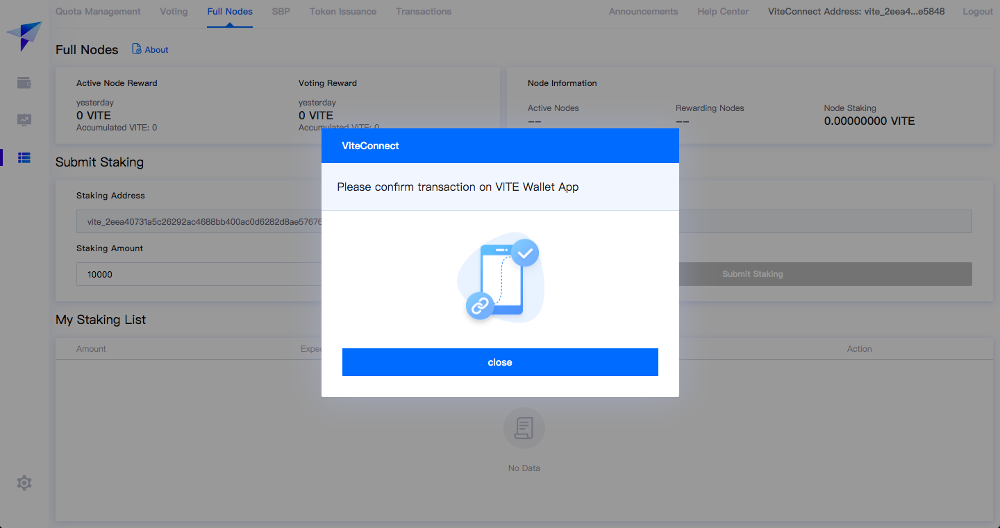
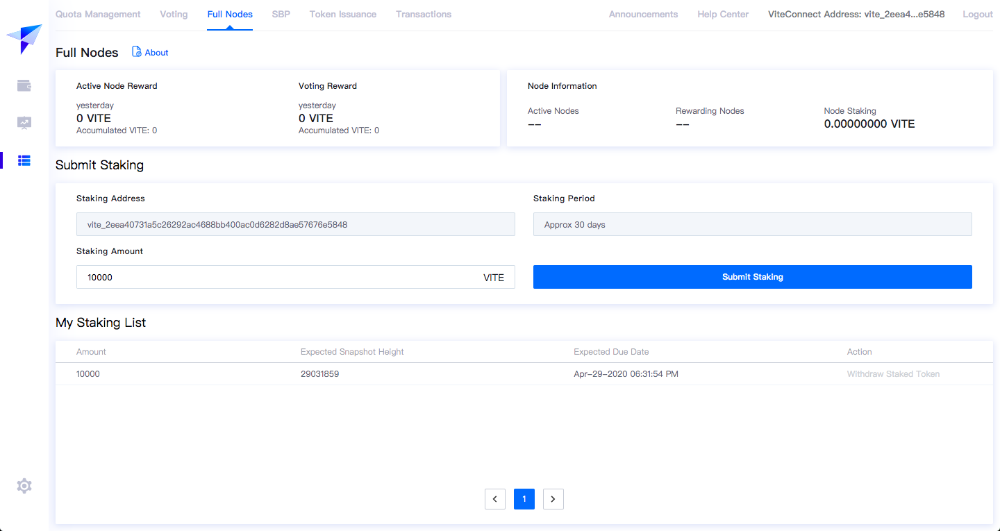
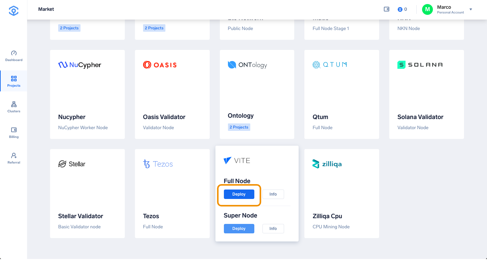
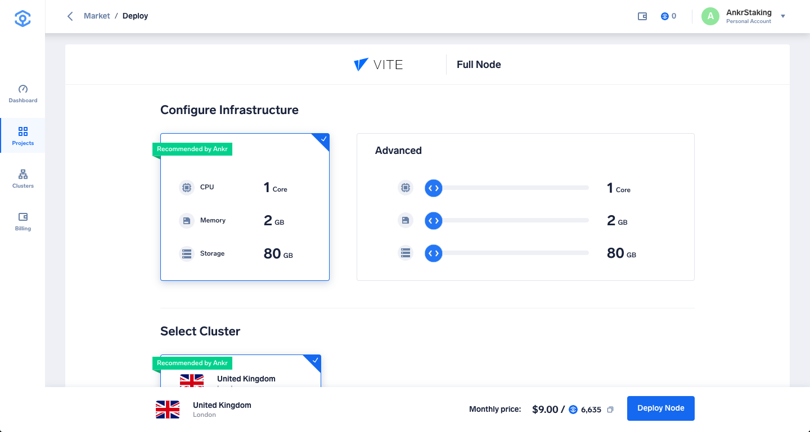
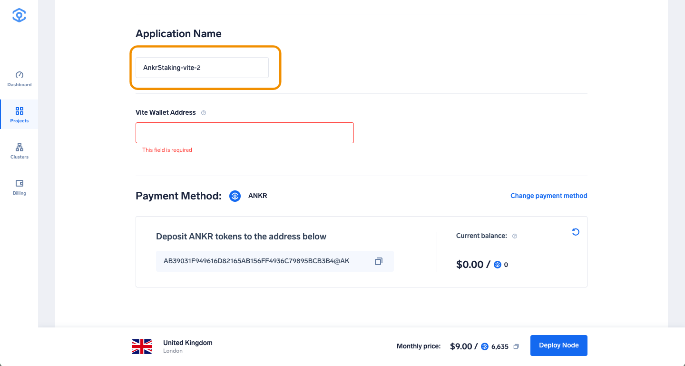
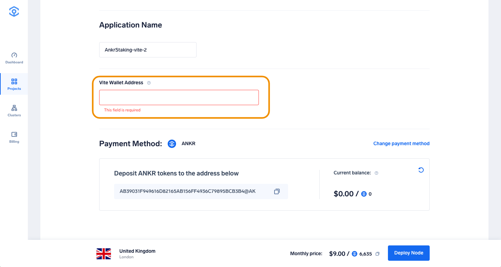
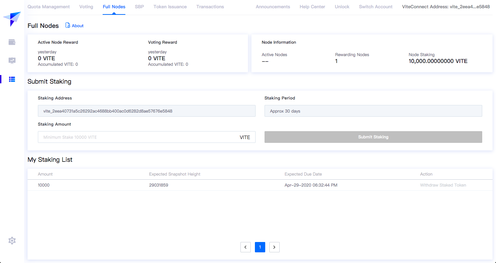

# Vite full node

In this tutorial, we will show you how to run a Vite Full node and stake 10,000 VITE tokens in order to earn Full node staking rewards.

## Create a Vite Wallet
1. First, download the official Vite Wallet for Android or IOS here and deposit 10,000 VITE tokens on it.
You can buy VITE tokens on various exchanges, such as [Binance](https://www.binance.com/en/trade/pro/VITE_USDT).
    
2. Once the 10,000 VITE tokens have arrived in the wallet, proceed with connecting the Wallet by opening the [Vite Web Application](https://wallet.vite.net/startLogin) in Google Chrome browser. Choose ViteConnect and scan the QR code with your mobile Vite Wallet.
     
    
    After scanning the QR code you should end up on the following page in your browser:
     

## Stake your VITE tokens
The next step is to stake the 10,000 VITE tokens inside the [Vite Web Application](https://wallet.vite.net/startLogin).
1. Click the button shown on the screenshot below, or access directly [this link](https://wallet.vite.net/walletQuota):
     
2. Click on **Full Nodes** tab and enter the number of VITE tokens you would like to stake (this must be a minimum of 10,000) and click **Submit Staking** to proceed.
        
3. The next step is to **confirm** the transaction in your mobile Vite wallet.
    
    After approval in the mobile Vite Wallet App, the confirmation should look like this:
    
    Congratulations, you have successfully staked 10,000 VITE tokens and are now set to receive rewards on your Vite Full node!

## Set up the Vite Full node on Ankr
To be eligible for receiving staking rewards you need to run a Vite Full node. The easiest way to do this is on the Ankr cloud.
1. Head to [app.ankr.com](http://app.ankr.com/) to deploy and click the **Deploy A Node** button.
    
2. Scroll down to find the Vite card, hover over it and press **Deploy** on **Vite Full Node**.
    
3. The hardware configuration is already set at the optimal system requirements. The platform also recommends a cluster, which is usually the one that has the most freely available resources. In this particular case, the recommended cluster is UK cluster, but another cluster may be recommended depending on your location.
    
    The application name is pre-filled. You can change it if you want.
    
4. Now enter your staking address.
    
    You can find your staking address [here](https://wallet.vite.net/walletFullNode).
    
    Please make sure that the address from which you have staked is the same with the address you insert when creating a Vite Full node
5. Select the Payment Method, choose the number of months you want to run the node by moving the slider. The price and discount will increase when you extend the run time. 
   If later on, you want to extend the node’s run time, you can add funds at any time
6. Click **Proceed to payment**.
    
7. Select payment method (USDT, ANKR erc20 or add your credit card).
8. For this tutorial we will choose **Add New Credit Card**.
    
9. Provide all requested information and click **Pay with Credit Card**.
    
10. If all information is provided successfully the deployment will of the node will start.
11. Click **Deploy** and your Vite Full Node will start deploying!

    Wait for about 5 minutes for the Vite Full node resources to get ready.