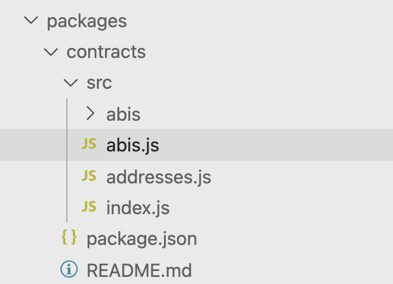
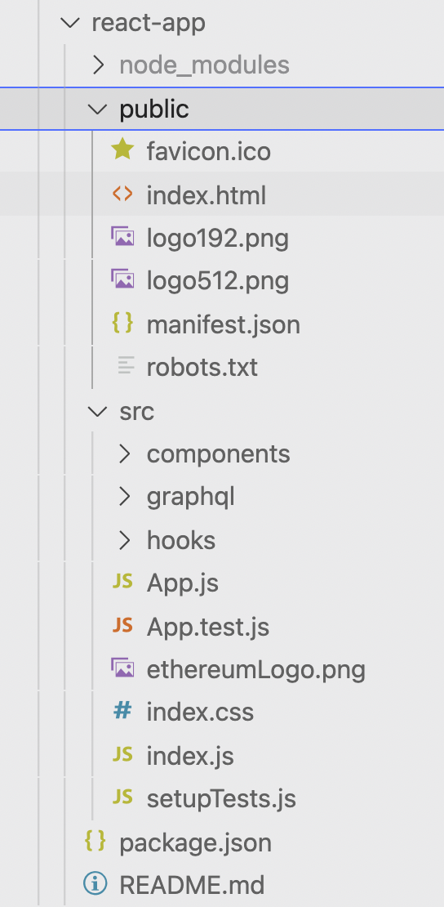
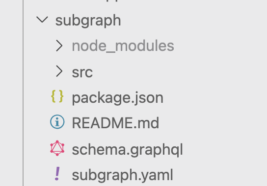
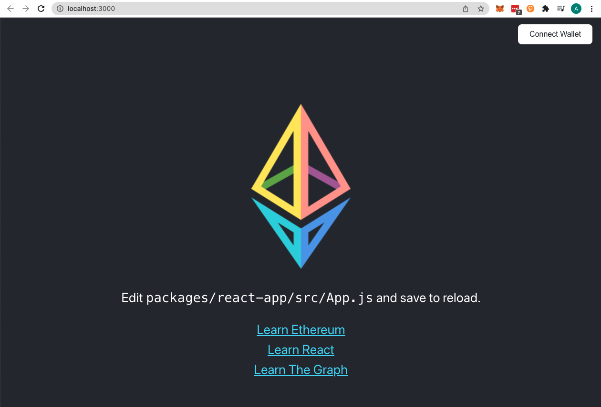
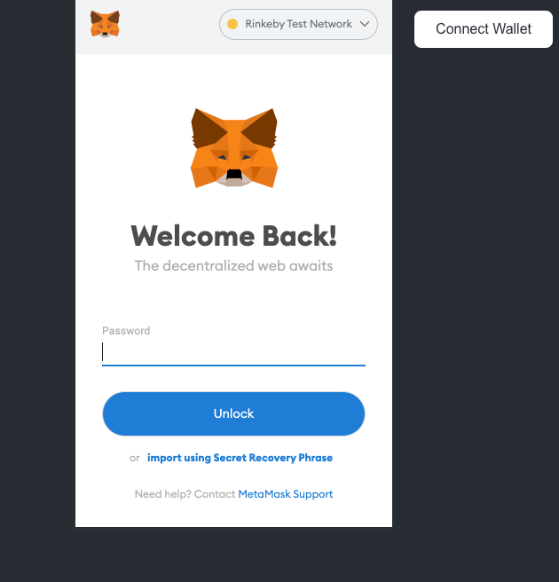
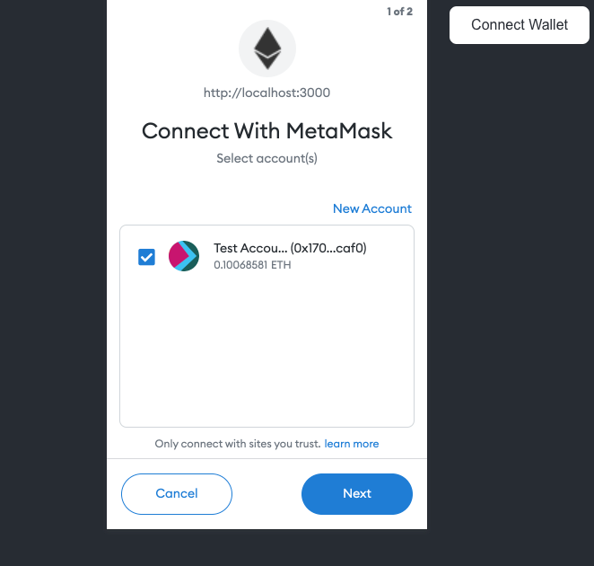
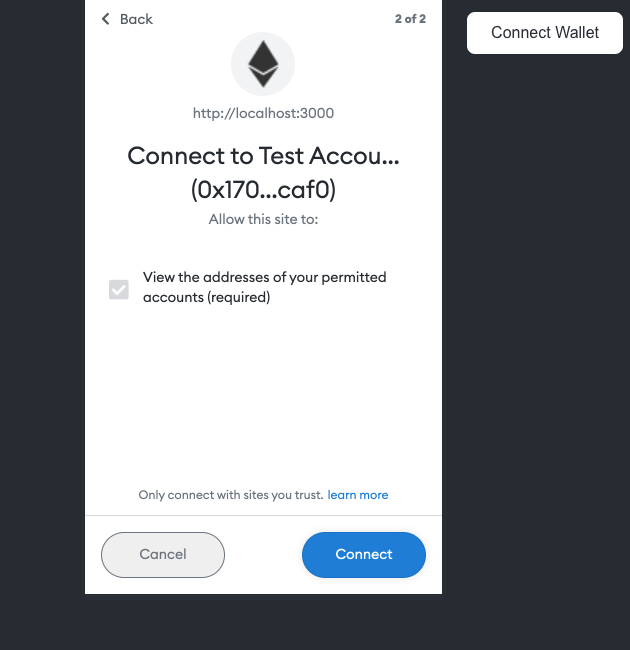
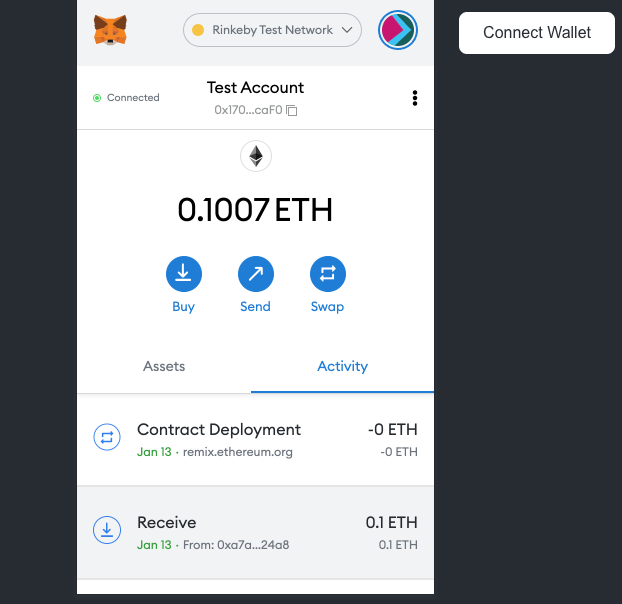
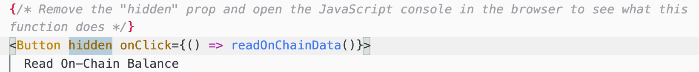

# Create an easy dApp frontend with create-eth-app

**By Anita Diamond**
<br/>

`create-eth-app` makes it super easy to spin up front ends for dApps with. `create-eth-app` is a fork of `create-react-app` and works on macOS, Windows, and Linux. It is a swift alternative to writing your own code with web3 libraries or Truffle Suite Box for React. It comes bundled with [ethers.js](https://docs.ethers.io/) and Web3Modal to connect with wallets as well as examples on how to interface with Smart Contracts. 

`create-eth-app` is a Node.js package. You can find its repo here : [create-eth-app repo](https://github.com/paulrberg/create-eth-app).


## 00 - Before you start

Ensure you have the following dependencies installed. 

1 Node.js >= version 14


```
$ node -v
v14.16.1

```

2 Node Package Manager (NPM) installed \


```
$ npm -v
6.14.12

```


3 Yarn (to enable Yarn Workspaces) \


```
$ yarn --version
1.22.11
```


## 01 - Get started


### Install create-eth-app

In Terminal/CLI


```
yarn create eth-app my-eth-app
```


This creates a basic blockchain project. Open the project in your code editor e.g. VS Code.


## 02 - View folders


```
cd my-eth-app
```


There are 3 main folders


- **CONTRACTS FOLDER**





This folder contains information to connect smart contracts like ABIs and the Contract Addresses. The ABI is an interface allowing you to interact with the smart contract deployed on the Ethereum network.

- **REACT APP FOLDER**





This folder is a fork of** create-react-app **and contains all the react front-end code and two key libraries -  
**Ethers.js** to connect the app to EVM compatible blockchains and **Web3modal**.  Web3modal provides support for injected providers e.g. MetaMask and WalletConnect

- **SUBGRAPH FOLDER** 




This folder contains code to query smart contracts in graphql by using the graph protocol.  You can also perform advanced queries and use sub-graphs by others. 


## 03 - Spin up the App with default settings


```
yarn react-app:start

Compiled successfully!

You can now view @project/react-app in the browser.

  Local:            http://localhost:3000
  On Your Network:  http://192.168.1.8:3000

Note that the development build is not optimized.
To create a production build, use npm run build.
```




## 04 - Connect wallet

Out of the box we can connect a wallet to our app. You can use MetaMask or WalletConnect. 

(To install MetaMask, open[ metamask.io ](https://metamask.io/) and click on ‘**Download’**. BE SURE TO KEEP YOUR SECRET SAFE. )

Click **_‘Connect Wallet_**’ in your app and a pop up modal will appear.


1. Enter your MetaMask password
2. Select an account to connect with your App. (Test Account)
3. Click **_‘Connect’_** 
4. Connection is indicated in your wallet
5. The App now states your wallet address.










## 05 - Modify app.js

You can change settings and code in App.js to suit your needs. 


1. Open the** App.js** file and follow the instructions to remove the hidden prop. 



2. With the Console open in the browser, click the now visible button “**_Read On-Chain Balance_**” and see what happens.

You can view the token balance. 


## 06 - Add templates

```create-eth-app``` comes with a range of decentralized finance templates pre-filled with contract ABIs, addresses and subgraphs. Checkout the [templates](https://github.com/paulrberg/create-eth-app/blob/develop/templates) folder. 

You can choose from [Aave](https://github.com/paulrberg/create-eth-app/tree/develop/templates/react/aave),[Balancer](https://github.com/paulrberg/create-eth-app/tree/develop/templates/react/balancer),[Compound](https://github.com/paulrberg/create-eth-app/tree/develop/templates/react/compound), [Kyber](https://github.com/paulrberg/create-eth-app/tree/develop/templates/react/kyber), [Maker](https://github.com/paulrberg/create-eth-app/tree/develop/templates/react/maker),[Sablier](https://github.com/paulrberg/create-eth-app/tree/develop/templates/react/sablier-v1)[Synthetix](https://github.com/paulrberg/create-eth-app/tree/develop/templates/react/synthetix), [Uniswap-v1](https://github.com/paulrberg/create-eth-app/tree/develop/templates/react/uniswap-v1) and [Uniswap-v2](https://github.com/paulrberg/create-eth-app/tree/develop/templates/react/uniswap-v2)

These come in ``react`` and ```vue``` frameworks. Select your preferred framework and see what templates are available.

Add the template as follows:

```bash
yarn create eth-app my-eth-app --template compound
```