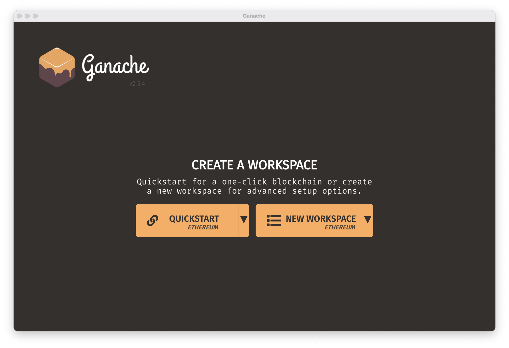
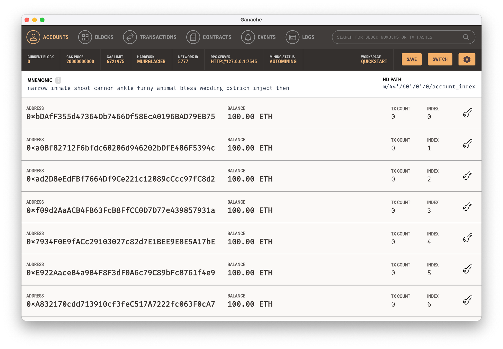
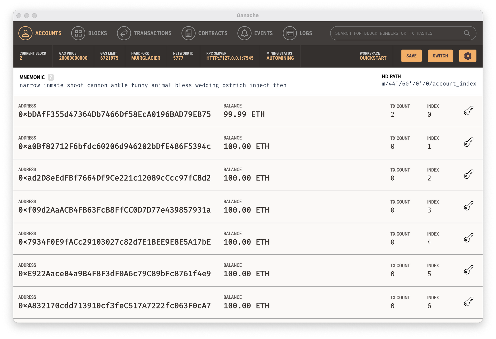
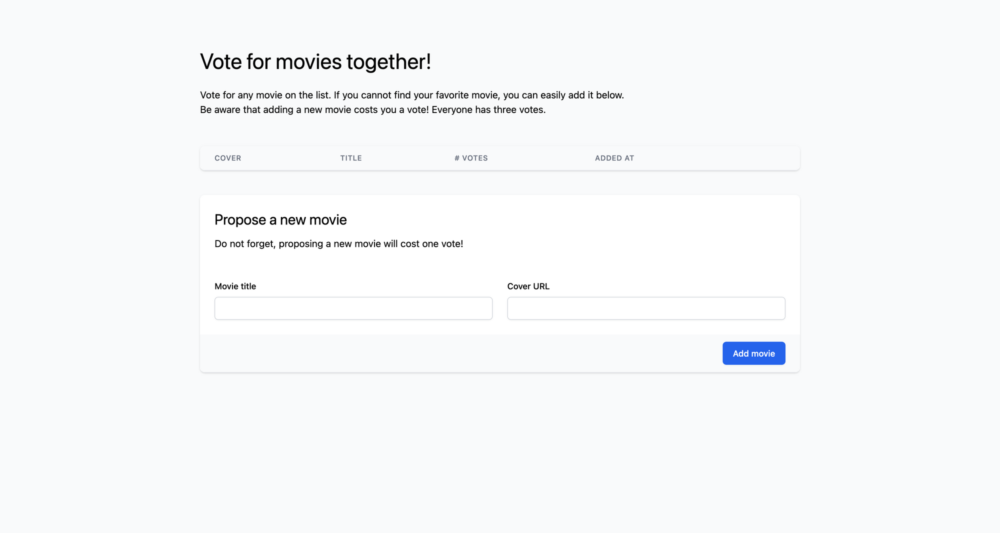
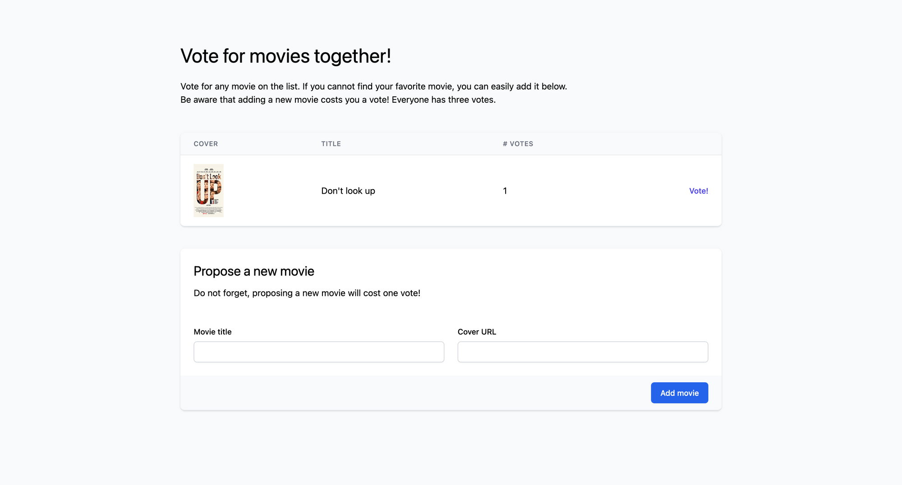
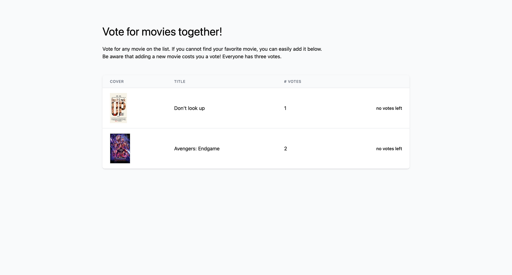
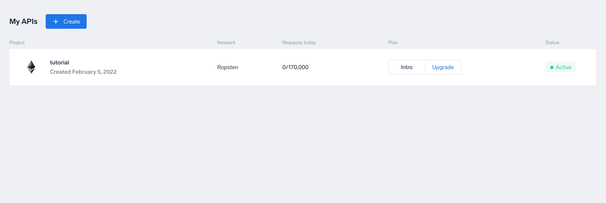

# Create a voting system on Ethereum using Web3

**By Gábor Boros** 


<br/>

_Disclaimer: This tutorial is for experienced programmers with basic knowledge about blockchains and web fundamentals._

First things first, this post is not about political voting systems. This post is about implementing a simple voting system based on blockchain technologies. For the demonstration, we are going to vote for movies. Sounds simple, right?

## Prerequisites

To implement our voting system, you will need Node.js installed and an account on Ankr. I assume you already know what Node.js is, but what is Ankr? Simply put, Ankr is a platform for developers and investors on every scale. With Ankr, we can effortlessly deploy an API server communicating with our favorite blockchain. Even better, we don't need to take care of its maintenance — which could cost a fortune.

Other than that, you will need a crypto wallet if you don't have one already. In this tutorial we use MetaMask, one of the most popular crypto wallets, to interact with our dApp. You can install MetaMask on Firefox, Chrome, Brave, iOS, Android, and many other operating systems and browsers. There is ample documentation about how to do so, therefore I won’t be guiding you through the basic MetaMask installation steps now, but I'll show you how to add fake accounts for testing later on.

Before moving on, make sure you have installed the [latest LTS version](https://nodejs.org/en/download/) of Node.js, created an [account on Ankr](https://app.ankr.com/auth/sign-up), and installed [MetaMask](https://metamask.io/download/) in your browser.

## A bit about Web3

If you’re familiar with blockchain and related topics, you’ve probably already encountered the term "Web3." It is a hot topic nowadays. There are podcasts, webinars, and tons of articles dedicated to educating people about Web3. For those encountering this term for the first time, let me quote Wikipedia:

> Web3 (also known as Web 3.0 and sometimes stylized as web3) is an idea for a new iteration of the World Wide Web based on the blockchain, which incorporates concepts including decentralization and token-based economics. - [https://en.wikipedia.org/wiki/Web3](https://en.wikipedia.org/wiki/Web3)

There are ongoing debates as to whether or not Web3 has already arrived or not, though we’ll avoid that rabbit hole for now.

In this tutorial, when we say "Web3", we mean "[web3.js](https://www.npmjs.com/package/web3)," which is a JavaScript package designed to work more easily with the Ethereum blockchain. It has other implementations available for Ruby, Python, Java, etc., though we will not use them in this tutorial.

## Create a new Truffle project

So far, we’ve talked about Web3 and how Ankr is related to our tutorial, but we need something to glue the pieces together. This is where [Truffle Suite](https://trufflesuite.com/) comes into the picture. Truffle Suite has three main components: Truffle, Ganache, and Drizzle.

Truffle and Ganache are used together for developing distributed applications and smart contracts locally. This development environment lets us test the application without deploying it to a testnet or mainnet on a live blockchain network. Truffle provides the ecosystem, while Ganache is a personal, in-memory blockchain.

Drizzle, in contrast, is a pre-made project template based on React. In a real-world situation, you would use React or Vue.js, though we are using vanilla JavaScript for the sake of simplicity throughout this tutorial.

### Install Truffle and Ganache

Before we start using Truffle and Ganache, we have to install them. To install Truffle and its dependencies, run `npm install -g truffle`. To install Ganache, we will use its standalone installer, which you can [download from Truffle's website](https://trufflesuite.com/docs/ganache/quickstart.html#1-install-ganache). Unlike Truffle, Ganache ships with a user interface, offering several options to customize the in-memory blockchain. To validate Truffle is installed correctly, execute `truffle version` in a new terminal session. You should see a similar output.

```shell
$ truffle version

Truffle v5.4.31 (core: 5.4.31)
Solidity v0.5.16 (solc-js)
Node v16.13.0
Web3.js v1.5.3
```

### Create a new project

Now we are ready to create our Truffle project. As we discussed, we won't unbox any [boxes](https://trufflesuite.com/boxes/index.html), but will rather use a plain project layout. Deploy the following commands to initiate a new Truffle project:

```shell
$ mkdir movie-vote
$ cd movie-vote
$ truffle init
```

Once you’ve executed the commands above, you will have initiated a new Truffle project and created some files and directories, seen here:

```shell
├── contracts
│   └── Migrations.sol
├── migrations
│   └── 1_initial_migration.js
├── test
└── truffle-config.js
```

As you can see, we have a default config, contract, and a related migration. What are migrations? It may sound familiar if you have worked with Django or Ruby on Rails. In Truffle, migrations are used to deploy smart contracts on a blockchain.

Before moving on, we need to adjust the default config a bit. Start Ganache to gather the necessary information. On the welcome screen, select "Quickstart" to get started.



After clicking “Quickstart,” you will see the default setup for Ganache. It shows some accounts with Ether in their wallets, seen here: 



It’s good to keep in mind that, by default, Ganache uses the first account when we run migrations. Take note of the network ID and the RPC server's address.

Then open `truffle-config.js` and find the `networks` key. Make sure the network configuration looks similar to this, then save the file:

```javascript
networks: {
  development: {
    host: "127.0.0.1",     // Ganache RPC server host
    port: 7545,            // Ganache RPC server port
    network_id: 5777,      // Ganache network ID
  },
},
```

Now the only thing left to do for this step is to compile the smart contract and run the migrations we have. Execute `truffle compile` which will create a new directory, called `build`. This directory contains all build-related files. When you check the content of that directory, you can find the "Migrations" contract's JSON version. `truffle migrate` will use this compiled contract to deploy to the blockchain.

Now, execute `truffle migrate` to deploy our initial smart contract to Ganache. Executing the command will result in a relatively long output containing the deployment summary. If we take a closer look at Ganache, we will see that the first account's balance has been reduced by 0.01 ETH. Although reading costs nothing on the blockchain, writing always has some associated gas fees. That's one of the many reasons why we are using Ganache for development.



So far, so good! We are ready to write our Smart Contract that will handle voting.

## Write the voting smart contract

When we ran the migration, we learned that writing to the blockchain has some costs. With that in mind, deploying a smart contract full of bugs could result in unplanned investment from our side — not only the time and energy needed to fix bugs, but actual fees too. To reduce the risk of bugs, we would want to write several tests for the smart contract, though this tutorial won't cover that topic. Testing itself could fill several standalone tutorials.

So let's jump right in and create the voting contract. The Truffle CLI tool is helping us with some utility commands to make development easier. To create the "Voting" contract, run `truffle create contract Voting` within the initialized project directory.

The `truffle create` command created a new file in the `contracts` directory, called "Voting.sol":

```javascript
// SPDX-License-Identifier: MIT
pragma solidity >=0.4.22 <0.9.0;

contract Voting {
  constructor() public {
  }
}
```

Depending on your truffle version, the content may look slightly different.

In this smart contract, we want to allow every user to place three votes. These votes don't need to be unique; the users can vote three times on the same movie if they want to. To limit the number of maximum votes, introduce a new constant within the contract block, `uint public constant MAX_VOTES_PER_VOTER = 3;`. Later on, we will use this contract to check if the user reached the maximum available votes or not.

While still within the `contract` block, now it’s time to define the structure of movies. From a voting point of view, we don't care about when the movie was released or who directed it. We only need an ID, a title, and the number of votes placed on the movie. To let the users identify the movie easier, we will use a cover image too — some of us are more visually oriented:

```javascript
// [...]

contract Voting {
  uint public constant MAX_VOTES_PER_VOTER = 3;

  struct Movie {
    uint id;
    string title;
    string cover;
    uint votes;
  }
}
```

Since we already know what we want to do, let's think about the user experience for a bit. Wouldn't it be great if we could notify the user when a new movie is added to the blockchain? Of course it would! Thankfully Solidity gives us building blocks, called “events.” Smart Contracts can emit these events, and dApps can listen to them. We define two events: `Voted` and `NewMovie`.

```javascript
// [...]

  struct Movie {
    uint id;
    string title;
    string cover;
    uint votes;
  }

  event Voted ();
  event NewMovie ();

// [...]
```

Although the events can receive arguments, we won't define any. In our use case, we don't need to differentiate between votes, nor do we want to know who added which movie. After defining the events, go on and define a getter for movies and votes.

```javascript
// [...]

  event NewMovie ();
  event Voted ();

  mapping(uint => Movie) public movies;
  uint public moviesCount;

  mapping(address => uint) public votes;

  constructor() {
    moviesCount = 0;
  }

// [...]
```

Mappings are key-value data structures. For movies, we bind a number to every movie, where the number represents the ID of the given movie. However, in the case of votes, we bind a wallet address to a number. This number stands for the number of votes placed from a single wallet.

You may wonder what `moviesCount` is then. That counter keeps track of how many movies have been added. It is also used to know which movie ID is next. Therefore, we begin with the `moviesCount` at zero.

Next, we must define the voting function, the core function of this smart contract. Define the voting function by deploying the following commands:

```javascript
// [...]

  function vote(uint _movieID) public {
    require(votes[msg.sender] < MAX_VOTES_PER_VOTER, "Voter has no votes left.");
    require(_movieID > 0 && _movieID <= moviesCount, "Movie ID is out of range.");

    votes[msg.sender]++;
    movies[_movieID].votes++;

    emit Voted();
  }

// [...]
```

The responsibilities of this function are to check if the user can place a vote on an existing movie, increment the voting counters, and emit the `Voted` event. Although this function is simple, I would like to mention one special part: `msg.sender`. Smart contracts have some built-in global variables and `msg` is one of them. This variable allows access to the message received by the smart contract. `msg.sender` represents the address that is called by the contract.

Now the only thing left to do is to implement a way we can add new movies. Deploy the following commands to define the `addMovie` function:

```javascript
// [...]

  function addMovie(string memory _title, string memory _cover) public {
    moviesCount++;

    Movie memory movie = Movie(moviesCount, _title, _cover, 0);
    movies[moviesCount] = movie;

    emit NewMovie();
    vote(moviesCount);
  }
}  // closing the contract block
```

Although we originally used `moviesCount` in the `vote` function, here you can see its real value. The `movies` mapping key represents the ID of the movie, and we keep track of the latest ID globally using the `moviesCount`.

That's it, the smart contract is done! But now we need to interact with it somehow.

## Write a dApp using Web3

Now that we have the contract in place, we can start working on a dApp to call it.

### Setup the environment

As mentioned earlier, we won't use React or Vue.js. To run the dApp locally, we will use `lite-server`, a lightweight development server for Node.js. To manage dependencies more easily, create a `package.json` file with the following content, and run `yarn install`, as seen here:

```json
{
  "name": "movie-vote",
  "version": "1.0.0",
  "description": "A tutorial for simple voting systems.",
  "license": "MIT",
  "main": "truffle-config.js",
  "scripts": {
    "dev": "lite-server",
    "test": "echo \"Error: no test specified\" && exit 1"
  },
  "devDependencies": {
    "@truffle/hdwallet-provider": "^2.0.3",
    "lite-server": "^2.6.1"
  }
}
```

Yarn will install `lite-server` that uses `BrowserSync`. Hence, we need to configure BrowserSync to include the contract we created. We are doing that by creating a `bs-config.json` file with the following content:

```json
{
  "server": {
    "baseDir": ["./src", "./build/contracts"]
  }
}
```

By now, we should have a folder structure like this:

```shell
├── bs-config.json
├── contracts
│   ├── Migrations.sol
│   └── Voting.sol
├── migrations
│   ├── 1643907400_voting.js
│   └── 1_initial_migration.js
├── package.json
├── truffle-config.js
└── yarn.lock
```

### Create the website

Create a new directory in the project root, called `src`. Within the new directory, create two files: `index.html` and `app.js`. Starting with `index.html`, scaffold a file as shown below:

```html
<!DOCTYPE html>
<html lang="en">

<head>
  <meta charset="utf-8">
  <meta http-equiv="X-UA-Compatible" content="IE=edge">
  <meta name="viewport" content="width=device-width, initial-scale=1">

  <title>Movie Voting</title>

  <!-- Tailwind CSS -->
  <script src="https://cdn.tailwindcss.com"></script>
</head>

<body class="bg-gray-50">
</body>
</html>
```

Although it is not necessary, you can see above that we added [Tailwind CSS](https://tailwindcss.com/). After all, we want to build a beautiful dApp, right?

Next up, it’s time to fill in the `body` tag. Because this tutorial is not about writing HTML, paste in the following commands:

```html
<!-- ... -->

  <div x-cloak class="w-3/5 mx-auto mt-20 mb-10">
    <div class="mb-12">
      <h1 class="text-4xl mb-6">Vote for movies together!</h1>
      <div>
        <p>
          Vote for any movie on the list. If you cannot find your favorite movie, you can easily add it below.
          <br />
          Be aware that adding a new movie costs you a vote! Everyone has three votes.
        </p>
      </div>
    </div>

    <div class="flex flex-col mb-10">
      <div class="-my-2 overflow-x-auto sm:-mx-6 lg:-mx-8">
        <div class="py-2 align-middle inline-block min-w-full sm:px-6 lg:px-8">
          <div class="shadow overflow-hidden border-b border-gray-200 sm:rounded-lg">
            <table class="min-w-full divide-y divide-gray-200">
              <thead class="bg-gray-50">
                <tr>
                  <th scope="col" class="px-6 py-3 text-left text-xs font-medium text-gray-500 uppercase tracking-wider">Cover</th>
                  <th scope="col" class="px-6 py-3 text-left text-xs font-medium text-gray-500 uppercase tracking-wider">Title</th>
                  <th scope="col" class="px-6 py-3 text-left text-xs font-medium text-gray-500 uppercase tracking-wider"># Votes</th>
                  <th scope="col" class="relative px-6 py-3"></th>
                </tr>
              </thead>
              <tbody id="movies" class="bg-white divide-y divide-gray-200" />
            </table>
          </div>
        </div>
      </div>
    </div>

    <form id="form-new-movie">
      <div class="shadow overflow-hidden border-b border-gray-200 sm:rounded-lg">
        <div class="px-4 py-5 bg-white space-y-6 sm:p-6">

          <div class="mb-12">
            <h1 class="text-2xl mb-3">Propose a new movie</h1>
            <p>Do not forget, proposing a new movie will cost one vote!</p>
          </div>

          <div class="grid grid-cols-6 gap-6">
            <div class="col-span-6 sm:col-span-3">
              <label for="title" class="block text-sm font-medium">Movie title</label>
              <input required type="text" name="title" id="title" class="mt-2 focus:ring-blue-500 focus:border-blue-500 block w-full shadow-sm sm:text-sm border-gray-300 border p-2 rounded-md">
            </div>

            <div class="col-span-6 sm:col-span-3">
              <label for="coverUrl" class="block text-sm font-medium">Cover URL</label>
              <input required type="text" name="coverUrl" id="coverUrl" class="mt-2 focus:ring-blue-500 focus:border-blue-500 block w-full shadow-sm sm:text-sm border-gray-300 border p-2 rounded-md">
            </div>
          </div>

        </div>
        <div class="px-4 py-3 bg-gray-50 text-right sm:px-6">
          <button type="submit" class="inline-flex justify-center py-2 px-4 border border-transparent shadow-sm text-sm font-medium rounded-md text-white bg-blue-600 hover:bg-blue-700 focus:outline-none focus:ring-2 focus:ring-offset-2 focus:ring-blue-500">
            Add movie
          </button>
        </div>
      </div>
    </form>
  </div>

<!-- ... -->
```

Finally, import some JavaScript files right before closing the `body` tag:

```html
    <!-- ... -->

    <!-- Web3.js -->
    <script src="https://cdn.jsdelivr.net/npm/web3@latest/dist/web3.min.js"></script>

    <!-- Truffle and DApp-related JavaScript -->
    <script src="https://cdn.jsdelivr.net/npm/truffle-contract@4.0.31/dist/truffle-contract.min.js"></script>
    <script src="app.js"></script>
  </body>
</html>
```

Stop here and take a look at the latest snippet: the last three imports need some explanation. We import `web3.js` to interact with the local blockchain, and we import `app.js` to utilize that, but we import a third script as well. The odd `truffle-contract.js` is responsible for the Ethereum contract abstraction.

If you followed patiently, you should see the following after running `yarn dev`.



## Add some interaction

If we click the "add movie" button, nothing happens right now. It’s time to add some interaction and change that. Open the `app.js` file and add some helpers:

```javascript
const addRow = (id, title, cover, votes, canVote) => {
  const element = document.createElement('tr');
  element.innerHTML = `
  <tr>
    <td class="px-6 py-4 whitespace-nowrap">
      <div class="flex items-center">
        <div class="flex-shrink-0">
          
          </div>
      </div>
    </td>
    <td class="px-6 py-4">${title}</td>
    <td class="px-6 py-4">${votes}</td>
    <td class="px-6 py-4 whitespace-nowrap text-right text-sm font-medium">
      ${
        canVote
        ? `<a data-id="${id}" href="#" class="btn-vote text-indigo-600 hover:text-indigo-900">Vote!</a>`
        : 'no votes left'
      }
    </td>
  </tr>
  `;

  document.getElementById("movies").appendChild(element);
}
```

The `addRow` function will create a new row in the empty table we have filled with the details of the movie. After that, make sure to create the `App`, that we will fill together:

```javascript
App = {
  account: null,
  web3Provider: null,
  contracts: {},

  init: async function () {
  },

  initContract: async function () {
  },

  bindEvents: async function () {
  },

  listenForEvents: async function () {
  },

  render: async function () {
  },

  handleVote: function (event) {
  },

  handleAddMovie: function (event) {
  }
};

window.addEventListener('load', function (event) {
  App.init();
});
```

As you see, when the window is loaded, we will initialize the `App`. In the initialization function, we initialize the `web3Provider` and the `account` that we will use for transactions. Also, we fall back to Ganache if we cannot initialize the provider in another way:

```javascript
  // [...]

  init: async function() {
    if (window.ethereum) {
      // Modern dapp browsers
      App.web3Provider = window.ethereum;

      try {
        // Request account access
        await window.ethereum.request({ method: 'eth_requestAccounts'});
      } catch (error) {
        console.error('User denied account access');
      }
    } else if (window.web3) {
      // Look out for injected web3.js
      App.web3Provider = window.web3.currentProvider;
    } else {
      // If no injected web3 instance is detected, fall back to Ganache
      App.web3Provider = new Web3.providers.HttpProvider(ganacheURL);
    }

    web3 = new Web3(App.web3Provider);

    let accounts = await web3.eth.getAccounts();
    App.account = accounts[0];

    await App.initContract();
  },

  // [...]
```

At the last line, we call `initContract`. This function is responsible for initializing the contract using the above-mentioned truffle-contract script.

```javascript
  // [...]

  initContract: async function() {
    const response = await fetch('Voting.json');
    const data = await response.json();

    App.contracts.Voting = TruffleContract(data);
    App.contracts.Voting.setProvider(App.web3Provider);

    await App.render();
    await App.listenOnEvents();
  },

  // [...]
```

After initialization, the app starts the rendering procedure and connects the event listeners. Now it’s time to define the behavior of the `bindEvents` function.

```javascript
  // [...]

  bindEvents: async function() {
    const newMovieForm = document.getElementById('form-new-movie');
    newMovieForm.addEventListener('submit', App.handleAddMovie);

    const voteButtons = document.getElementsByClassName('btn-vote');
    for(var i = 0; i < voteButtons.length; i++){
      voteButtons[i].addEventListener('click', App.handleVote);
    }
  },

  // [...]
```

`bindEvents` sets the vote and form submission handlers. To provide a smooth user experience, we defined “events” in the smart contract. Although the events are emitted in the contract, nothing listening to those events yet. To watch these events, fill the `listenForEvents` function as follows:

```javascript
  // [...]

  listenOnEvents: async function() {
    const instance = await App.contracts.Voting.deployed();

    instance.Voted({ fromBlock: 0 }).on('data', function(event){
        App.render();
    }).on('error', console.error);

    instance.NewMovie({ fromBlock: 0 }).on('data', function(event){
        console.log("new movie added");
    }).on('error', console.error);
  },

  // [...]
```

This represents the first time we have interacted with the smart contract. We instantiate the contract by calling `App.contracts.Voting.deployed()`. This function returns a handle to the deployed contract. Calling any method or accessing any property of `instance` will result in a call to the contract.

Listening to events is handled by the `on` function. When the event is emitted successfully, the `data` handler is called. However, if the execution resulted in an error, the `error` handler will be called.

Now let's continue with the `render` function, the core of the app.

```javascript
  // [...]

  render: async function() {
    document.getElementById("movies").innerHTML = "";

    const instance = await App.contracts.Voting.deployed();
    const moviesCount = (await instance.moviesCount.call()).toNumber();
    const userVotes = (await instance.votes(App.account)).toNumber();
    const maxVotesPerUser = (await instance.MAX_VOTES_PER_VOTER.call()).toNumber();

    for (let i = 1; i <= moviesCount; i++) {
      const movie = await instance.movies.call(i);
      const movieID = movie[0].toNumber();
      const userCanVote = userVotes < maxVotesPerUser;

      addRow(
        movieID,  // ID
        movie[1].toString(),  // Title
        movie[2].toString(),  // Cover
        movie[3].toNumber(),  // Votes
        userCanVote,
      );

      if (!userCanVote) {
        document.getElementById("form-new-movie").remove()
      }
    }

    await App.bindEvents();
  },

  // [...]
```

The `render` function creates a handle to the smart contract, then sends a request to get the `moviesCount`, `userVotes`, and the `maxVotesPerUser`. Remember, the maxVotesPerUser was created as a helper in the smart contract, though we can use that in the dApp as well.

After collecting the necessary information, we can iterate through the movies stored on the blockchain. So far, we won't have any movies, but we will add them later. Then we fill the movie table rows by calling `addRow`. If the user has no votes left, we remove the form so the user cannot add more movies to the blockchain.

The two remaining functions have pretty much the same functionality: capture an event and call a method on the smart contract.

```javascript
  // [...]

  handleVote: function(event) {
    event.preventDefault();

    const movieID = parseInt(event.target.dataset.id);

    App.contracts.Voting.deployed().then(function(instance) {
      instance.vote(movieID, { from: App.account }).then(function(address) {
        console.log(`Successfully voted on ${movieID}`, address);
      }).catch(function(err) {
        console.error(err);
      });
    });

    return false;
  },

  handleAddMovie: function(event) {
    event.preventDefault();

    const inputs = event.target.elements;
    const title = inputs['title'].value;
    const cover = inputs['coverUrl'].value;

    App.contracts.Voting.deployed().then(function(instance) {
      instance.addMovie(title, cover, { from: App.account }).then(function() {
        console.log(`Successfully added movie ${title}`);
        event.target.reset();
      }).catch(function(err) {
        console.error(err);
      });
    }).catch(function(err) {
      console.error(err);
    });

    return false;
  }

  // [...]
```

The first handler will ensure the user can vote for movies, while the second handles new movie submissions.

### Let's vote

We’re finally ready to test our dApp! Open a new terminal session, change the current directory to the project root and run `truffle migrate --reset`. This command will compile and re-deploy the smart contract to the blockchain. From now on, we can communicate with it. Now, run `yarn dev` if it is not already running and open `localhost:3000`.

You already installed MetaMask, but we have not connected to Ganache yet. [Connect](https://coinsbench.com/connect-to-metamask-from-new-or-existing-web-application-with-truffle-and-ganache-f48aa763c0ac) MetaMask to Ganache and refresh `localhost:3000` in your browser. You should see MetaMask connected, and you should see ~100 ETH, depending on which account you choose.

To vote, we need to add a new movie:

1. Fill out the movie proposal form and submit it.
1. MetaMask pops up for confirmation; review the dialog, and confirm the changes.
1. After confirmation, the new movie will be added to the list, and the form is cleared.




Hooray! The smart contract has been called, we confirmed that the transaction succeeded, and that our vote was placed. We could add more movies or keep voting on existing ones. Let's add another movie and vote on an existing one. When we vote, we will see the movie proposal form disappear, and notice that one of the movies has two votes.



Congratulations! We successfully created a basic voting dApp where we can vote on movies. The last step is to deploy the smart contract on an Ethereum test network.

## Ankr APIs

_Note: from now on, you will need a wallet connected to the Ropsten Ethereum test network with some funds. You can request Ether on the Ropsten test network [here](https://faucet.egorfine.com/)._

At the beginning of this tutorial, we discussed that we are going to use Ankr to connect to the Ethereum test network. If you followed the prerequisites, you should have an account on Ankr by now. If not, please create one.

Jump right in and create a new API to connect to an Ethereum test network:

1. Navigate to [https://app.ankr.com/api](https://app.ankr.com/api)
1. Click on "Create"
1. Hover over "Ethereum" (not "Ethereum 2.0"), and click on "Deploy"
1. Select the desired API plan on the popup
1. Set the project name to "tutorial"
1. Select the "Ropsten" test network, and click "Create"
1. Choose “token” for authentication type and click "Create" again



By clicking on the API name, we can access its settings. Select the "Settings" tab and copy the endpoint starting with "https".

Switch back to the editor and open `truffle-config.js`. At the beginning of the file, paste the following and replace the value of the `endpoint` constant:

```javascript
const HDWalletProvider = require('@truffle/hdwallet-provider');
const fs = require('fs');
const mnemonic = fs.readFileSync('.secret').toString().trim();
const endpoint = '<REPLACE ME>'

// [...]
```

Make sure that the `.secret` file exists in the project root and contains 12 words. Find the networks section and add the following network configuration:

```javascript
// [...]

  ankrRopsten: {
    provider: () => new HDWalletProvider(mnemonic, endpoint),
    network_id: 3,
    gas: 5500000,
    confirmations: 2,
    skipDryRun: true,

// [...]
  },
```

Now, open a new terminal session and execute `truffle migrate --network ankrRopsten` in the project root. The migrate command will deploy the smart contract on the test network so others can try it too after you publish the dApp on a hosting service, like [Netlify](https://netlify.com/) or [Vercel](https://vercel.com/).

## Summary

In this tutorial, we learned what Truffle is, became familiar with Ganache, and wrote a smart contract and a dApp for it. Then we deployed our smart contract to the Ropsten test network thanks to the amazing API hosted on Ankr. Overall, this tutorial demonstrated how to combine several distinct elements to make something on the Ethereum blockchain. Thanks for reading!
