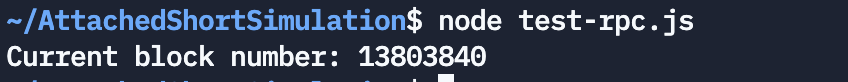

# ☕ Use Web3.js to interact with RPC nodes

**By Anita Diamond**
<br/>

Use the web3.js library to connect and interact with Ethereum and all EVM
based blockchains.

You can develop two different types of applications with Ethereum.

**1. Smart contracts** 
- Writing programs that run on the blockchain with the Solidity programming language. 

**2. Clients**
- Clients that talk to the blockchain - code that reads and writes new transaction data or executes business logic from smart contracts.

Use **web3.js** to do the second. That is to write code that reads and writes data from the blockchain.

(Use Solidity for Smart Contract Development)

## About Web3.js?

**Web3.js** is a Javascript library that makes it easy to use the Ethereum API and all EVM based blockchain APIs such as Binance Smart Chain and Polygon. You can use the API to interact with smart contracts and read and write data from the blockchain.

Web3.js is written in NodeJS. You can use it server-side or in a web browser.

## 00 - Let’s get started

1) **Install dependencies**

First install web3 from the command line / terminal to the shell.

```bash
npm install web3
```

2) **Create a script**

Use your favourite code editor to write a script. e.g. VSCode.

Name it e.g. `test-rpc.js`

3) **Import web3.js library**

Add the following to your script to import web3.js

```
const Web3 = require('web3');
```

## 01 - Connect to a public RPC URL

:::caution

You could run your own node but this requires you to download a HUGE QUANTITY of data from the blockchain and keep it in sync. This is a logistical and technical headache if you've ever tried to do this before.
:::

It’s way easier to _**get started straight away with a remote node for free**_.

You can use the Ankr Public RPC node for free with any of our open access public URLs.

In this example, we'll be interacting with the Ethereum Network.

```https://rpc.ankr.com/eth```


**Connect to public RPC URL**

Add the following to your script (add the chain you wish you to connect to).

```
const url = "https://rpc.ankr.com/eth";
```

## 02 - Let's make some requests

Let's display the current block number

Add the following to your script:

```javascript
provider.eth.getBlockNumber().then((result) => {
  console.log("Current block number: " + result);
});
```

Now run your **test-rpc.js** script

**Example Response**



## 03 - Summary

Here is _**test-rpc.js**_

```javascript
// import web3.js library
const Web3 = require("web3");
 
// connect to public RPC URL
const url = "https://rpc.ankr.com/eth";
 
// set the provider
const provider = new Web3(new Web3.providers.HttpProvider(url));

// display the current block number
provider.eth.getBlockNumber().then((result) => {
  console.log("Current block number: " + result);
});
```
