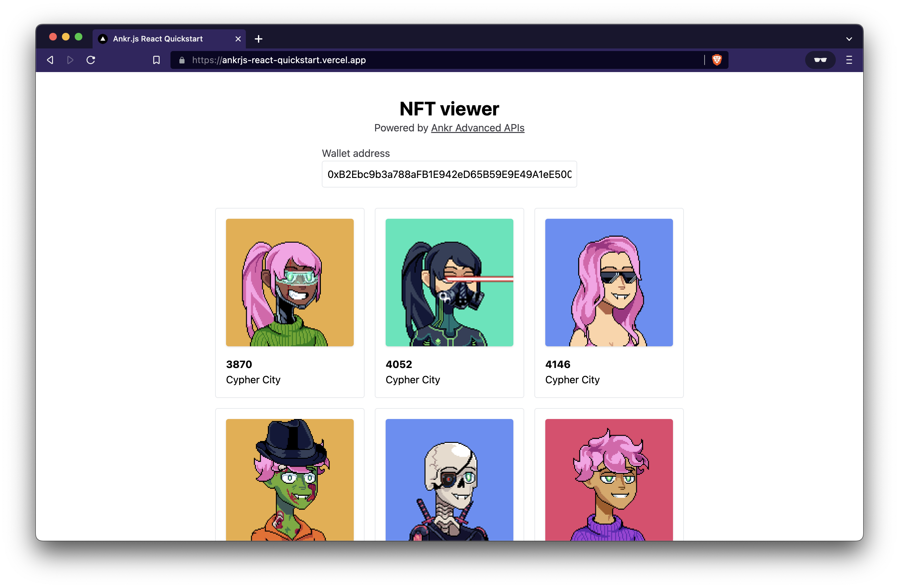
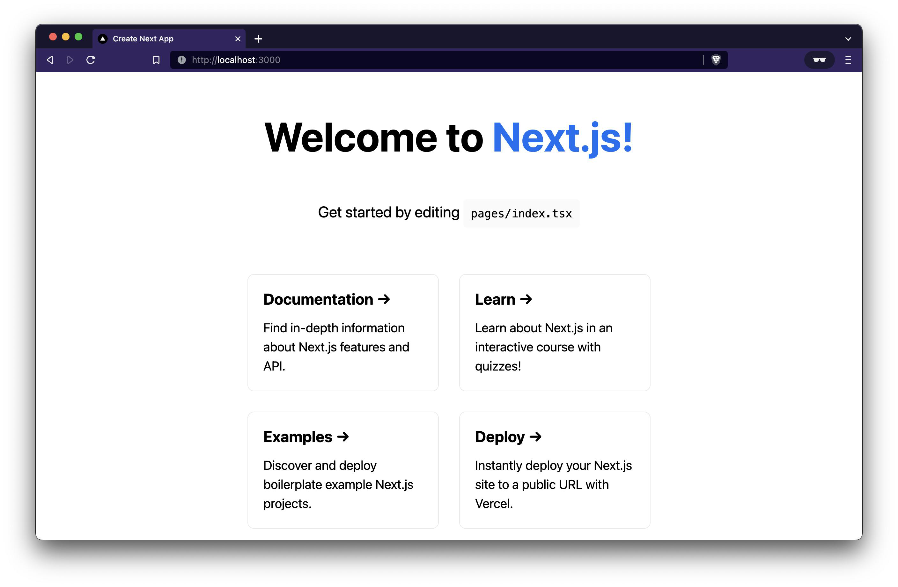
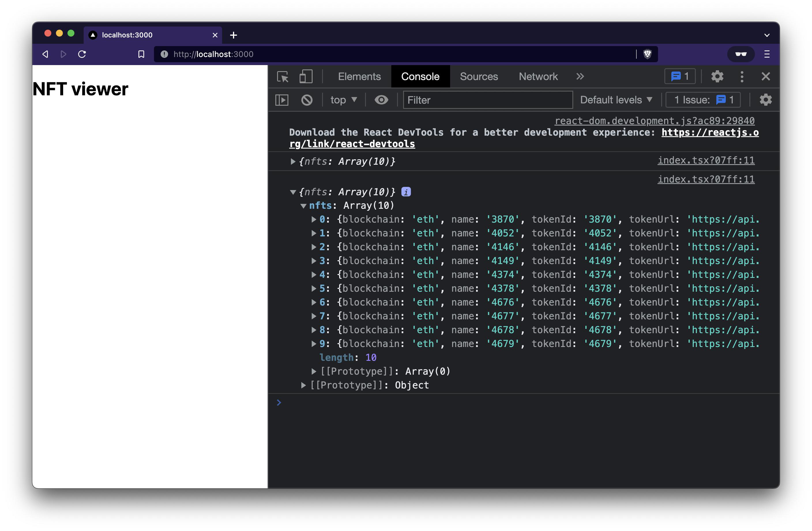
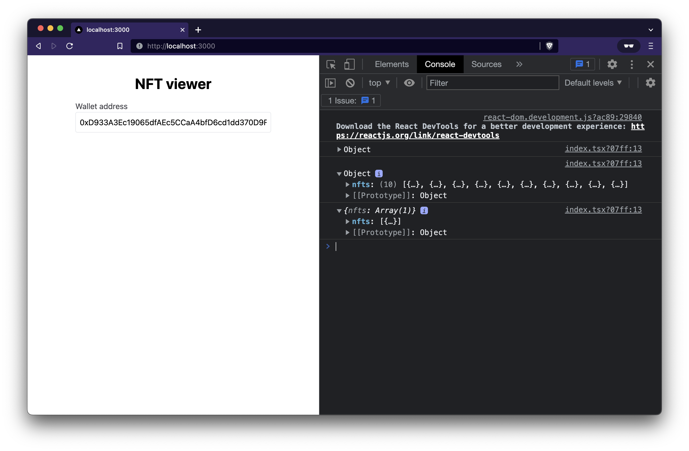

import { Code } from "../../../components";
import Bleed from "nextra-theme-docs/bleed";
import Callout from "nextra-theme-docs/callout";

# Ankr.js (Advanced APIs) React Quickstart Guide

**By** [**Dhaiwat Pandya**](https://twitter.com/dhaiwat10)
________________

[Ankr.js](https://github.com/ankr-network/ankr.js) is a JavaScript library that lets you interact with [Ankr's Advanced APIs](https://ankr.com/advanced-api). In this guide, you'll learn how to create an NFT viewer app using the following technologies:

- [Next.js](https://nextjs.org/) as the React/frontend framework
- [TailwindCSS](https://tailwindcss.com/) as the CSS framework
- [Ankr.js](https://github.com/ankr-network/ankr.js) to interact with Ankr's Advanced APIs
- [Ankr's Advanced APIs](https://ankr.com/advanced-api) as the data source





## Prerequisites

To successfully finish this guide, you'll only need [Node.js](https://nodejs.org/en/) and [Yarn](https://yarnpkg.com/) installed on your machine.

## Step 1: Set Up Your Next.js Starter Project

Navigate into a directory of your choice and run the following command in your terminal to set up a new Next.js project:

```
yarn create next-app --ts ankrjs-tutorial
```

You can now navigate into the directory and launch the app:

```
cd ankrjs-tutorial && yarn dev
```

Here's what it looks like at the moment:




The app currently only contains the boilerplate code provided by Next.js. Over the course of the next few sections, you'll set up Ankr.js and use it to create a gallery of NFTs for any given wallet address.

Before we proceed to step 2, feel free to set up TailwindCSS by following their [official guide for Next.js.](https://tailwindcss.com/docs/guides/nextjs) 

## Step 2: Install And Set Up Ankr.js

Next, you will install and set up Ankr.js so that you can use it to fetch all the NFTs for a given wallet address later on.

Start by installing the `ankr.js` package from npm:

```
# ./ankrjs-tutorial

yarn add @ankr.com/ankr.js
```

Next, create a new file named `utils.ts` at the root of your project directory. You will initialize Ankr.js in this file.

File: `./utils.ts`

```
import AnkrscanProvider from '@ankr.com/ankr.js';

const provider = new AnkrscanProvider('');
```
Your provider instance will be your interface to the Ankr Advanced APIs whenever you want to fetch some data from them.

## Step 3: Create NFT Retrieval Function

In this step, you will create a `getNfts` function that accepts a walletAddress and returns a list of NFTs owned by that address.

You can utilize the `getNFTsByOwner` function provided by Ankr.js for this.

File: `./utils.ts`

```
import AnkrscanProvider from '@ankr.com/ankr.js';

const provider = new AnkrscanProvider('');

export const getNfts = async (address: string) => {
  const { assets } = await provider.getNFTsByOwner({
    walletAddress: address,
    blockchain: 'eth',
  });
  return {
    nfts: assets,
  };
};

```

Just to see if things are working, let's call this function on our page i.e. `./pages/index.tsx` and log out the output.

File: `./pages/index.tsx`

```
import type { NextPage } from 'next';
import { useEffect } from 'react';
import { getNfts } from '../utils';

const Home: NextPage = () => {
  useEffect(() => {
    (async () => {
      const { nfts } = await getNfts(
        '0xB2Ebc9b3a788aFB1E942eD65B59E9E49A1eE500D'
      );
      console.log({ nfts });
    })();
  }, []);

  return (
    <div className='p-10 flex flex-col items-center'>
      <h1 className='text-3xl font-bold'>NFT viewer</h1>
    </div>
  );
};

export default Home;
```

You should see a list of nfts being logged out in your browser's console.



## Step 4: Create Wallet Address Input

You will now add an input to the UI that lets the user input any wallet address they want and pass it to the `getNfts` function.

You can keep track of the wallet address input in a state variable named `walletAddress`, hook it up to the input element in the UI, and then pass `walletAddress` to the `getNfts` function.

File: `./pages/index.tsx`

```
/* eslint-disable @next/next/no-img-element */
import type { NextPage } from 'next';
import Link from 'next/link';
import { useState } from 'react';
import { useNfts } from '../hooks';

const Home: NextPage = () => {
  const [walletAddress, setWalletAddress] = useState(
    '0xB2Ebc9b3a788aFB1E942eD65B59E9E49A1eE500D'
  );

  useEffect(() => {
    (async () => {
      const { nfts } = await getNfts(walletAddress);
      console.log({ nfts });
    })();
  }, [walletAddress]);

  return (
    <div className='p-10 flex flex-col items-center'>
      <h1 className='text-3xl font-bold'>NFT viewer</h1>

      <div className='flex flex-col mt-4'>
        <label className='text-zinc-700' htmlFor='wallet-address'>
          Wallet address
        </label>
        <input
          id='wallet-address'
          type='text'
          value={walletAddress}
          onChange={(e) => setWalletAddress(e.target.value)}
          className='rounded p-2 w-[400px] border'
          placeholder='Enter a wallet address here'
        />
      </div>
    </div>
  );
};

export default Home;

```

You should see a different list of `nfts` being logged out in the console when you change the wallet address in the input now. Congrats! You are now able to fetch the list of NFTs owned by any given address.




## Step 5: Display NFTs In Your UI

You can start off by storing the list of NFTs you fetch in a state variable named `nfts`. You can then loop through `nfts` and display all the NFTs in a grid.

File: `./pages/index.tsx`

```
/* eslint-disable @next/next/no-img-element */
import type { NextPage } from 'next';
import Link from 'next/link';
import { useState } from 'react';
import { useNfts } from '../hooks';

const Home: NextPage = () => {
  const [walletAddress, setWalletAddress] = useState(
    '0xB2Ebc9b3a788aFB1E942eD65B59E9E49A1eE500D'
  );
  const [nfts, setNfts] = useState<Nft[]>([]);

  useEffect(() => {
    (async () => {
      const { nfts } = await getNfts(walletAddress);
      console.log({ nfts });
      setNfts(nfts);
    })();
  }, [walletAddress]);

  return (
    <div className='p-10 flex flex-col items-center'>
      ...

      <div className='grid grid-cols-3 mt-8 gap-4'>
        {nfts.map((nft) => {
          return (
            <div
              key={`${nft.contractAddress}/${nft.tokenId}`}
              className='flex flex-col rounded border p-4'
            >
              
              <span className='font-bold mt-4'>{nft.name}</span>
              <span>{nft.collectionName}</span>
            </div>
          );
        })}
      </div>
    </div>
  );
};

export default Home;

```
You should now see a gallery of all the NFTs owned by the given wallet address of your choice. LFG!


# Conclusion & Next Steps

Ankr.js and Ankr Advanced APIs have so much more to offer than what we covered in this quick-start guide. Ankr.js gives you access to all sorts of data from seven different chains. Learn more [here!](https://github.com/ankr-network/ankr.js#️-ankrjs)

Apart from that, you can make some UX improvements to the app we built in the guide. We did not handle the loading or the error state for our app. You can try fixing that on your own! 

If you want to go the fancy route, you can create a useNfts hook on top of the getNfts function to do this.
