import { Code } from "../../../components";
import { Bleed } from "nextra-theme-docs";
import { Callout } from "nextra-theme-docs";
import Image from 'next/image';

# How to Create your First DAO using Plug-and-Play No-Code Solution On Ethereum

**By** [**Krinza Momin**](https://twitter.com/kayprasla)
____________________________________

I'm writing this article thinking about two things. First, why is the web3 community obsessed with three-letter words - think ICOs, NFTs, and now DAO? Second, will the no-code revolution really dismantle the mentality that building cool stuff is only reserved for very serious developers?! 

I mean, I'm no Naval Ravikant, so I won’t say that the next big thing in code is no-code but I'll rather let Chris echo that on my behalf:

> "The future of coding is no coding at all." - Chris Wanstrath, CEO at GitHub.

Anyway, getting back to the topic, the DAO; a new-ish type of organizational structure and another hot acronym on the block. For those of you who aren't familiar with what DAO is, [toggle the tweet](https://twitter.com/themetav3rse/status/1456337864342466561?s=20&t=wzXj7B8cqaclAlYDFi2MXw). For the rest of you, enter the playground! 

__________________

### So, what are we building today?

A DAO.  
*haha, I already read the title … tell me more!*

Um, without writing a single line of code.                                                           
*what do you think why I clicked on this article, huh?*

Let me just show you instead. Also, was that just me talking to myself or what? 

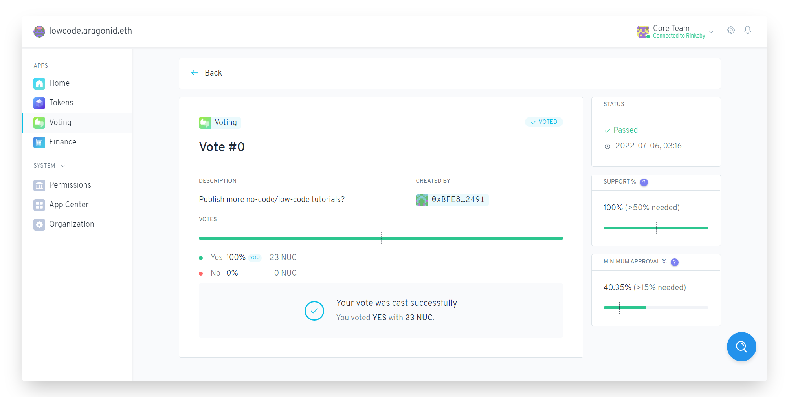

TL;DR: We will build a DAO on [Aragon Client](https://client.aragon.org/#/)↗ and deploy it on the Ethereum Rinkeby Testnet. By the end of this tutorial, you’ll be able to:

- deploy a DAO
- declare the name and symbol for your token
- allocate tokens to the members of the DAO
- create the first proposal question 
- begin the voting process
- and enter your first vote in favor/against the proposal

## Wait, what’s Aragon though?

Aragon is a DAO maker tool for beginners and developers to create their first of many DAOs in a couple of clicks. This tool will help you with managing your DAO members, their votes, and proposals, and will let you admin your funds directly on the blockchain without writing a single line of code. 

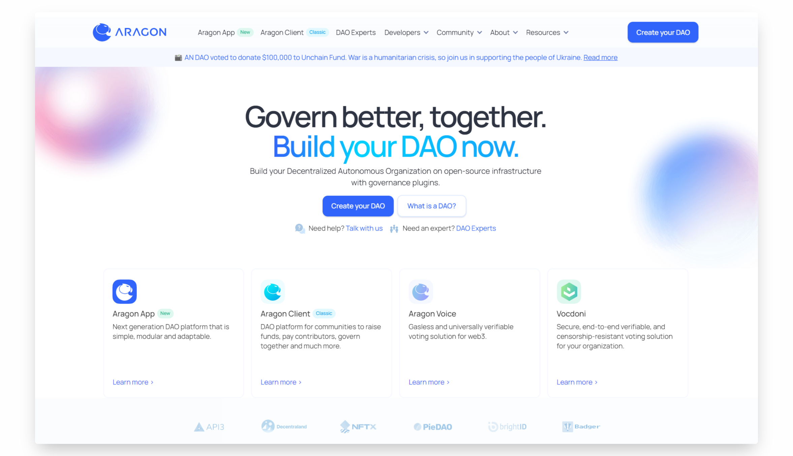
______________________________
## Getting Started

Before we get started deploying our very first DAO, make sure your Metamask wallet is connected with the Rinkeby Testnet. Next, we will need some test ethers to make transactions. So, head over to the [Rinkeby Faucet](https://faucets.chain.link/rinkeby)↗, follow through the instructions, and get yourself some test ETH. You'll at least need 0.2 test ETH. 

### Setting up a DAO
Head over to [Aragon Client](https://client.aragon.org/#/)↗ and follow these steps:

- Click on the "Connect Account" button and select "Metamask", approve the request from MetaMask, and connect with the ‘Ethereum Rinkeby Testnet.

- Navigate to the "Create an organization" option and click on that.

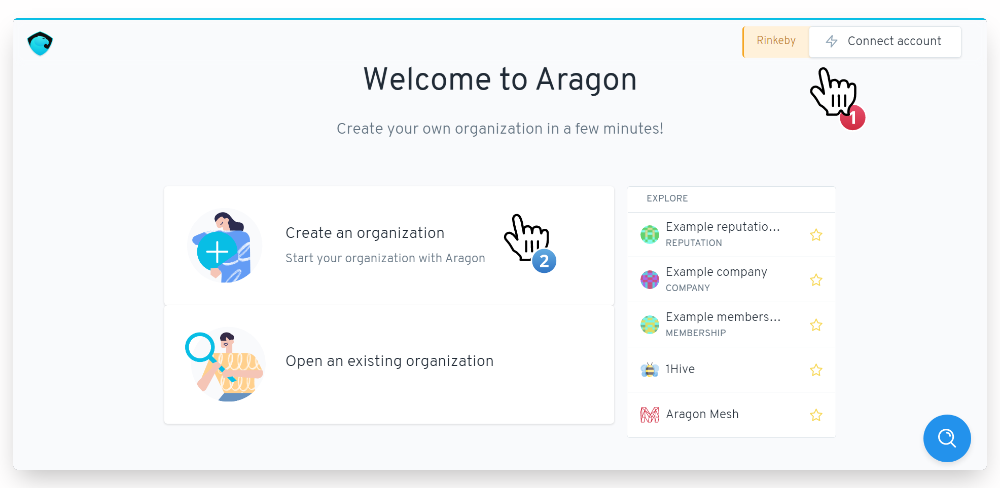

Once you select the "Create an Organization" button, you'll land to this page where you'll be given a few options as pre-configured templates for your DAO, with the details given already. 

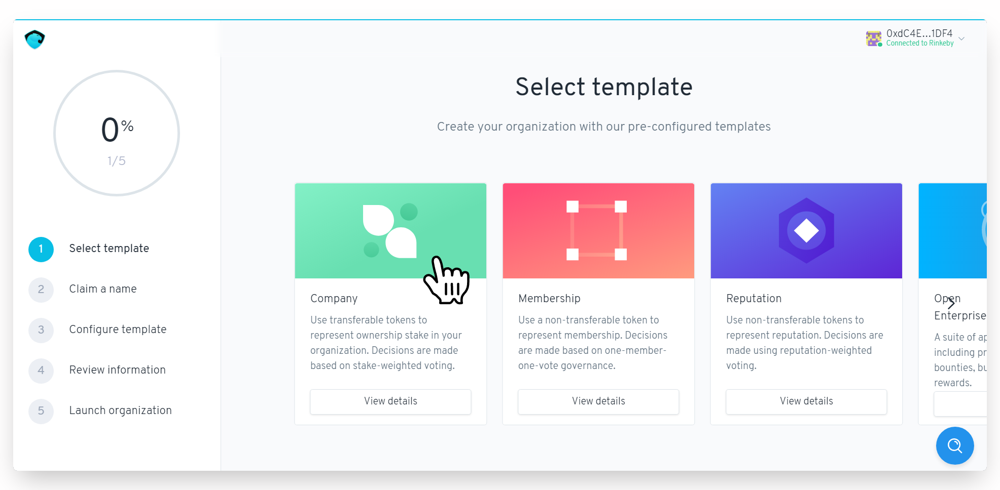

For this project, we will opt for the "Company" template where the tokens are transferable and decisions are based on the weighted voting system. 

> In a weighted voting system, all votes are valid but not equally counted. Each voter's voting power is based on the size of their stake; their individual level of status or expertise; or according to pre-defined organizational rules.

- Next up, we will set up the DAO's name. The name you choose will be mapped to the organization's address and cannot be changed after you launch it.

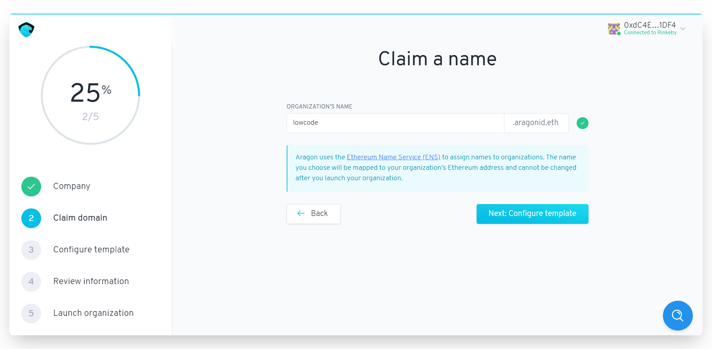

- Once you set up the name from the DAO, click "Next: Configure template".

### Configure Voting  

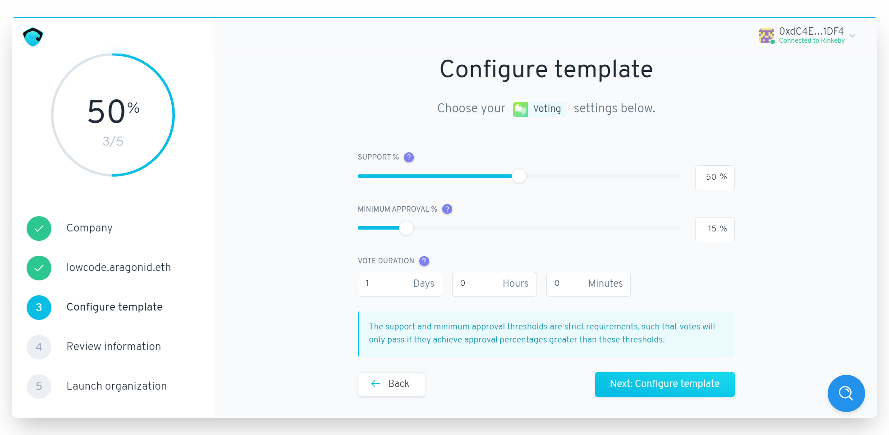

Now, in the above screenshot, you see a couple of different options which we will be exploring below: 

- **Support %** is the relative percentage of tokens that are required to vote “Yes” for a proposal to be approved. For example, if “Support” is set to 50%, then more than 50% of the tokens used to vote on a proposal must vote “Yes” for it to pass.

- **Minimum Approval %** is the percentage of the total token supply that is required to vote “Yes” on a proposal before it can be approved. For example, if the “Minimum Approval” is set to 20%, then more than 20% of the outstanding token supply must vote “Yes” on a proposal for it to pass.

- **Vote Duration** is the length of time that the vote will be open for participation. For example, if the Vote Duration is set to 24 hours, then token holders have 24 hours to participate in the vote.

You can set the settings which might suit best for your DAO, for the sake of this project, let's go with the default configs. 

### Set Tokens!

Now that we have configured the voting mechanism for the DAO, you can now set a desired name and symbol for your token. 

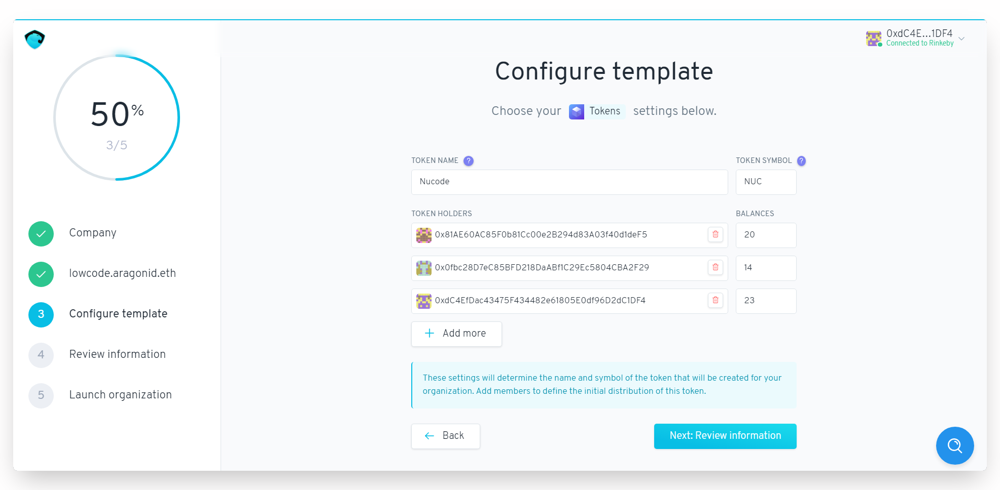

- Enter the token name and symbol 
- Enter the addresses of the DAO members or holders and allocate tokens to them. 
- Review the information and hit ‘Launch your organization’.

After you launch your organization, the Metamask window will pop up for transaction approval. Confirm the transaction and make sure you don't select the speed-up option in MetaMask. Also, do not refresh the window.

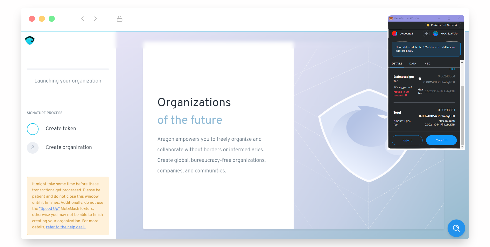

With that, you should be presented with a screen similar to this:

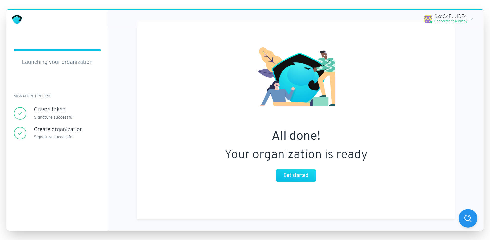

### First Proposal, First Vote

Click on get started, and let us create our very first proposal to begin the voting process.

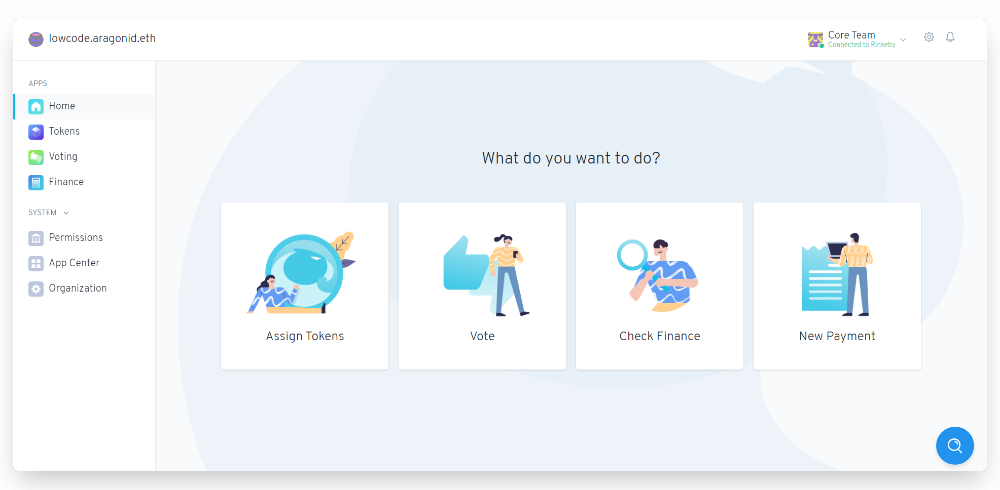

- Click on ‘Vote’ from the options shown or find 'Voting' from the left menu and click on ‘Create a New Vote’. 

- Add in the proposal question and open it for voting. 

This action will require you to sign a transaction for the proposal to go live.

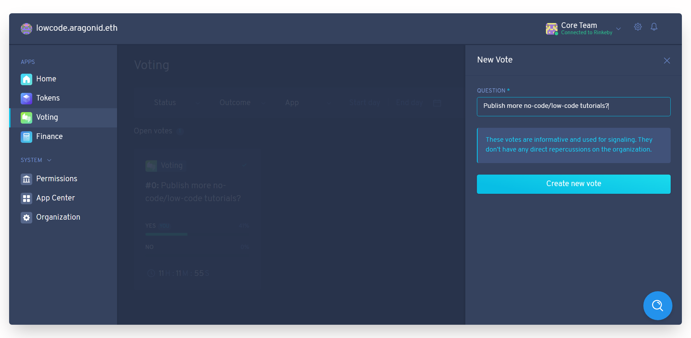

Once the proposal is live, members can vote "yes" or "no" based on their decision in favor or against the question asked. The voting window will be open for the time duration set in the earlier steps. In our case, it is 24 hours only. 

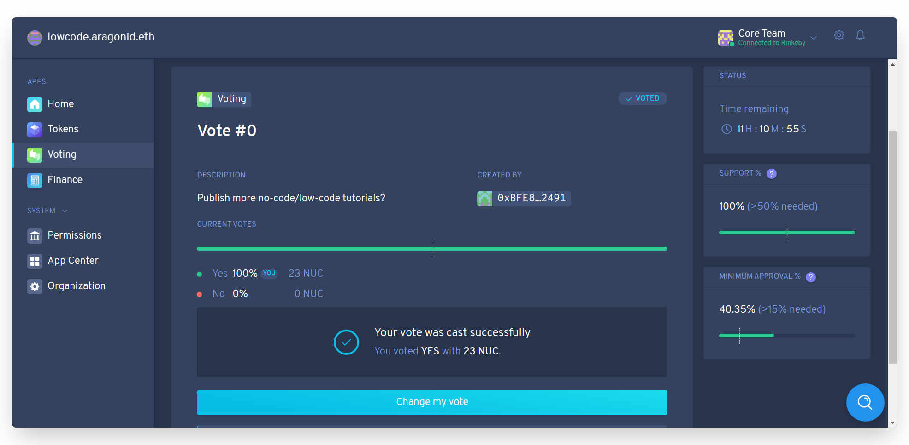

Now that you have successfully published the first proposal, you can finally register your first vote!

_______________________________

## Next Steps
If you're leaving under a rock, here is some news for you - Ethereum Rinkeby Testnet will be deprecated soon. Don't fret, we're good for now and I'll update these tutorials as the testnet landscape changes. But for now, here's a task for you all: Create an exclusive club for your friends online (aka DAO) and deploy it on the Polygon network instead (here's me saving you from dollars worth of deployment cost). 
