import { Code } from "../../../components";
import { Bleed } from "nextra-theme-docs";
import { Callout } from "nextra-theme-docs";
import Image from 'next/image';

# Build an end-to-end Crypto Picks Board with No-Code on Ethereum

**By** [**Krinza Momin**](https://twitter.com/kayprasla)
____________________________________

Now that you have entered the chat, let me guess what made you swipe right on this article. Is that the “pickup lines” and you desperately wanting to avoid the low level uttering of "hey.” Or is it the “no-code” buzzword that many coders roll their eyes at?

In any case, at least it made an impression. So why not capitalize on both the no-code and have a crack at our idea of building a Pickup Line dApp on-chain.
__________________________

## So, what are we building exactly?

In this tutorial, we will be creating a pickup line directory app with Atra and deploy it on the Ethereum Rinkeby Testnet. By the end of this you’ll be able to:

- manage, customize, and deploy a decentralized database
- configure triggers, which “reacts” to certain actions we make in the database
- and build a minimal frontend

all without writing a single line of code.

[Here](https://console.atra.io/app/191ed8b7-01b1-4044-8256-0b664c77ac2d)↗ is the sample dApp all set and ready to be used for the reference, and this is exactly what we will be building.

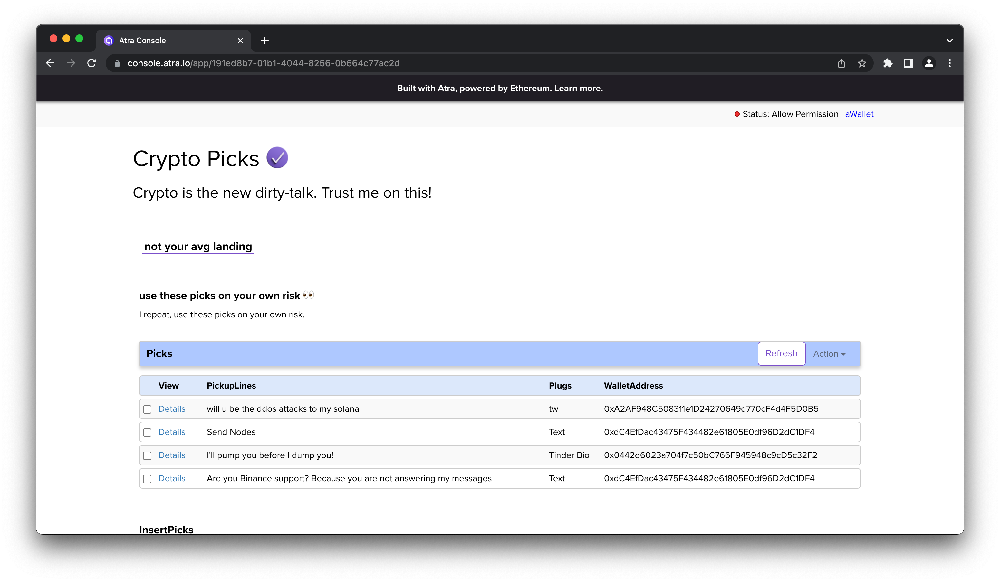
________________________

## Wait, What’s Atra Though?

Atra is a platform that offers services and tools to help users build and maintain dApps. We will be using Atra’s 3 beta services - dTables, Triggers and LiteUI to build an end-to-end application on Ethereum Rinkeby Testnet. Will explore all three services in detail below, as we move on to building our dApp.

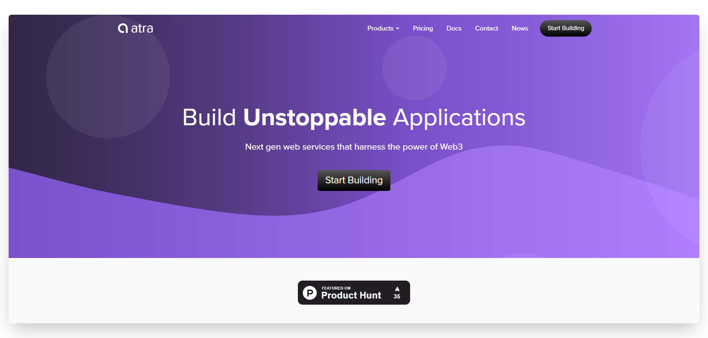

Here's a brief about each beta service:

- **dTables:** act as relational databases that can be deployed in one single click. Its fast, simple and offers data storage on the Ethereum public network.
- **Triggers:** helps create business logic for the application. It controls access and helps map user-input values by creating a response or reacting against every action.
- **LiteUI:** serves drag and drop UI elements to build a website that connects the services to the frontend and integrates decentralized resources with Ethereum instantly.

Now that we have some knowledge about the tool we will be using, let's get building!
________________________

## Getting Started

Before we dive into the project, first thing we need to set up is a Metamask account with some test ethers added. If you have a MetaMask wallet installed, setup and running, you can skip to the next section.

If you don’t have one, install [Metamask](https://metamask.io/download/) for your browser and follow through the steps needed to set up an account. Once Metamask is installed, make sure you are connected with the Rinkeby test network. Next, you’ll need to deposit test Ether into your wallet so you can sign some transactions. For that, head to the [faucet](https://faucets.chain.link/rinkeby) to top up your account with some ether.

With that, you now have the basic requirements for building a decentralized application on Atra. So, let’s start building our dApp!

### Step 1: Create A dTable

As briefed above, dTables are used to store information or any data we might want to record for our application. In our case, we will be storing user entered pickup lines to our application on the Ethereum blockchain.

Follow the steps below to get the dTable created for the pickup lines:

- Navigate to [console.atra.io/](https://console.atra.io/) and find the `Services` dropdown in the nav bar
- Select `dTables` to land on the dTable service dashboard
- Now, click the `Create Table` button and set the **Name** field to "Picks" and **Description** to whatever explanation you want to enter for the table.

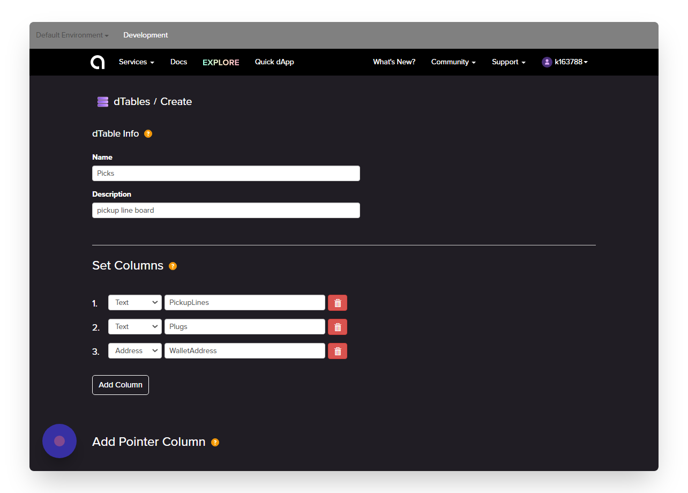

In the next section, we will add a column for each piece of information we want to store in the database as shown in the screenshot above. Once the columns are set, click on `Create dTable`.

> **Note:** Once table is created, you won't be able to edit it again as the table will be deployed to the Ethereum Rinkeby network.

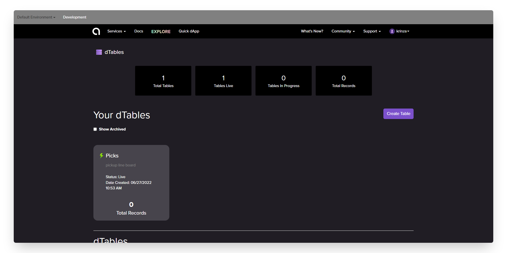

You can monitor the status of the dTable deployment on the dTables Dashboard. The green lightning bolt means the table is successfully deployed on the network. You can even view the deployed contract on etherscan by following the next section. 

### Step 2: View The Deployed Smart Contract On Etherscan

Once the lighting bolt icon go green, click on the newly created table and you'll see the `Contracts` tab.

- Click on that to explore the Ethereum smart contract, written in solidity

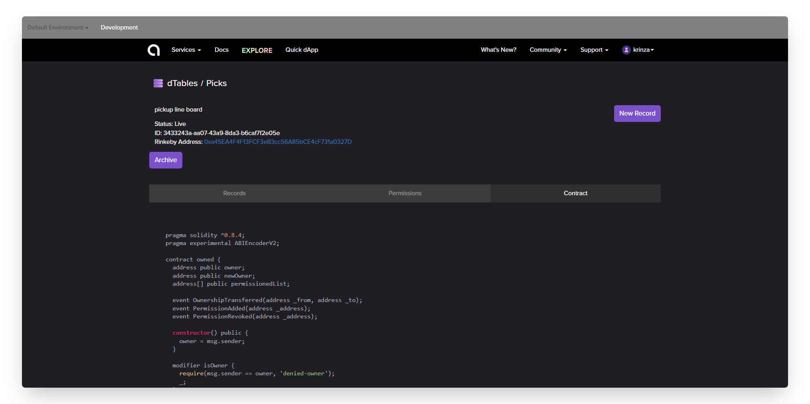

You can also view the creation of the table on Etherscan by clicking on the Rinkeby Address. 

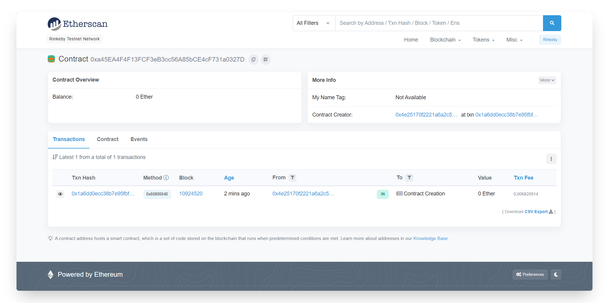

The dTables contract is specifically designed to store records. It uses methods for inserting, reading, updating, and deleting records. We can also see these contract methods in action while we insert a new record into the table.

### Step 3: Insert New Records

- Click the New Record button given on the top right corner of the screen

This will open a pop up on the page where you’ll see inputs for each column. We are manually going to insert a record as shown below.

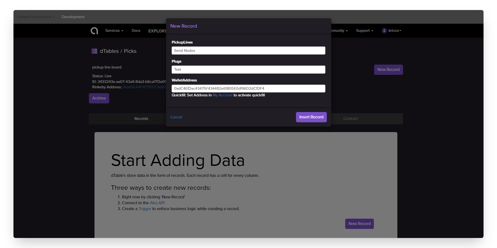

- Click `Insert Record` and you should be able to see the newly created entry in the table as well on Etherscan

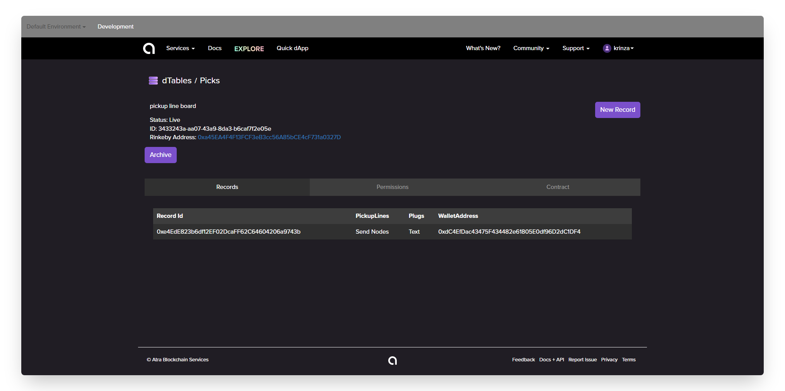

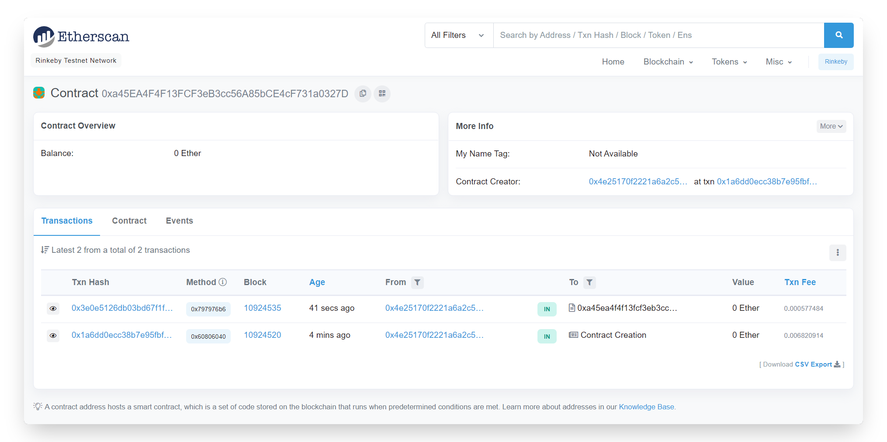

In the next section, we will start to build the logic to allow users the ability to modify the table themselves. In this case, the users would be adding a pickup line entry to the table without paying any gas fee for their transaction.

### Step 4: Add Trigger

In this section, we will add the base functionality for users to post their fav pickup lines on the dApp we are building. To add a trigger for new entries in the table, go through the steps below:

- From the nav bar, select `Triggers` from the `services` dropdown and you'll land on a triggers dashboard

- From the Triggers Dashboard, click the ‘Create Trigger’ button and you will land on the **Set Actions** tab on the **Create trigger** page. 

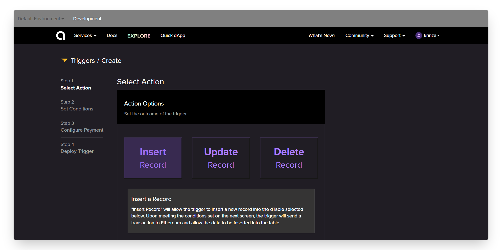

- Once you land on the trigger page, you'll see three options. In this tutorial, we will only be using the `Insert` action, as we want to allow users to create a new entry on the board. 

- Select ‘Insert a Record’ as the method type, `Picks` as the table we want to modify and configure the value mapping to the values as shown below:

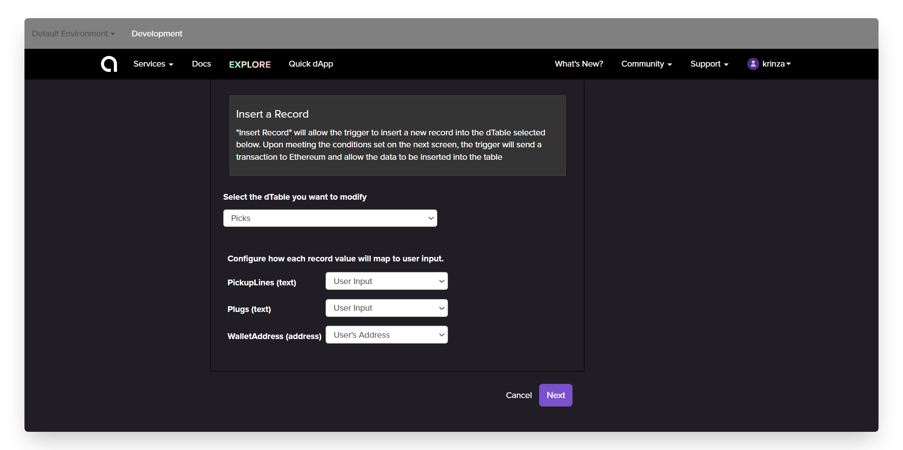

Click on `Next` and you will land on the Conditions tab, which is where you can set conditions that must be met for your trigger to execute. In this tutorial, we will not use conditions.

Next, we will set the configuration for payment of the transactions. Because we don't want to charge users ETH to add pickup lines to the board, therefore we will be marking "**No**" under the payment option and move on to the next step.

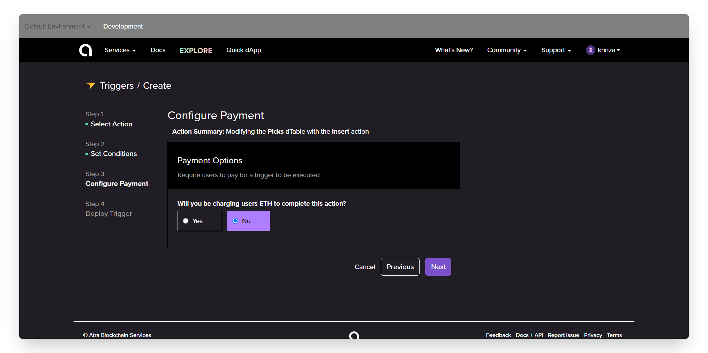

At this point, we’re almost done. We just have to name and review the **Trigger** which you can refer from the screenshot below.

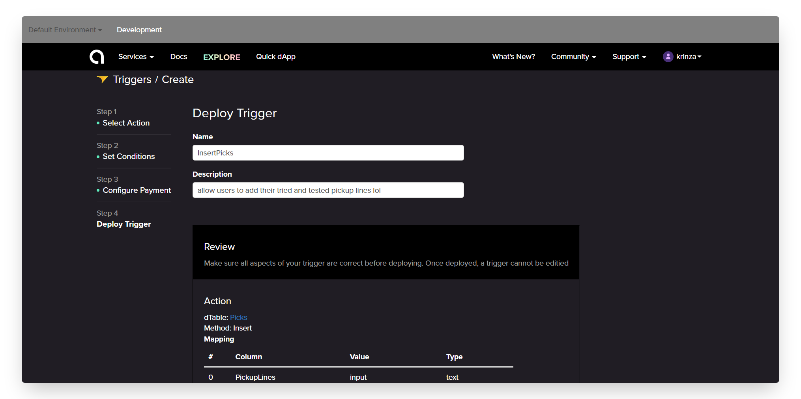

- Once done, click on `Deploy` and wait for the trigger to go live. 

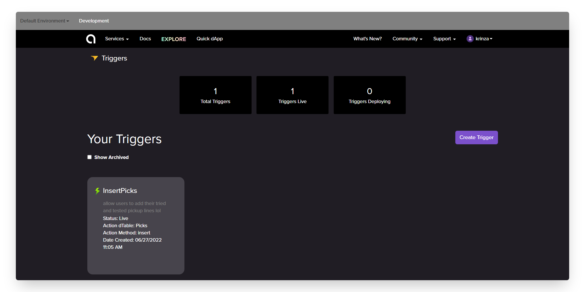

Click on the `InsertPicks` Trigger and in the details tab, click ‘Grant Permission’ which will give the underlying smart contract permission to interact with the dTable’s smart contract.

Now that we have our table and trigger ready, let's go ahead a create a UI for this project using the LiteUI service.

### Step 5: Create The User Interface

In this section, we will combine everything we just created into one simple user interface. LiteUI will bring together our dTables and Triggers, and give us a public website URL which we can share with our users.

To start building the UI, you can follow through design I made in the reference website or you can go ahead and create your own user interface for the dApp.

- First, select `LiteUI` option from the **Services** dropdown in the navigation and create a new LiteUI

- Click the `Plus` button in the upper right of the dashboard and give a name to your dApp

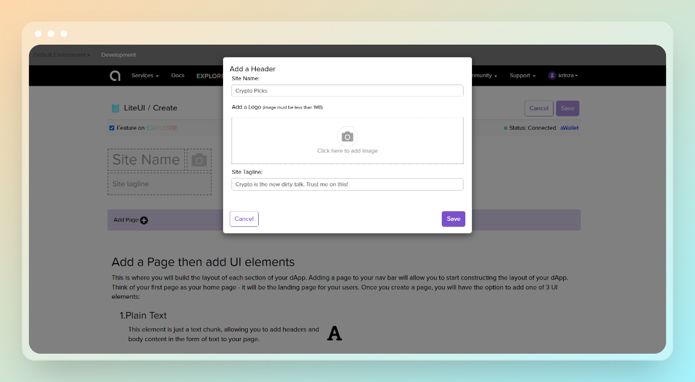

- Next, we can add our first page which will serve as our home page. Click the **Add Page ** button in the purple header, type whatever you want to call the home page, hit enter or click ‘Save’ to add the page to our LiteUI

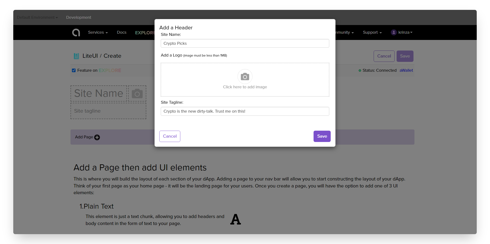

Now that we have named our application and created the first page, it’s time to add a UI Element to the home page. Go ahead and add some `text`, our `dTable` and then the `form` for users to be able to entry new pickup lines in our board.

Once you add all of the UI elements to the website, click `Save` in the upper right corner of the page.

Enter back into the LiteUI from the dashboard, click the 'Open Public URL' link under the Update button and you are good to share this link with everyone to add their fav pickup lines to the board.

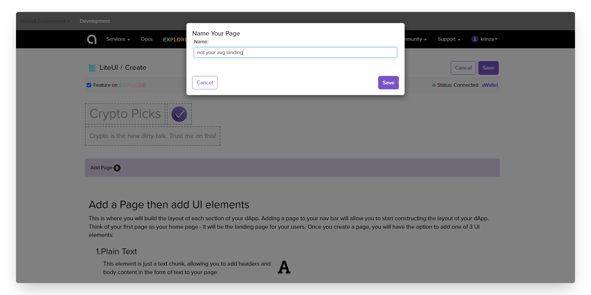

With that, your dApp is ready! The URL is accessible to anyone, however the user will need MetaMask installed and have testnet Ether to post pickup lines to the board through the `InsertPick` form within our dApp.

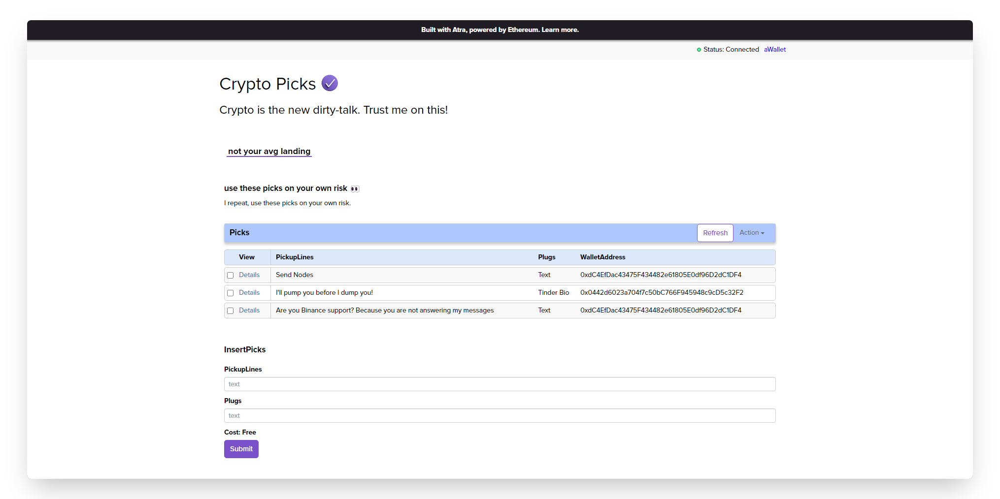

______________________

## Next Steps

Now that you have created your first dApp with Atra, you can go explore and experiment with the services offered. Here are some ideas to stimulate your creativity:

- Build a Clone Craigslist Website with No-Code
- Create a Job Directory website without writing a single line of code
- Build a voting app on-chain with no-code
