import { Code } from "../../../components";
import { Bleed } from "nextra-theme-docs";
import { Callout } from "nextra-theme-docs";

# Filebase to store files to IPFS

**By** [**Manny**](https://twitter.com/codingwithmanny)
________________

## IPFS & Filebase

If you’re just getting started with web3 or just haven’t touched decentralized storage before, then Filebase is a good way to bridge the gap between traditional storage and Interplanetary File System (IPFS).

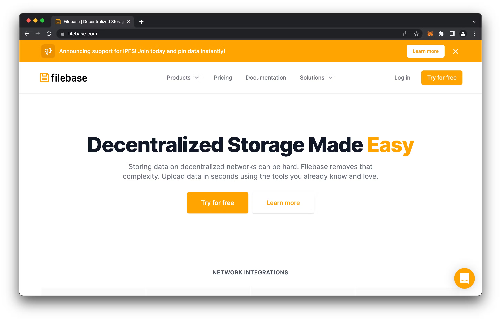

If you read that last line and asked yourself “What the heck is IPFS”, then let’s break it down in simple terms, it’s a decentralized storage system that lives forever. In other words, make sure you know what you’re uploading before hand.

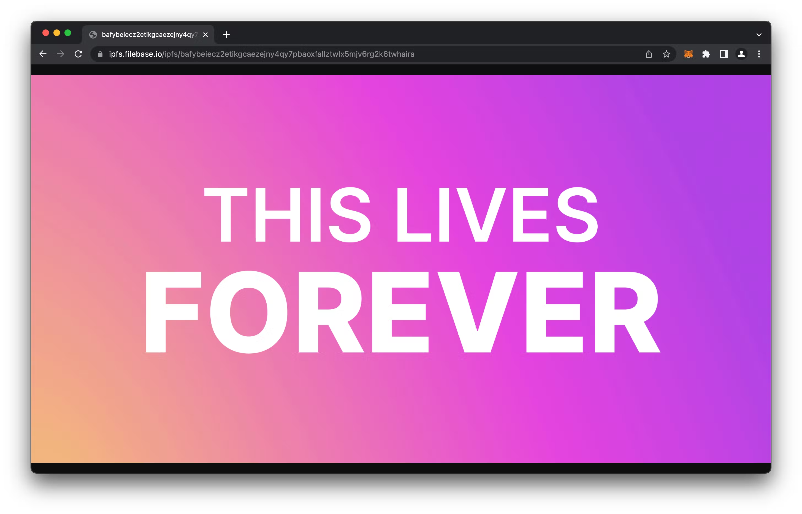

## Why Would You Want Forever Storage?
One of the main reasons for storing a file forever is to either give value to its permanence or keep a full record of data that is immutable (can never be modified), which adds to its validity of authenticity. One of main uses for this currently are Non-Fungible Tokens (NFTs).

If you get past the highly priced JPGs then there is value in authentic data. In the offline world, authentic data comes in the form government issued identification, supply chain logs, wills, deeds, contracts, and basically anything that could potentially be forged.

Web3 is still young, and IPFS is still being adopted by major browsers, but decentralized storage definitely has a use, alongside traditional web2 storage.

## Getting Started With Filebase
Web3 is growing and until it has a mass adoption there will still be a need for web2 solutions that bridge the gap. Filebase is the bridge to web3 decentralized storage on IPFS. The good news is that Filebase is currently 5GB of storage without any credit card, so take advantage and upload that entire collection of Gilmore Girls* to IPFS. Just create an account at [Filebase.com](https://console.filebase.com/signup).

*(Don’t listen to me. This is probably a bad idea)

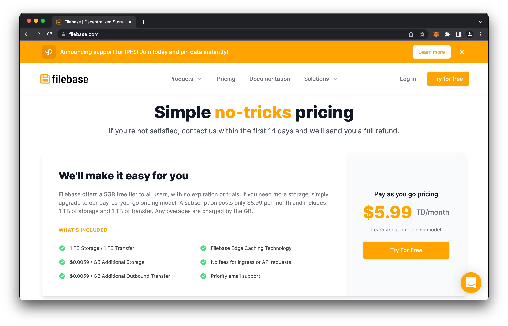

## Uploading Your First File
The first step will be to create a bucket, by going to the Buckets section and click **Create Bucket**. If you’re familiar with AWS S3, then buckets are another way of saying folders. Why they chose the names buckets, I have no idea, but my guess is that instead of trying to organize things into folders, they just dumped everything into a bucket and ignore trying to organize anything.

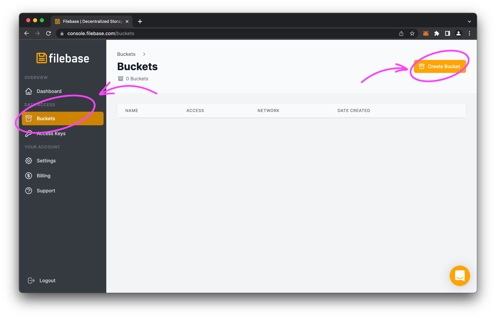

Give your Bucket a name, to try and organize things, and select the **IPFS (All data is public)** as the **Storage Network**.

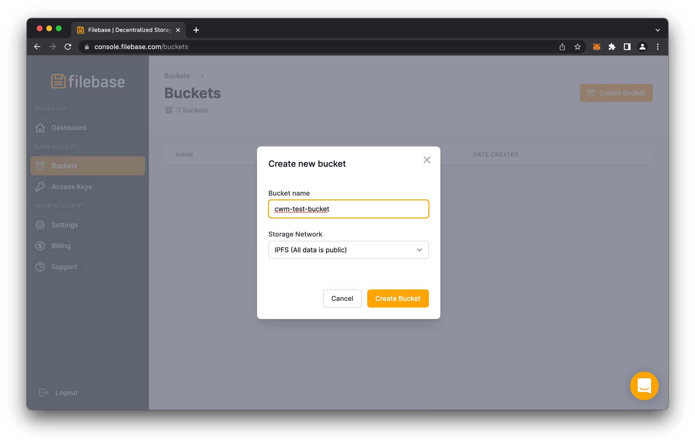

Click on your newly created bucket to open it up and take a look at its emptiness that screams “I need some files!”

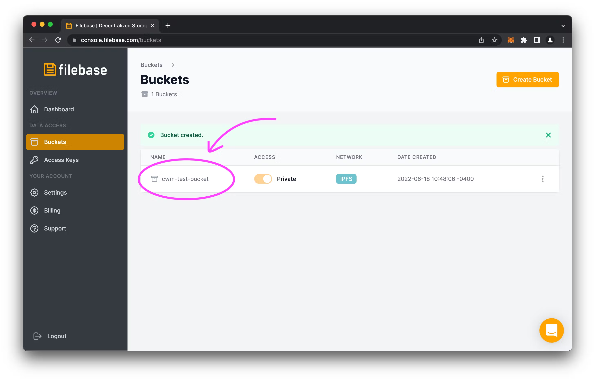

In your new bucket, click upload and File, to be prompted with file to upload, and select an image to start with to make things easier.

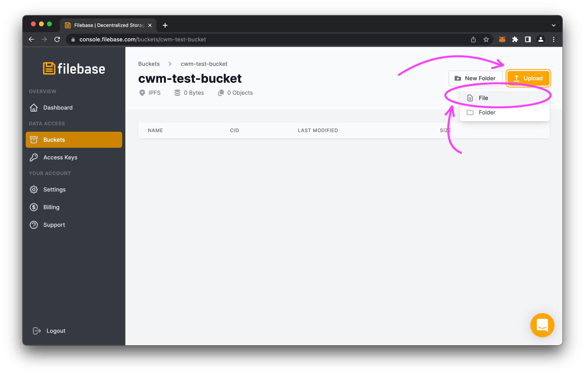

Tada! You have uploaded a file to IPFS. Click on the new file to see its details.

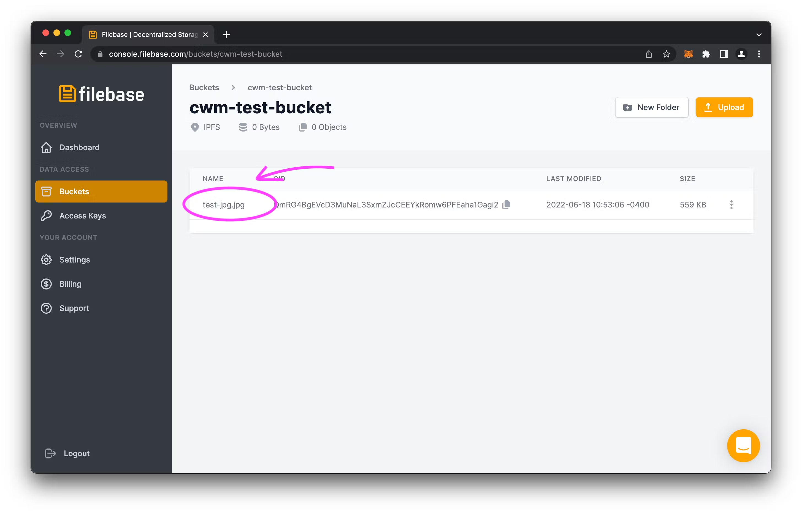

In the details, Right-Click the link in a new tab and wait for it to load.

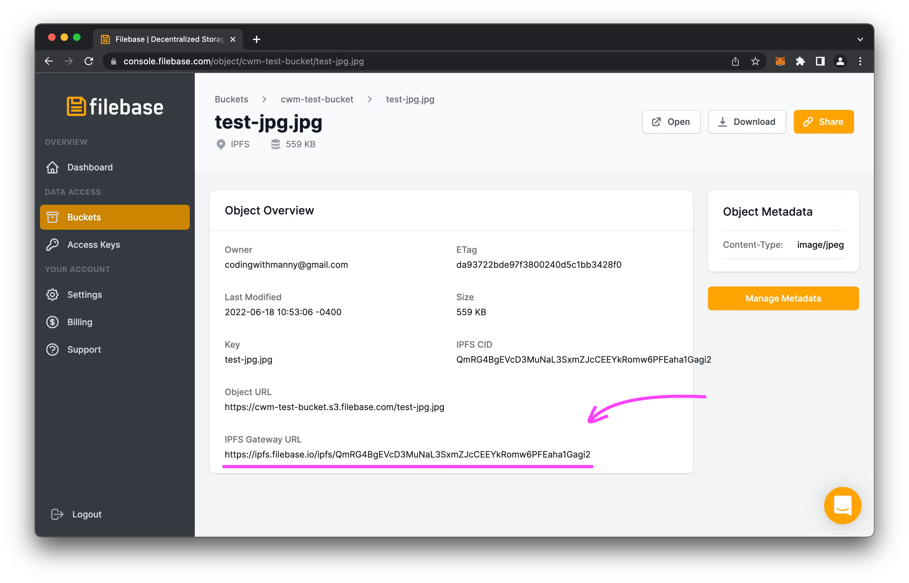

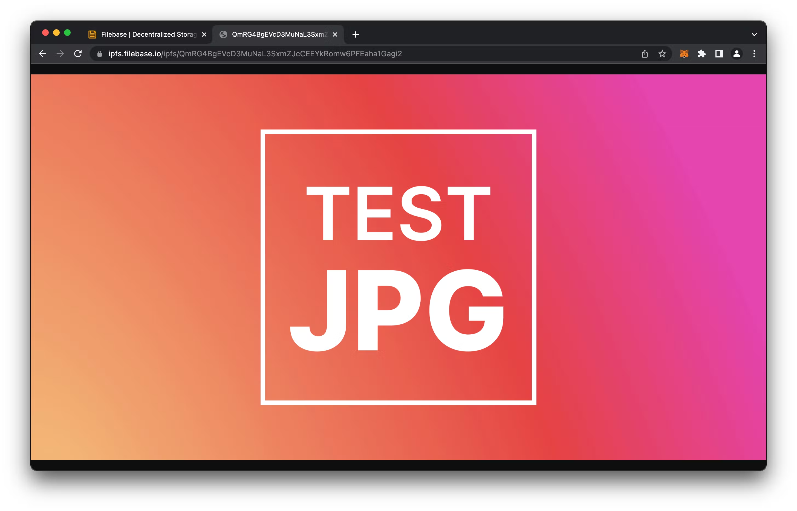

You should also be able to access the file from this public gateways URL

```
https://ipfs.filebase.io/ipfs/bafybeiblmwzu3evblahlvasdbs2a7p4qk6n6yaihcznvyqpp7mabfadkd4
```

## Deleting Your Files
Wait, how can you delete a file that lives forever and is immutable?

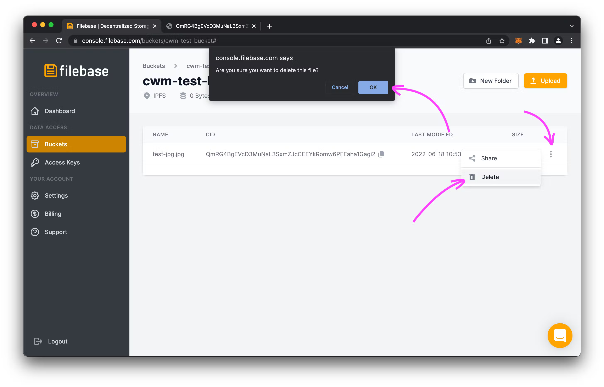


The answer is you can’t, the file lives forever. What you’re really deleting is just the reference to it in Filebase. A good way to test this theory is to use other IPFS Gateways to access the file. Depending on the Gateway, the request to load the file may differ.

We can access the file natively through the Opera Web Browser at:

```
ipfs://bafybeiblmwzu3evblahlvasdbs2a7p4qk6n6yaihcznvyqpp7mabfadkd4
```
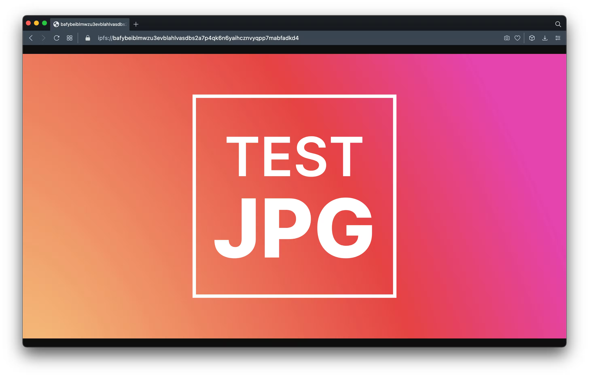

We can use Cloudfare’s IPFS Gateway to also access the file through a browser that doesn’t natively support IPFS.

```
https://cloudflare-ipfs.com/ipfs/QmRG4BgEVcD3MuNaL3SxmZJcCEEYkRomw6PFEaha1Gagi2
```

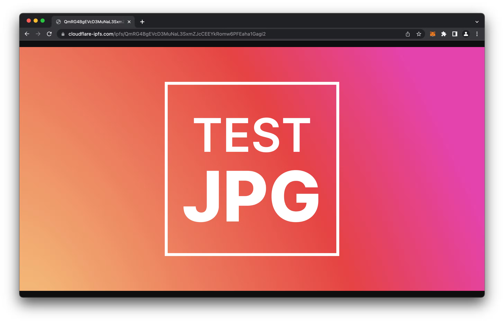

We can also still access our file through Filebase’s IPFS Gateway, even after we’ve deleted it in Filebase.


### What’s Next
Now that we can see that we can upload files directly to IPFS with Filebase, we can start to think about what we can do to built on top of this.

With IPFS in mind, you can explore the following:

- Build a Frontend file uploader with React & Filebase
- Store your NFT Images Permanently On-Chain with IPFS

