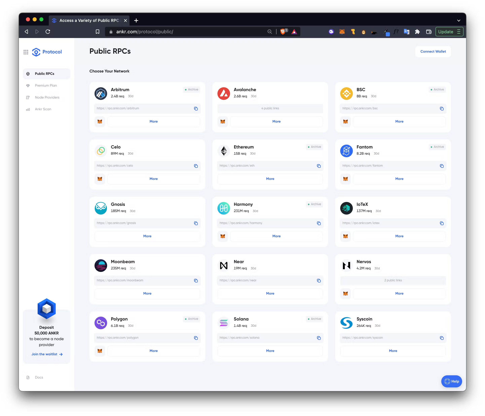
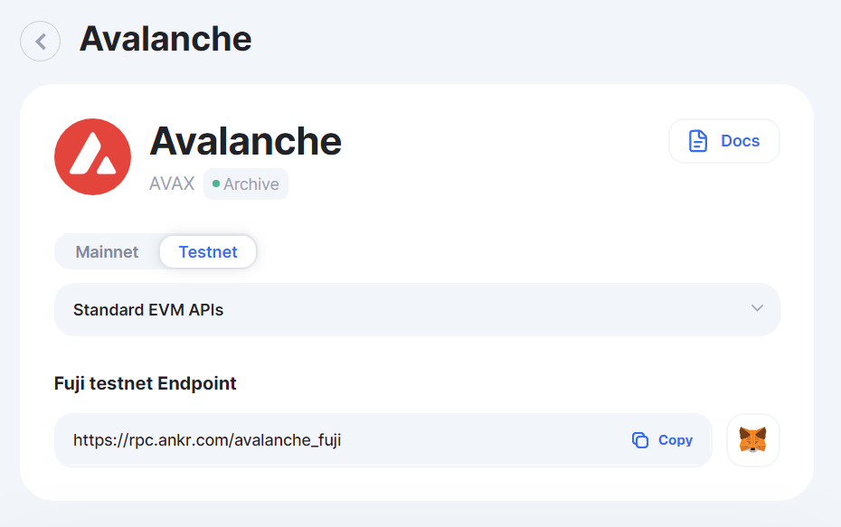
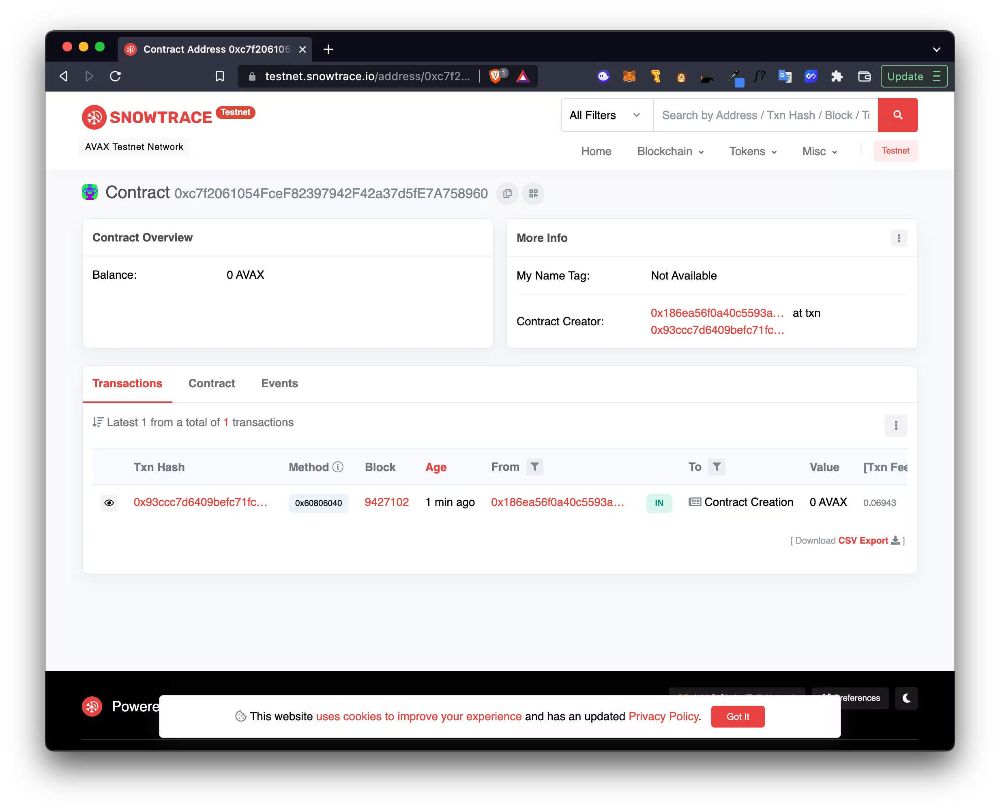
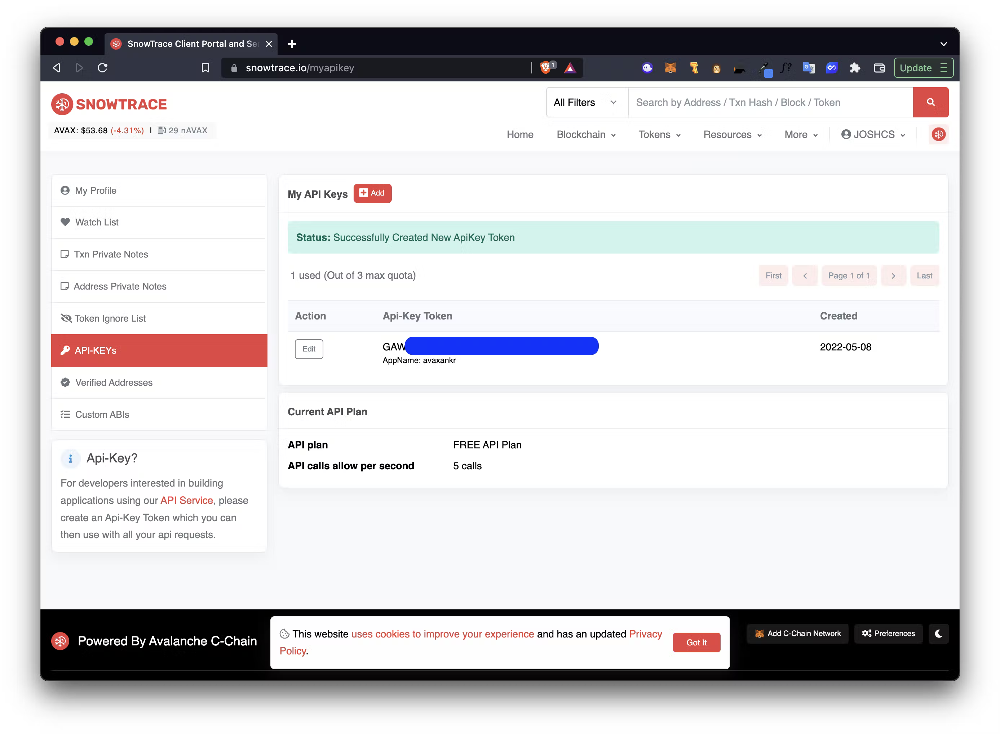
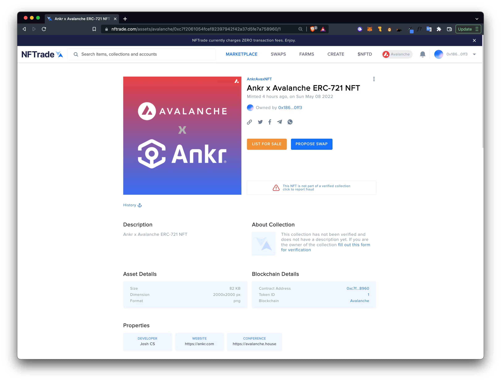

import { Code } from "../../../components";
import { Bleed } from "nextra-theme-docs";
import { Callout } from "nextra-theme-docs";
import Image from 'next/image';

# Deploy and Mint a CryptoKitties-Like NFT with ERC-721 Smart Contract

**By** [**JoshCS**](https://twitter.com/JoshCStein)
____________________________________

## Set up your Dev Environment

First, create a new directory called `avaxankr`. 

Initialize your new npm project in the directory:

```
npm init
```

Install Hardhat, an Ethereum development environment for testing and deploying smart contracts to the blockchain.

```
npm install --save-dev hardhat
```

Create a new Hardhat project:

```
npx hardhat
```
Select “create an empty `hardhat.config.js`"

Add project folders:

```
mkdir contracts && mkdir scripts
```

## Write Your Smart Contract

Write your contract. We will use an ERC-721 standard based on OpenZepplin. ERC-721 is the free and open standard that defines the schema for a non-fungible or unique token on Ethereum. ERC-20 tokens are fungible and each token is the same as another, whereas ERC-721 tokens are unique. You can also learn more at the page below. OpenZepplin is an open-source standard for securing blockchain applications and provides security products to build, automate, and operate dApps.

```
npm install @openzeppelin/contracts
```

Next, add the following smart contract to the `contracts` directory and name it `AnkrAvalancheNFT.sol`

```java
// SPDX-License-Identifier: MIT
pragma solidity ^0.8.0; // declare the version of solidity to compile this contract. This must match the version of solidity in your hardhat.config.js file

// import ERC-721 URI storage extension standard and Counters.sol which will help set token IDs from OpenZepplin
// add ownable and ERC721.sol
import "@openzeppelin/contracts/token/ERC721/ERC721.sol";
import "@openzeppelin/contracts/token/ERC721/extensions/ERC721URIStorage.sol";
import "@openzeppelin/contracts/utils/Counters.sol";
import "@openzeppelin/contracts/access/Ownable.sol";

// @dev This function instantiates the contract for AnkrPolygonNFT and classifies ERC-721 for storage schema
contract AnkrAvalancheNFT is ERC721URIStorage, Ownable {

/* @dev Set up our counters
* @param Counters will create unique TokenIds for each mint of the ERC-721 token
* @return This will return the current TokenId
*/
    using Counters for Counters.Counter;

/* @dev Store our counter
* @param The TokenId will be stored based on the current count
* @return This will store the current TokenId
*/
    Counters.Counter private _tokenIds;

// pass arguments for name and symbol
/* @dev Set the name and token tracker for our contract
* @param AnkrPolygonNFT will be the name of the ERC-721 token, and ANKRPG will be the token tracker
* @return This will name the token each time it is minted
*/
    constructor() ERC721("AnkrAvaxNFT", "ANKRAVAX") {}

/* @dev This will set the mint function for the token with the URI and recipient specified
* @param tokenURI specifies the schema and 
* @return This will set the name, image, description, and properties
*/
    function mint(address recipient, string memory tokenURI) public returns (uint256){

// increment the tokenId by one
        _tokenIds.increment();

// fetch the current tokenId and set the new tokenId
        uint256 newItemId = _tokenIds.current();

/* @dev Set the token owner by retrieving the address from recipient
* @param recipient is the wallet address for the receiver and newItemId is current tokenId
* @return Receiver of ERC-721 and tokenId
*/
        _safeMint(recipient, newItemId);

/* @dev Set the token URI and new TokenId
* @param newItemId is current tokenId and new tokenURI
* @return Current TokenId and tokenURI
*/
        _setTokenURI(newItemId, tokenURI);

// return current newItemId for the ERC-721 token
        return newItemId;
    }
}
```

Install the Ethers.js Ethereum library:
```
npm install --save-dev @nomiclabs/hardhat-ethers ethers@^5.0.0 @nomiclabs/hardhat-etherscan
```

Set and keep our environment variables hidden by using [dotenv](https://www.npmjs.com/package/dotenv)

```
npm install --save dotenv
```

Create a `.env` file in your project’s root folder and set the environment variable as follows. This is the private key of the account you intend to use on the Avalanche Network from MetaMask.

```
PRIVATE_KEY=YOUR_PRIVATE_KEY
```

## Setup Hardhat to Compile and Deploy Your Contract to Fuji Testnet



We will be using [Ankr's Public RPC's](https://www.ankr.com/rpc/avalanche/) to connect to and send transactions on the Avalanche blockchain just copy the URL for the Fuji testnet and mainnet. No account or login required!



Now you are ready to edit your `hardhat.config.js` with the following:

```java
/**
 * @type import('hardhat/config').HardhatUserConfig
 */
require("dotenv").config();
require("@nomiclabs/hardhat-ethers");
require("@nomiclabs/hardhat-etherscan");

module.exports = {
  solidity: "0.8.6",

  networks: {
    avalanche: {
      url: "https://rpc.ankr.com/avalanche",
      accounts: [`0x` + process.env.PRIVATE_KEY],
      chainId: 43114,
    },
    fuji: {
      url: "https://rpc.ankr.com/avalanche_fuji",
      accounts: [`0x` + process.env.PRIVATE_KEY],
      chainId: 43113,
    },
  },
  etherscan: {
    apiKey: process.env.SNOWTRACE_API_KEY,
    apiUrl: "https://api.snowtrace.io",
    browserURL: "https://snowtrace.io/",
  },
};
```
Compile your contract to make sure everything is good to deploy

```bash
npx hardhat compile

# output
# Compiled 1 Solidity file successfully
```

Write a deploy script by navigating to the scripts folder and creating a new file called `deploy.js`

```
cd scripts && touch deploy.js
```
Add the following script to the `deploy.js` file

```java
// open main asynchronous function will handle deployment
async function main() {
  // use ethers to pass the name of our contract to getContractFactory
  const nftContractFactory = await ethers.getContractFactory(
    "AnkrAvalancheNFT"
  );

  // create variable to allow us to use the deploy function of getContractFactory
  const nftContract = await nftContractFactory.deploy();

  // log the address of the Contract in our console
  console.log("Contract deployed to:", nftContract.address);
  process.exit(0);
}

// run main, catch error, if any, and log in console
main()
  .then(() => process.exit(0))
  .catch((error) => {
    console.error(error);
    process.exit(1);
  });
```

Deploy the contract to the Avalanche Fuji Testnet

```bash
npx hardhat run scripts/deploy.js --network fuji

# output
# Contract deployed to: 0xc7f2061054FceF82397942F42a37d5fE7A758960
```
Copy the contract address and search for it in Snowtrace at [testnet.snowtrace.io](https://testnet.snowtrace.io/)↗ (example)




##  Deploy the Contract to Avalanche Mainnet

Deploy your contract to Avalanche Mainnet

```bash
npx hardhat run scripts/deploy.js --network avalanche

# output
# Contract deployed to: 0xc7f2061054FceF82397942F42a37d5fE7A758960
```

Copy the contract address and search for it in Snowtrace at snowtrace.io ([example contract](https://snowtrace.io/address/0xc7f2061054FceF82397942F42a37d5fE7A758960)↗)


Create an account on Snowtrace and go to `https://snowtrace.io/myapikey`. Create a new API key. Copy the API key and paste it in your `.env` file



```
PRIVATE_KEY=YOUR_PRIVATE_KEY
SNOWTRACE_API_KEY=YOUR_API_KEY
```
Be sure your Snowtrace API key is in your `.env` file and then run the following command to verify your contract on Snowtrace. Verifying the contract on Snowtrace will decode the bytecode to human-readable code. Be sure to replace the `YOUR_CONTRACT_ADDRESS` with your contract address.

```bash
npx hardhat verify YOUR_CONTRACT_ADDRESS --network avalanche

# output
# Nothing to compile
# Successfully submitted source code for contract
# contracts/AnkrAvalancheNFT.sol:AnkrAvalancheNFT at 0xc7f2061054FceF82397942F42a37d5fE7A758960 for verification on the block explorer. Waiting for verification result...

# Successfully verified contract AnkrAvalancheNFT on Etherscan.
# https://snowtrace.io/address/YOUR_CONTRACT_ADDRESS#code
```

## Mint an ERC-721 NFT on Avalanche

We will be using Hardhat to mint an NFT programmatically and [web3.storage](https://web3.storage/)↗ to store our image and data. We will need to set the Token URI to a [JSON](https://www.json.org/json-en.html)↗ file. I’ve gone ahead and made an image with the tools we’ve used on this tutorial. Web3.storage is a tool that allows users to store their files on the Interplanetary File System (IPFS) by Protocol Labs

Start by uploading your file to Web3.storage.

Copy the URI and create an avaxnft.json file in root directory. Add the URI to the JSON code. You can learn more about how to structure your JSON file from [OpenSea’s metadata standards](https://docs.opensea.io/docs/metadata-standards)

```bash
{
  "name": "Ankr x Avalanche ERC-721 NFT",
  "description": "Ankr x Avalanche ERC-721 NFT",
  "image": "https://ipfs.io/ipfs/bafybeieua46kk2xqshlpttael2r2ypjiyua3fcwnft52a44tk7jlzu263y/AVAX_x_ANKR.png",
  "attributes": [
    {
      "trait_type": "Developer",
      "value": "Josh CS"
    },
    {
      "trait_type": "Website",
      "value": "https://ankr.com"
    },
    {
      "trait_type": "Conference",
      "value": "https://avalanche.house"
    }
  ]
}
```
Upload `avaxnft.json` to Web3.storage and copy the URI and add it to the `tokenURI` variable in `mint.js`. Add a `CONTRACT_ADDRESS` variable and PUBLIC_KEY in your `.env` file and add them.

```
PRIVATE_KEY=YOUR_PRIVATE_KEY
SNOWTRACE_API_KEY=YOUR_API_KEY
CONTRACT_ADDRESS=YOUR_CONTRACT_ADDRESS
PUBLIC_KEY=YOUR_PUBLIC_KEY
```

Create your `mint.js` file in the `scripts` directory
```java
// require the correct libraries

require("dotenv").config();
require("@nomiclabs/hardhat-ethers");

// Our contract’s ABI (Application Binary Interface) is the interface enabling our js script to interact with our smart contract. Hardhat generates and stores the ABI version of our contract in the artifacts folder as a JSON file.
const contract = require("../artifacts/contracts/AnkrAvalancheNFT.sol/AnkrAvalancheNFT.json");
const contractInterface = contract.abi;

let provider = ethers.provider;

const tokenURI =
  "https://ipfs.io/ipfs/bafybeib3skazl2dhjctsmiroc6ug5zketfooovt53ast5pxytcan2n3zba/avaxankr.json";
const privateKey = `0x${process.env.PRIVATE_KEY}`;
const wallet = new ethers.Wallet(privateKey);

wallet.provider = provider;
const signer = wallet.connect(provider);

// https://docs.ethers.io/v5/api/contract/contract
const nft = new ethers.Contract(
  process.env.CONTRACT_ADDRESS,
  contractInterface,
  signer
);

const main = () => {
  console.log("Waiting 5 blocks for confirmation...");
  nft
    .mint(process.env.PUBLIC_KEY, tokenURI)
    .then((tx) => tx.wait(5))
    .then((receipt) =>
      console.log(
        `Your transaction is confirmed, its receipt is: ${receipt.transactionHash}`
      )
    )
    .catch((e) => console.log("something went wrong", e));
};

main();
```

Call `mint.js` and specify the network as Avalanche

```bash
npx hardhat run scripts/mint.js --network avalanche

# output
# Waiting 5 blocks for confirmation...
# Your transaction is confirmed, its receipt is: 0xb52eece2e80648fdfc14ffcf460903cf06716ace5616ebd3fd03045239bed94d
```

## View your NFT on [NFTrade.com](https://nftrade.com/)

Copy the `PUBLIC_KEY` address and navigate to `https://nftrade.com/users/avalanche/PUBLIC_KEY` to view your NFT.



