import { Code } from "../../../components";
import { Bleed } from "nextra-theme-docs";
import { Callout } from "nextra-theme-docs";

# How To Build An ERC-20 token On Optimism's Lightning-Fast Ethereum L2 Blockchain

**By** [**Manny**](https://twitter.com/codingwithmanny)
________________

## What We're Building
If you have ever wanted to create your own type of currency or token that would be used as a means for an exchange of value or trading then you’re in the right place today. We’ll be building and deploying an ERC-20 Token to Optimism Kovan Testnet.

We’ll be walking you through the entire process of coding, testing, setting up your network, adding tokens via a faucet, deploying the contract to the Optimism testnet, and interacting with it via a

## Wait, What’s Optimism?

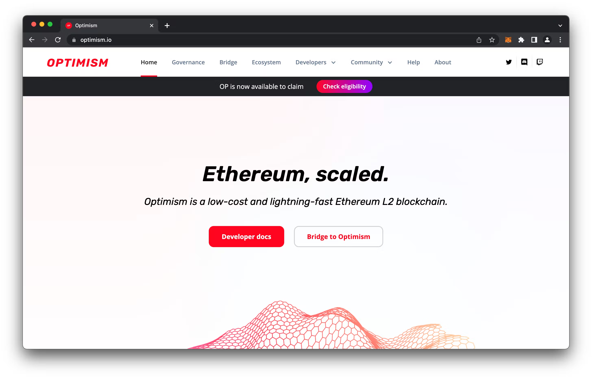

Optimism is a fast and transactionally cheap L2 EVM Blockchain that lets developers build contracts on top of its chain with Solidity. If you’d like to read more about what Optimism is, there is a great article on CoinMarketCap explaining its advantages and differences.

### Requirements
Before we start, here is a list of things you’ll need on your computer:

- NVM or Node v16.15.1+
- Yarn
- VSCode
- Metamask Wallet

## Project Setup
To start, we’re going to leverage Hardhat to develop, compile, test, and deploy our contract locally. If you’re not familiar, this will be a good primer to start with.

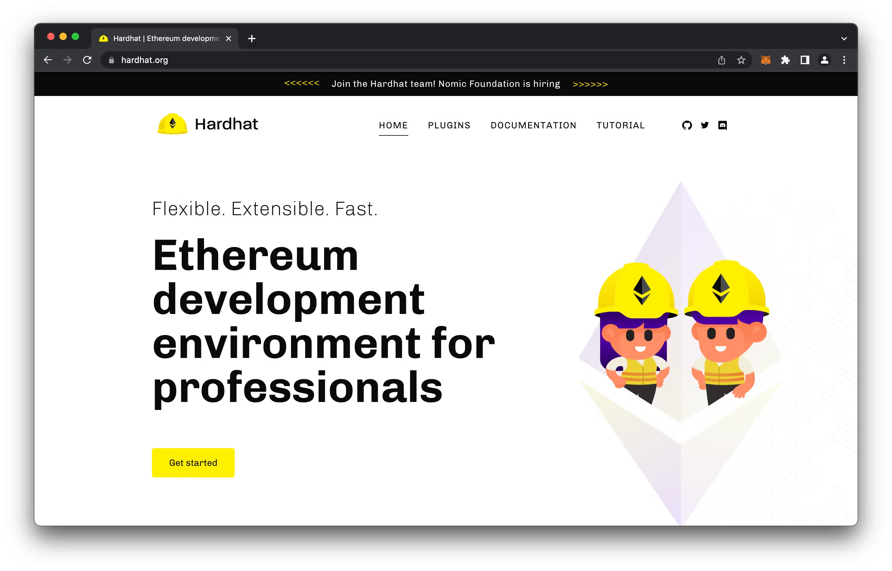

To start, we’re going to scaffold out a new project with TypeScript.

```bash
mkdir optimism-erc20;
cd optimism-erc20;
npx hardhat;

# PROMPT 1 - Choose base
888    888                      888 888               888
888    888                      888 888               888
888    888                      888 888               888
8888888888  8888b.  888d888 .d88888 88888b.   8888b.  888888
888    888     "88b 888P"  d88" 888 888 "88b     "88b 888
888    888 .d888888 888    888  888 888  888 .d888888 888
888    888 888  888 888    Y88b 888 888  888 888  888 Y88b.
888    888 "Y888888 888     "Y88888 888  888 "Y888888  "Y888

👷 Welcome to Hardhat v2.9.9 👷‍

? What do you want to do? …
  Create a basic sample project
  Create an advanced sample project
❯ Create an advanced sample project that uses TypeScript
  Create an empty hardhat.config.js
  Quit

# PROMPT 2 - Confirm project root
✔ What do you want to do? · Create an advanced sample project that uses TypeScript
? Hardhat project root: › /path/to/optimism-erc20

# PROMPT 3 - Git Ignore
✔ What do you want to do? · Create an advanced sample project that uses TypeScript
✔ Hardhat project root: · /path/to/optimism-erc20
? Do you want to add a .gitignore? (Y/n) › y

# PROMPT 4 - Install Dependencies
✔ What do you want to do? · Create an advanced sample project that uses TypeScript
✔ Hardhat project root: · /Users/manny/Documents/github/optimism-erc20
✔ Do you want to add a .gitignore? (Y/n) · y
? Do you want to install this sample project's dependencies with npm (hardhat @nomiclabs/hardhat-waffle ethereum-waffle chai @nomiclabs/hardhat-ethers ethers @nomiclabs/hardhat-etherscan dotenv eslint eslint-config-prettier eslint-config-standard eslint-plugin-import eslint-plugin-node eslint-plugin-prettier eslint-plugin-promise hardhat-gas-reporter prettier prettier-plugin-solidity solhint solidity-coverage @typechain/ethers-v5 @typechain/hardhat @typescript-eslint/eslint-plugin @typescript-eslint/parser @types/chai @types/node @types/mocha ts-node typechain typescript)? (Y/n) › y
```

If we open up our project in VSCode we should see big list of files generated for us, but don’t worry we won’t need to use all of them.

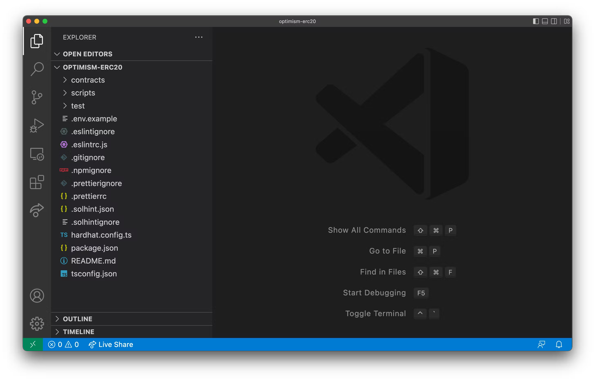


## Creating Our Contract
Now that we have all our files, we’re going to start off by modifying our current Solidity contract (`Greeter.sol`) in the `contracts` folder by renaming it to `Buidl.sol` and making the following modifications.

File: `./contracts/Buidl.sol`

```javascript
//SPDX-License-Identifier: Unlicense
pragma solidity ^0.8.0;

contract BuidlToken {
}
```

With that base in place, we’re now going to leverage some existing code to easily build our own ERC-20 token on top of a widely adopted standard. To do this, we’ll be using OpenZeppelin’s contract npm package.

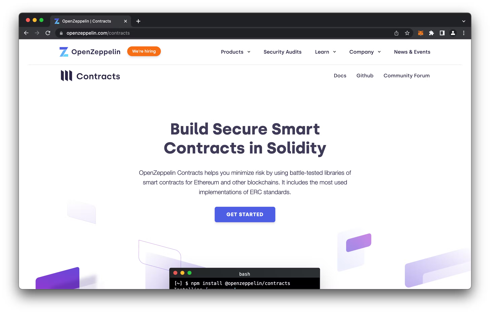

```bash
# /optimism-erc20
yarn add @openzeppelin/contracts;
```
With this newly installed npm package, we can add it to our contract, extend the contract, and pass the default attributes needed to define the name and its symbol.


```java
//SPDX-License-Identifier: Unlicense
pragma solidity ^0.8.0;

import "@openzeppelin/contracts/token/ERC20/ERC20.sol";

contract BuidlToken is ERC20 {
    constructor(uint256 initialSupply) ERC20("BuidlToken", "BDL") {
        _mint(msg.sender, initialSupply);
    }
}
```
That’s it! We have our ERC-20 token. The reason why our code is so short is because we’re using all the functions defined by the OpenZeppelin ERC20.sol file. The file provided by OpenZeppelin is an inherited set of functions from the ERC-20 contract, which you can more details on here. In VSCode, you can actually see the functions by doing Command (PC CTRL) + Click on the ERC20.sol part of the import.

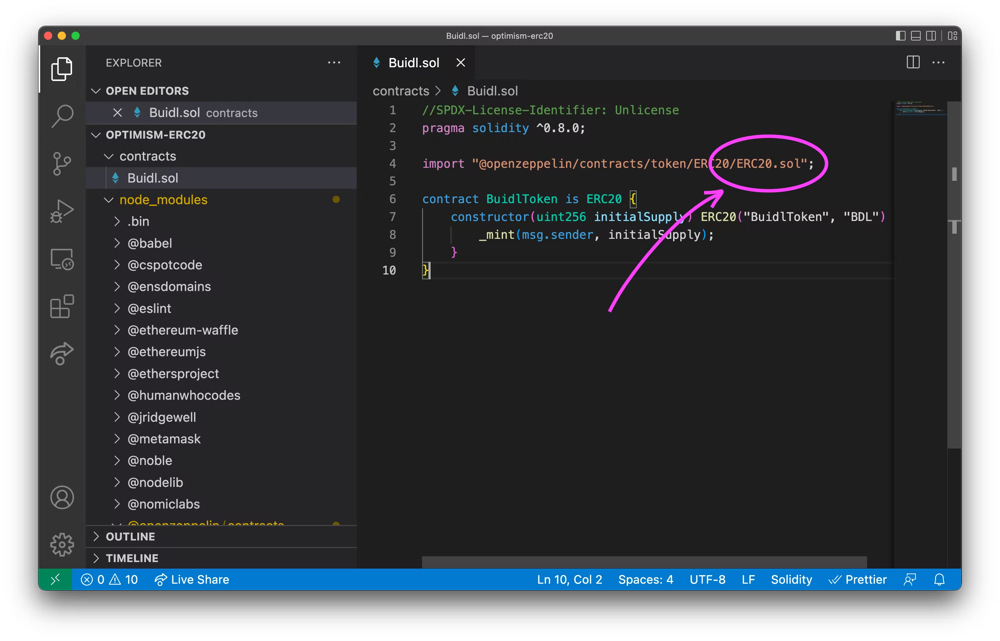


This should open up the file located in your node_modules folder and show you the [contents](https://github.com/OpenZeppelin/openzeppelin-contracts) of the entire file we’re extending.

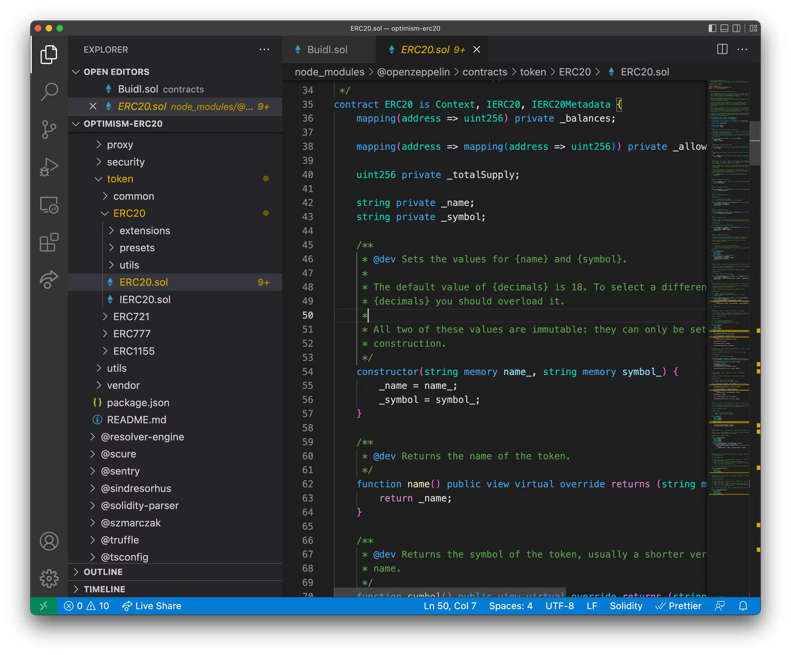


There is one thing that we need to factor in with this default ERC-20 token and that is that the supply can only be defined once, at the time of the contract deployed. We’re going to make a slight modification to our contract to make it so that only the owner (the wallet that deployed the contract) can modify the supply after the contract has been deployed.


```java
//SPDX-License-Identifier: Unlicense
pragma solidity ^0.8.0;

import "@openzeppelin/contracts/token/ERC20/ERC20.sol";
import "@openzeppelin/contracts/access/Ownable.sol";

contract BuidlToken is ERC20, Ownable {
    constructor(uint256 initialSupply) ERC20("BuidlToken", "BDL") {
        _mint(msg.sender, initialSupply);
    }

    /**
     * Contract Owner - Increase the total supply and add it to their wallet
     */
    function mint(uint256 amount) external onlyOwner {
        _mint(msg.sender, amount);
    }

    /**
     * User - Decrease their total supply
     */
    function burn(uint256 amount) public {
        _burn(msg.sender, amount);
    }
}
```
## Deploying Our Contract Locally

The next step is to deploy our contract to our local development environment to make sure things compile correctly. To do that we’ll need modify `deploy.ts`.

File: `./scripts/deploy.ts`

```java
// We require the Hardhat Runtime Environment explicitly here. This is optional
// but useful for running the script in a standalone fashion through `node <script>`.
//
// When running the script with `npx hardhat run <script>` you'll find the Hardhat
// Runtime Environment's members available in the global scope.
import { ethers } from "hardhat";

async function main() {
  // Hardhat always runs the compile task when running scripts with its command
  // line interface.
  //
  // If this script is run directly using `node` you may want to call compile
  // manually to make sure everything is compiled
  // await hre.run('compile');

  // We get the contract to deploy
  const Contract = await ethers.getContractFactory("BuidlToken");
  const contract = await Contract.deploy(1000); // Create 1000 initial tokens

  await contract.deployed();

  console.log("Contract deployed to:", contract.address);
}

// We recommend this pattern to be able to use async/await everywhere
// and properly handle errors.
main().catch((error) => {
  console.error(error);
  process.exitCode = 1;
});
```
After we’ve modified the file we’ll need to run two Terminals to get things deployed. The first one is to run the local development Ethereum Virtual Machine and the second is to deploy it to that environment.

**Terminal 1:**
```bash
# TERMINAL 1
# /optimism-erc20

./node_modules/.bin/hardhat node;

# Expected Output
# Started HTTP and WebSocket JSON-RPC server at http://127.0.0.1:8545/
# 
# Accounts
# ========
# 
# WARNING: These accounts, and their private keys, are publicly known.
# Any funds sent to them on Mainnet or any other live network WILL BE LOST.
# 
# Account #0: 0xf39Fd6e51aad88F6F4ce6aB8827279cffFb92266 (10000 ETH)
# Private Key: 0xac0974bec39a17e36ba4a6b4d238ff944bacb478cbed5efcae784d7bf4f2ff80
# 
# Account #1: 0x70997970C51812dc3A010C7d01b50e0d17dc79C8 (10000 ETH)
# Private Key: 0x59c6995e998f97a5a0044966f0945389dc9e86dae88c7a8412f4603b6b78690d
# 
# ...
# 
# WARNING: These accounts, and their private keys, are publicly known.
# Any funds sent to them on Mainnet or any other live network WILL BE LOST.
```

**Terminal 2:**
```bash
# TERMINAL 2
# /optimism-erc20

./node_modules/.bin/hardhat run scripts/deploy.ts --network localhost;

# Expected Output
# Generating typings for: 5 artifacts in dir: typechain for target: ethers-v5
# Successfully generated 11 typings!
# Compiled 5 Solidity files successfully
# Contract deployed to: 0x5FbDB2315678afecb367f032d93F642f64180aa3
```


## Testing Our Contract

A good habit is that when you have your contract code, is to create a series of tests to make sure that things are working as expected. As a brief overview of how I structure tests, the guideline I try to aim for is the following:

```
1 - Imports
2 - Configurations
3 - Helpers (Optional)
4 - Tests
    A - Function One Expected Failure(s)
    B - Function One Expected Success(es)
    C - Function Two ...
    D - Scenario(s)
```

Taking this guide into consideration, the main things we’re going to test for are:

1. **Minting** - Increasing the supply
2. **Burning** - Decreasing the supply
3. **Approving** - Giving another user permission to spend tokens on our behalf
4. **Transferring** - Moving tokens from one user to another
5. **Scenario Insufficient Tokens** - A user has the permission to spend tokens of another user but the tokens are already spent or burned

**NOTE:** This is a lot of code to read, but gives you some insight as to how tests are written. If you want to skip this part, just scroll through it, but if you want to test your code, I recommend just copying it for now.

File: `./test/index.ts`

```javascript
// Imports
// ========================================================
import { expect } from "chai";
import { ethers } from "hardhat";
import ContractABI from "../artifacts/contracts/Buidl.sol/BuidlToken.json";

// Config
// ========================================================
/**
 * Name of contract
 */
const CONTRACT_NAME = "BuidlToken";

/**
 * @dev Account #0: First wallet address given when we run the hardhat node
 */
const OWNER_ADDRESS = "0xf39Fd6e51aad88F6F4ce6aB8827279cffFb92266";

/**
 * @dev Account #1: Second wallet address given when we run the hardhat node
 */
const RANDOM_ADDRESS = "0x70997970C51812dc3A010C7d01b50e0d17dc79C8";

/**
 * @dev Account #2: Third wallet address given when we run the hardhat node
 */
const ANOTHER_ADDRESS = "0x3C44CdDdB6a900fa2b585dd299e03d12FA4293BC";

// Tests
// ========================================================
describe(`${CONTRACT_NAME} - Contract Tests`, async () => {
  /**
   * mint
   */
  it("mint - should FAIL when minting -1", async () => {
    // Setup
    const initialSupply = 1000;
    const amountToMint = -1;
    // - Deploy contract
    const Contract = await ethers.getContractFactory(`${CONTRACT_NAME}`);
    const deployedContract = await Contract.deploy(initialSupply);
    await deployedContract.deployed();
    // - Setup wallet that will interact with the contract as a signer
    const provider = new ethers.providers.JsonRpcProvider();
    const signer = provider.getSigner(OWNER_ADDRESS);
    // - Get the contract linked with the signer
    const contract = new ethers.Contract(
      (await deployedContract.deployed()).address,
      ContractABI.abi,
      signer
    );

    try {
      // Init
      await contract.mint(amountToMint);
    } catch (error: any) {
      // Expectations
      expect(error?.reason).to.be.eq("value out-of-bounds");
    }
  });

  /**
   * mint
   */
  it("mint - should PASS when minting 10", async () => {
    // Setup
    const initialSupply = 1000;
    const amountToMint = 10;
    const walletOwner = OWNER_ADDRESS;
    // - Deploy contract
    const Contract = await ethers.getContractFactory(`${CONTRACT_NAME}`);
    const deployedContract = await Contract.deploy(initialSupply);
    await deployedContract.deployed();
    // - Setup wallet that will interact with the contract as a signer
    const provider = new ethers.providers.JsonRpcProvider();
    const signer = provider.getSigner(walletOwner);
    // - Get the contract linked with the signer
    const contract = new ethers.Contract(
      (await deployedContract.deployed()).address,
      ContractABI.abi,
      signer
    );

    // Init
    await contract.mint(amountToMint);
    const result = await contract.totalSupply();

    // Expectations
    expect(result).to.be.eq(initialSupply + amountToMint);
  });

  /**
   * burn
   */
  it("burn - should FAIL when burning -1", async () => {
    // Setup
    const initialSupply = 1000;
    const amountToBurn = -1;
    const walletOwner = OWNER_ADDRESS;
    // - Deploy contract
    const Contract = await ethers.getContractFactory(`${CONTRACT_NAME}`);
    const deployedContract = await Contract.deploy(initialSupply);
    await deployedContract.deployed();
    // - Setup wallet that will interact with the contract as a signer
    const provider = new ethers.providers.JsonRpcProvider();
    const signer = provider.getSigner(walletOwner);
    // - Get the contract linked with the signer
    const contract = new ethers.Contract(
      (await deployedContract.deployed()).address,
      ContractABI.abi,
      signer
    );

    try {
      // Init
      await contract.burn(amountToBurn);
    } catch (error: any) {
      // Expectations
      expect(error?.reason).to.be.eq("value out-of-bounds");
    }
  });

  /**
   * burn
   */
  it("burn - should FAIL when burning tokens that aren't owned", async () => {
    // Setup
    const initialSupply = 1000;
    const amountToBurn = 100;
    const walletOwner = RANDOM_ADDRESS;
    // - Deploy contract
    const Contract = await ethers.getContractFactory(`${CONTRACT_NAME}`);
    const deployedContract = await Contract.deploy(initialSupply);
    await deployedContract.deployed();
    // - Setup wallet that will interact with the contract as a signer
    const provider = new ethers.providers.JsonRpcProvider();
    const signer = provider.getSigner(walletOwner);
    // - Get the contract linked with the signer
    const contract = new ethers.Contract(
      (await deployedContract.deployed()).address,
      ContractABI.abi,
      signer
    );

    try {
      // Init
      await contract.burn(amountToBurn);
    } catch (error: any) {
      // Expectations
      expect(error?.reason).to.be.eq(
        "Error: VM Exception while processing transaction: reverted with reason string 'ERC20: burn amount exceeds balance'"
      );
    }
  });

  /**
   * burn
   */
  it("burn - should PASS when burning tokens that exist/owned", async () => {
    // Setup
    const initialSupply = 1000;
    const amountToBurn = 100;
    const walletOwner = OWNER_ADDRESS;
    // - Deploy contract
    const Contract = await ethers.getContractFactory(`${CONTRACT_NAME}`);
    const deployedContract = await Contract.deploy(initialSupply);
    await deployedContract.deployed();
    // - Setup wallet that will interact with the contract as a signer
    const provider = new ethers.providers.JsonRpcProvider();
    const signer = provider.getSigner(walletOwner);
    // - Get the contract linked with the signer
    const contract = new ethers.Contract(
      (await deployedContract.deployed()).address,
      ContractABI.abi,
      signer
    );

    // Init
    await contract.burn(amountToBurn);
    const result = await contract.totalSupply();

    // Expectations
    expect(result).to.be.eq(initialSupply - amountToBurn);
  });

  /**
   * approve
   */
  it("approve - should FAIL when approving -1", async () => {
    // Setup
    const initialSupply = 1000;
    const amountToApprove = -1;
    const walletOwner = OWNER_ADDRESS;
    const walletApproved = RANDOM_ADDRESS;
    // - Deploy contract
    const Contract = await ethers.getContractFactory(`${CONTRACT_NAME}`);
    const deployedContract = await Contract.deploy(initialSupply);
    await deployedContract.deployed();
    // - Setup wallet that will interact with the contract as a signer
    const provider = new ethers.providers.JsonRpcProvider();
    const signer = provider.getSigner(walletOwner);
    // - Get the contract linked with the signer
    const contract = new ethers.Contract(
      (await deployedContract.deployed()).address,
      ContractABI.abi,
      signer
    );

    try {
      // Init
      await contract.approve(walletApproved, amountToApprove);
    } catch (error: any) {
      // Expectations
      expect(error?.reason).to.be.eq("value out-of-bounds");
    }
  });

  /**
   * approve
   */
  it("approve - should PASS when approving 10", async () => {
    // Setup
    const initialSupply = 1000;
    const amountToApprove = 10;
    const walletOwner = OWNER_ADDRESS;
    const walletApproved = RANDOM_ADDRESS;
    // - Deploy contract
    const Contract = await ethers.getContractFactory(`${CONTRACT_NAME}`);
    const deployedContract = await Contract.deploy(initialSupply);
    await deployedContract.deployed();
    // - Setup wallet that will interact with the contract as a signer
    const provider = new ethers.providers.JsonRpcProvider();
    const signer = provider.getSigner(walletOwner);
    // - Get the contract linked with the signer
    const contract = new ethers.Contract(
      (await deployedContract.deployed()).address,
      ContractABI.abi,
      signer
    );

    // Init
    await contract.approve(walletApproved, amountToApprove);
    const result = await contract.allowance(walletOwner, walletApproved);

    // Expectations
    expect(result.toNumber()).to.be.eq(amountToApprove);
  });

  /**
   * transfer
   */
  it("transfer - should FAIL when transferring -1", async () => {
    // Setup
    const initialSupply = 1000;
    const amountToTransfer = -1;
    const walletOwner = OWNER_ADDRESS;
    const walletReceiving = RANDOM_ADDRESS;
    // - Deploy contract
    const Contract = await ethers.getContractFactory(`${CONTRACT_NAME}`);
    const deployedContract = await Contract.deploy(initialSupply);
    await deployedContract.deployed();
    // - Setup wallet that will interact with the contract as a signer
    const provider = new ethers.providers.JsonRpcProvider();
    const signer = provider.getSigner(walletOwner);
    // - Get the contract linked with the signer
    const contract = new ethers.Contract(
      (await deployedContract.deployed()).address,
      ContractABI.abi,
      signer
    );

    try {
      // Init
      await contract.transfer(walletReceiving, amountToTransfer);
    } catch (error: any) {
      // Expectations
      expect(error?.reason).to.be.eq("value out-of-bounds");
    }
  });

  /**
   * transfer
   */
  it("transfer - should FAIL when transferring more than owned", async () => {
    // Setup
    const initialSupply = 1000;
    const amountToTransfer = 1001;
    const walletOwner = OWNER_ADDRESS;
    const walletReceiving = RANDOM_ADDRESS;
    // - Deploy contract
    const Contract = await ethers.getContractFactory(`${CONTRACT_NAME}`);
    const deployedContract = await Contract.deploy(initialSupply);
    await deployedContract.deployed();
    // - Setup wallet that will interact with the contract as a signer
    const provider = new ethers.providers.JsonRpcProvider();
    const signer = provider.getSigner(walletOwner);
    // - Get the contract linked with the signer
    const contract = new ethers.Contract(
      (await deployedContract.deployed()).address,
      ContractABI.abi,
      signer
    );

    try {
      // Init
      await contract.transfer(walletReceiving, amountToTransfer);
    } catch (error: any) {
      // Expectations
      expect(error?.reason).to.be.eq(
        "Error: VM Exception while processing transaction: reverted with reason string 'ERC20: transfer amount exceeds balance'"
      );
    }
  });

  /**
   * transfer
   */
  it("transfer - should PASS when transferring 10", async () => {
    // Setup
    const initialSupply = 1000;
    const amountToTransfer = 10;
    const walletOwner = OWNER_ADDRESS;
    const walletReceiving = RANDOM_ADDRESS;
    // - Deploy contract
    const Contract = await ethers.getContractFactory(`${CONTRACT_NAME}`);
    const deployedContract = await Contract.deploy(initialSupply);
    await deployedContract.deployed();
    // - Setup wallet that will interact with the contract as a signer
    const provider = new ethers.providers.JsonRpcProvider();
    const signer = provider.getSigner(walletOwner);
    // - Get the contract linked with the signer
    const contract = new ethers.Contract(
      (await deployedContract.deployed()).address,
      ContractABI.abi,
      signer
    );

    // Init
    await contract.transfer(walletReceiving, amountToTransfer);
    const result = await contract.balanceOf(walletReceiving);

    // Expectations
    expect(result.toNumber()).to.be.eq(amountToTransfer);
  });

  /**
   * scenario transferFrom
   */
  it("scenario transferFrom - should FAIL when approved spender spends more than the owner has", async () => {
    // Setup
    const initialSupply = 1000;
    const amountToApprove = 10;
    const walletOwner = OWNER_ADDRESS;
    const walletApproved = RANDOM_ADDRESS;
    const walletReceiving = ANOTHER_ADDRESS;
    // - Deploy contract
    const Contract = await ethers.getContractFactory(`${CONTRACT_NAME}`);
    const deployedContract = await Contract.deploy(initialSupply);
    await deployedContract.deployed();
    // - Setup wallet that will interact with the contract as a signer
    const provider = new ethers.providers.JsonRpcProvider();
    const signerOwner = provider.getSigner(walletOwner);
    const signerSpender = provider.getSigner(walletApproved);
    // - Get the contract linked with the signer
    const contractOwner = new ethers.Contract(
      (await deployedContract.deployed()).address,
      ContractABI.abi,
      signerOwner
    );
    // - Get the contract linked with other signer
    const contractSpender = new ethers.Contract(
      (await deployedContract.deployed()).address,
      ContractABI.abi,
      signerSpender
    );

    // Init
    await contractOwner.approve(walletApproved, amountToApprove);
    const resultAllowance = await contractOwner.allowance(
      walletOwner,
      walletApproved
    );
    await contractOwner.burn(initialSupply);
    try {
      await contractSpender.transferFrom(
        walletOwner,
        walletReceiving,
        amountToApprove
      );
    } catch (error: any) {
      // Expectations
      expect(error?.reason).to.be.eq(
        "Error: VM Exception while processing transaction: reverted with reason string 'ERC20: transfer amount exceeds balance'"
      );
      expect(resultAllowance.toNumber()).to.be.eq(amountToApprove);
    }
  });

  /**
   * scenario transferFrom
   */
  it("scenario transferFrom - should PASS when approved spender spends what the owner has", async () => {
    // Setup
    const initialSupply = 1000;
    const amountToApprove = 10;
    const walletOwner = OWNER_ADDRESS;
    const walletApproved = RANDOM_ADDRESS;
    const walletReceiving = ANOTHER_ADDRESS;
    // - Deploy contract
    const Contract = await ethers.getContractFactory(`${CONTRACT_NAME}`);
    const deployedContract = await Contract.deploy(initialSupply);
    await deployedContract.deployed();
    // - Setup wallet that will interact with the contract as a signer
    const provider = new ethers.providers.JsonRpcProvider();
    const signerOwner = provider.getSigner(walletOwner);
    const signerSpender = provider.getSigner(walletApproved);
    // - Get the contract linked with the signer
    const contractOwner = new ethers.Contract(
      (await deployedContract.deployed()).address,
      ContractABI.abi,
      signerOwner
    );
    // - Get the contract linked with other signer
    const contractSpender = new ethers.Contract(
      (await deployedContract.deployed()).address,ContractABI.abi, signerSpender
    );

    // Init
    await contractOwner.approve(walletApproved, amountToApprove);
    const resultAllowanceBefore = await contractOwner.allowance(
      walletOwner,
      walletApproved
    );
    await contractSpender.transferFrom(
      walletOwner,
      walletReceiving,
      amountToApprove
    );
    const resultAllowanceAfter = await contractOwner.allowance(
      walletOwner,
      walletApproved
    );
    const resultBalanceReceiver = await contractOwner.balanceOf(
      walletReceiving
    );
    const resusltBalanceOwner = await contractOwner.balanceOf(walletOwner);

    // Expectations
    expect(resultAllowanceBefore).to.be.eq(amountToApprove);
    expect(resultAllowanceAfter).to.be.eq(0);
    expect(resultBalanceReceiver.toNumber()).to.be.eq(amountToApprove);
    expect(resusltBalanceOwner.toNumber()).to.be.eq(
      initialSupply - amountToApprove
    );
  });
});
```
**NOTE: You might get this error in TypeScript**

```
ContractABI is declared but its value is never read.
```

To fix this, add `resolveJsonModule` to your `tsconfig.json` file:

File: `./tsconfig.json`
```bash
{
  "compilerOptions": {
    "target": "es2018",
    "module": "commonjs",
    "strict": true,
    "esModuleInterop": true,
    "outDir": "dist",
    "declaration": true,
    "resolveJsonModule": true
  },
  "include": ["./scripts", "./test", "./typechain"],
  "files": ["./hardhat.config.ts"]
}
```
In another Terminal, if we run the tests, we should get the following results:

```bash
# /optimism-erc20
./node_modules/.bin/hardhat --network localhost test;

# Expected Output
# No need to generate any newer typings.
# 
#   BuidlToken - Contract Tests
#     ✔ mint - should FAIL when minting -1 (276ms)
#     ✔ mint - should PASS when minting 10 (192ms)
#     ✔ burn - should FAIL when burning -1 (75ms)
#     ✔ burn - should FAIL when burning tokens that aren't owned (122ms)
#     ✔ burn - should PASS when burning tokens that exist/owned (143ms)
#     ✔ approve - should FAIL when approving -1 (67ms)
#     ✔ approve - should PASS when approving 10 (144ms)
#     ✔ transfer - should FAIL when transferring -1 (65ms)
#     ✔ transfer - should FAIL when transferring more than owned (102ms)
#     ✔ transfer - should PASS when transferring 10 (147ms)
#     ✔ scenario transferFrom - should FAIL when approved spender spends more than the owner has (259ms)
#     ✔ scenario transferFrom - should PASS when approved spender spends what the owner has (339ms)
# 
#   12 passing (2s)
```

## Deploying To Testnet

Now that we have our code and our tests validate the different scenarios, we are ready to deploy our ERC-20 Token contract to Optimism’s Kovan Testnet. Before we start, we’ll need to configure our Metamask wallet with Optimism’s Testnet and then add native Optimism tokens to it with a faucet.

## Getting Testnet Tokens From A Faucet

Once you have Optimism Testnet supported in your Metmask wallet is to get Testnet tokens. You can do this by going to `https://faucet.paradigm.xyz/`. You will need a Twitter account, but once you sign in, you should be able to enter your wallet address and click claim.

⚠️ NOTE: Remember to click the checkbox for "Drip on additional networks"

If you don’t have a Twitter account, you can use some of these faucet options as alternatives:

- https://kovan.optifaucet.com
- https://optimismfaucet.xyz

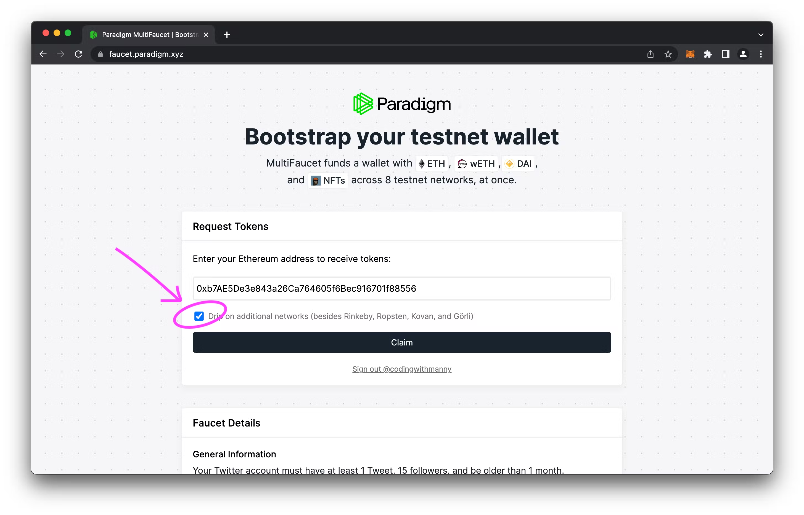


5dYFHOWWv.png

## Deployment Configuration
Now that we have the tokens in our wallet, we just need to need to create our environment variable file (.env) and modify our hardhat.config.ts to add the Optimism network to it.

Let’s first start by modifying our .env.example file:

File: `./.env.example`

```
ETHERSCAN_API_KEY=ABC123ABC123ABC123ABC123ABC123ABC1
OPTIMISM_KOVAN_URL=https://kovan.optimism.io
PRIVATE_KEY=0xabc123abc123abc123abc123abc123abc123abc123abc123abc123abc123abc1
```

Next we’ll make a copy of it and paste our wallet private key to the PRIVATE_KEY section.

REMEMBER: Never share this private key with anyone, not even your mom.

```
cp .env.example .env;
```
Next, we’ll need to get our wallet private key.


Once we have it, add it to our newly created .env file.

File: `./.env`

```
ETHERSCAN_API_KEY=ABC123ABC123ABC123ABC123ABC123ABC1
OPTIMISM_KOVAN_URL=https://kovan.optimism.io
PRIVATE_KEY=<YOUR-WALLET-SECRET-PRIVATE-KEY>
```
With these details entered, we just need to modify our hardhat.config.ts to support these new values and the Optimism Kovan testnet.

File: `./hardhat.config.ts`

```javascript
import * as dotenv from "dotenv";

import { HardhatUserConfig, task } from "hardhat/config";
import "@nomiclabs/hardhat-etherscan";
import "@nomiclabs/hardhat-waffle";
import "@typechain/hardhat";
import "hardhat-gas-reporter";
import "solidity-coverage";

dotenv.config();

// This is a sample Hardhat task. To learn how to create your own go to
// https://hardhat.org/guides/create-task.html
task("accounts", "Prints the list of accounts", async (taskArgs, hre) => {
  const accounts = await hre.ethers.getSigners();

  for (const account of accounts) {
    console.log(account.address);
  }
});

// You need to export an object to set up your config
// Go to https://hardhat.org/config/ to learn more

const config: HardhatUserConfig = {
  solidity: "0.8.4",
  networks: {
    // ! START HERE - ADD THIS
    optimismKovan: {
      url: process.env.OPTIMISM_KOVAN_URL || "",
      accounts:
        process.env.PRIVATE_KEY !== undefined ? [process.env.PRIVATE_KEY] : [],
    },
        // END HERE !
  },
  gasReporter: {
    enabled: process.env.REPORT_GAS !== undefined,
    currency: "USD",
  },
  etherscan: {
    apiKey: process.env.ETHERSCAN_API_KEY,
  },
};

export default config;
```
## Finally Deploying & Verifying Deployment

Everything is now setup, now we can deploy our contract to the Optimism Kovan Testnet.

Run the following and enjoy the miracle of deploying to the blockchain.

```bash
./node_modules/.bin/hardhat run scripts/deploy.ts --network optimismKovan;

# Expected Ouput
# No need to generate any newer typings.
# Contract deployed to: 0x375F01b156D9BdDDd41fd38c5CC74C514CB71f73
```
Using [Etherscan’s Optimism Kovan Blockchain Explorer](https://kovan-optimistic.etherscan.io/), we can search for the deployed contract.

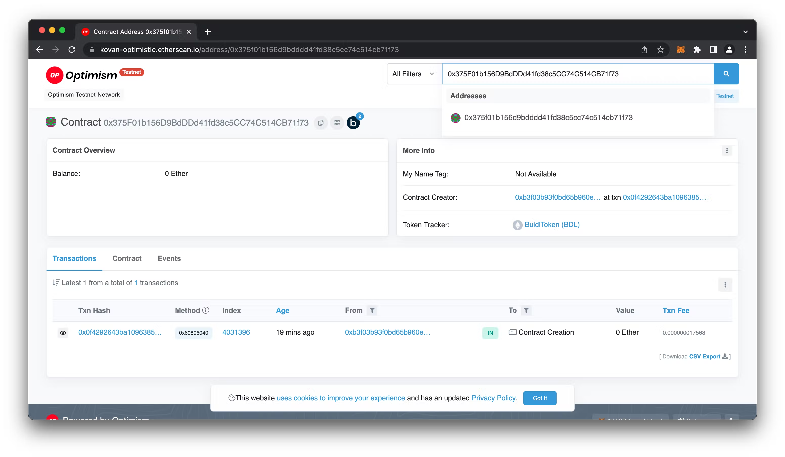

## Verifying Our Contract

Now that we have our contract deployed, we want to be able to interact with it via the blockchain explorer and in order to do that we need to verify its source code. This part requires creating an account with Optimistic Etherscan and generating an API key.


To do this, you’ll need to go to https://optimistic.etherscan.io/, sign up for a new account, and then make your way to the API Key section to generate a new key. With this key you’ll be pasting it into you .env file.
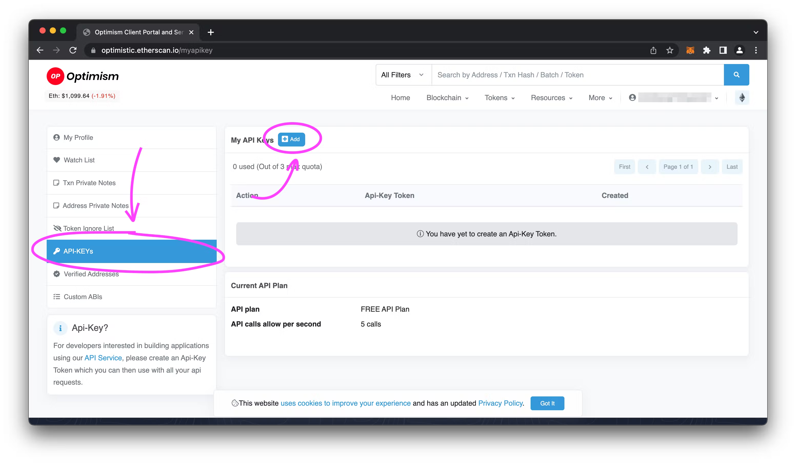

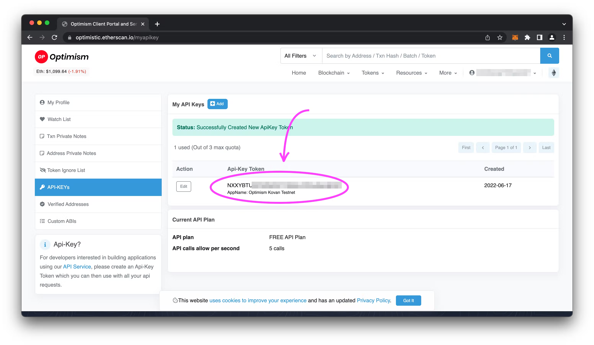


With the newly created API key, copy it to this file.

File: `./.env`

```
ETHERSCAN_API_KEY=<YOUR-OPTIMISTIC-ETHERSCAN-API-KEY>
OPTIMISM_KOVAN_URL=https://kovan.optimism.io
PRIVATE_KEY=<YOUR-WALLET-SECRET-PRIVATE-KEY>
```
Now that we have all the right values, we can run the following to validate the contract.

```bash
# /optimism-erc20
# NOTE:
# 1 - 0x375... refers to the deployed contract address
# 2 - 1000 refers to the original 1000 supply parameter deployed in our deploy.ts file 
./node_modules/.bin/hardhat verify --network optimismKovan 0x375F01b156D9BdDDd41fd38c5CC74C514CB71f73 1000

# Expected Output
# Nothing to compile
# No need to generate any newer typings.
# Successfully submitted source code for contract
# contracts/Buidl.sol:BuidlToken at 0x375F01b156D9BdDDd41fd38c5CC74C514CB71f73
# for verification on the block explorer. Waiting for verification result...

# Successfully verified contract BuidlToken on Etherscan.
# https://kovan-optimistic.etherscan.io/address/0x375F01b156D9BdDDd41fd38c5CC74C514CB71f73#code
```
Now if we look on the test net we’ll see a bunch of functions that are available to us.

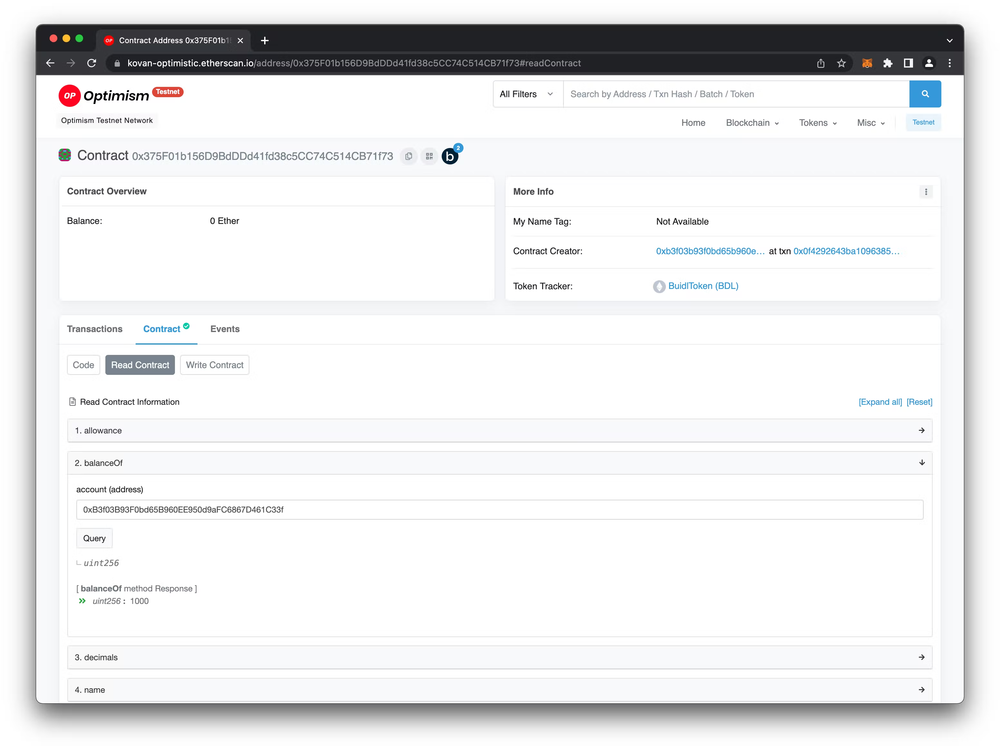


## Minting Tokens

Our final step is to increase the total supply by minting more token through the blockchain explorer. To do this you’ll head over to the Contract section and select Write Contract. From there you’ll need to connect your wallet (the wallet address which deployed the contract) and use the mint function.


Once the transaction is complete, you can verify the total supply by going back the Read Contract section and expanding the totalSupply section to see the new supply being reflected.

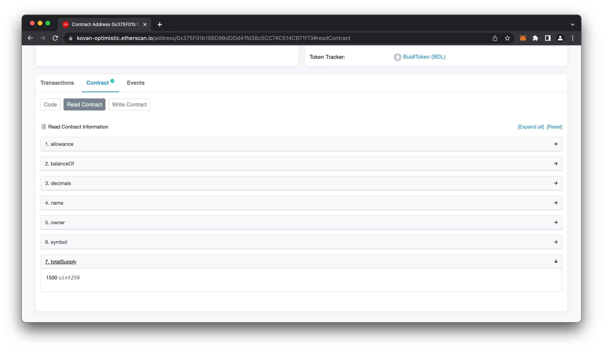


