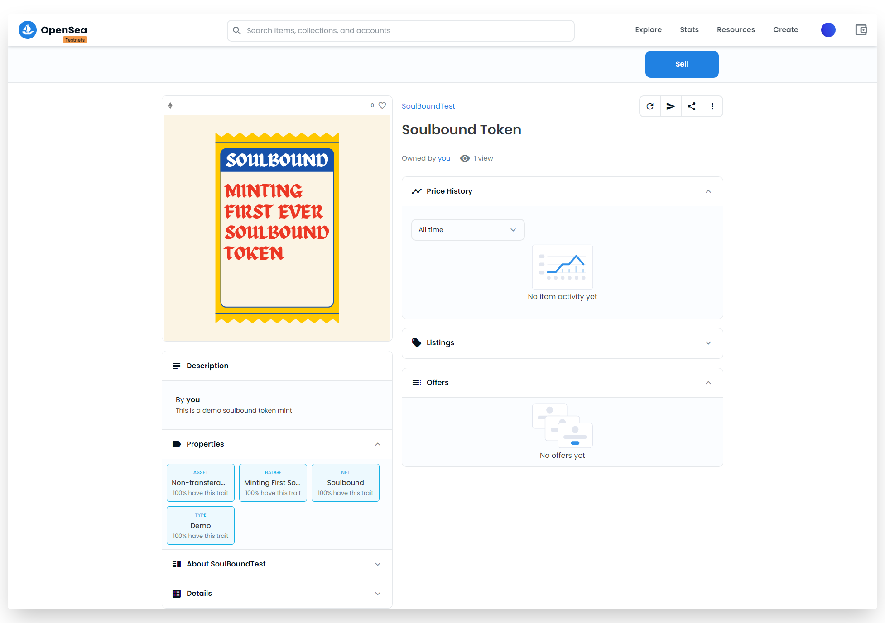
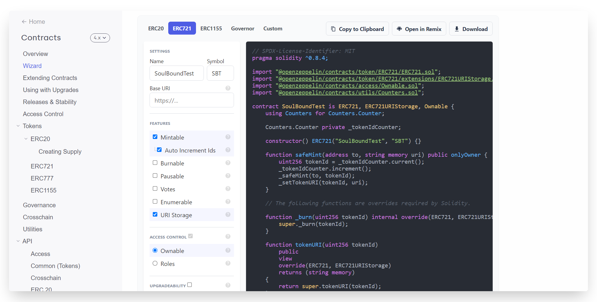
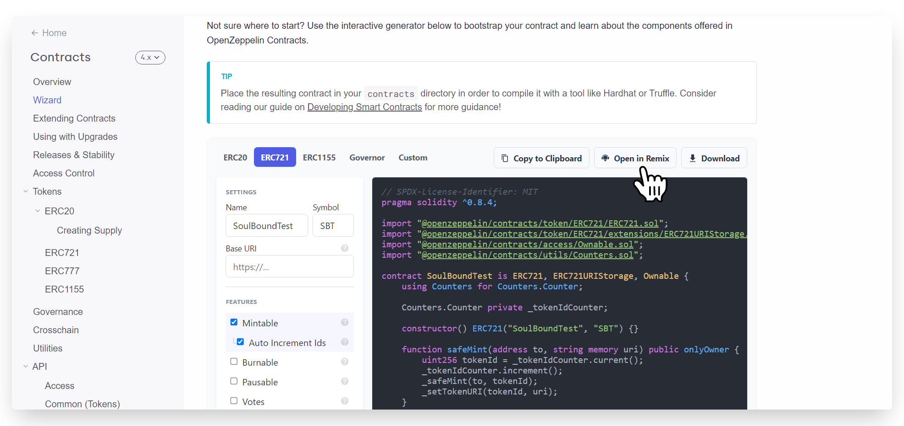
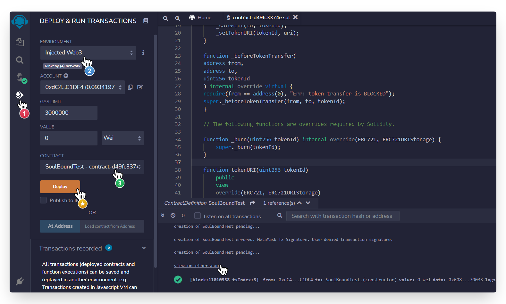
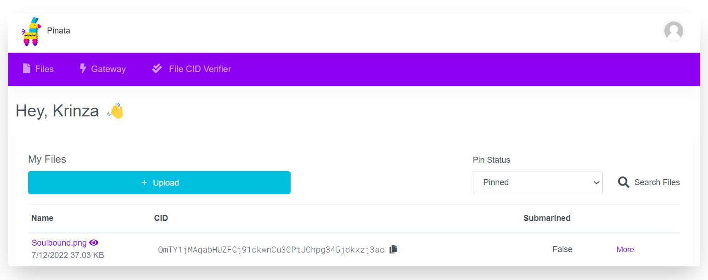
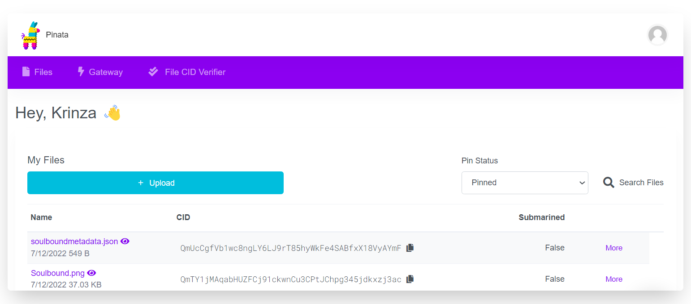
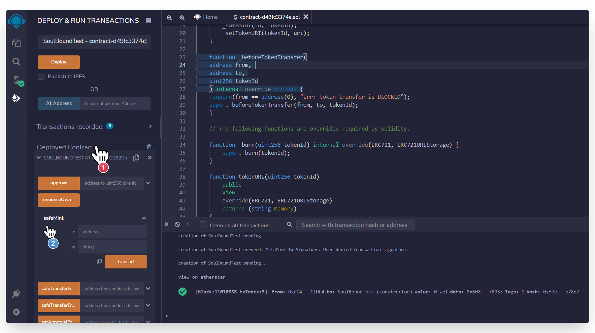
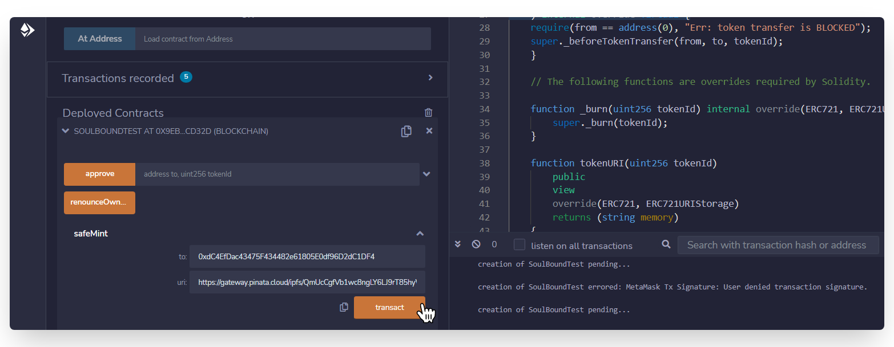
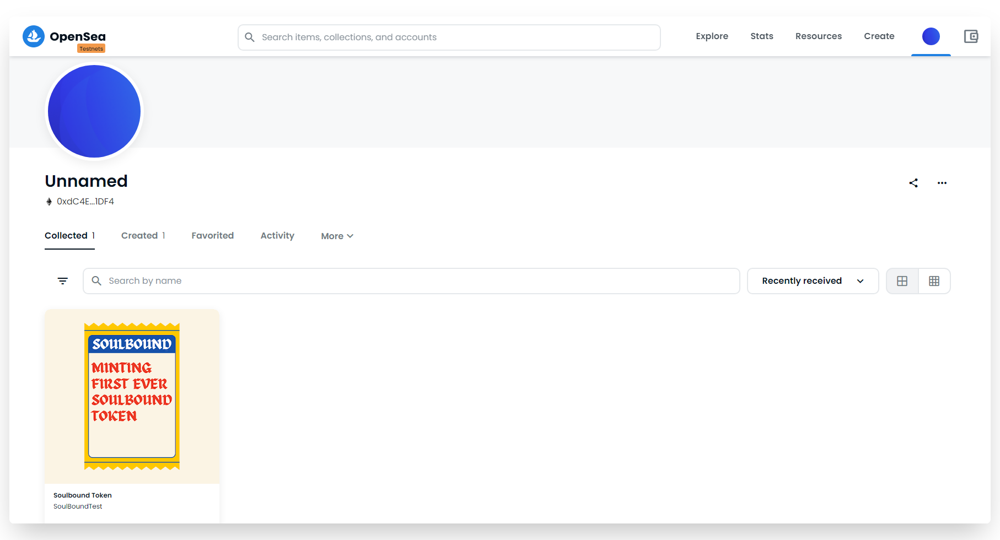
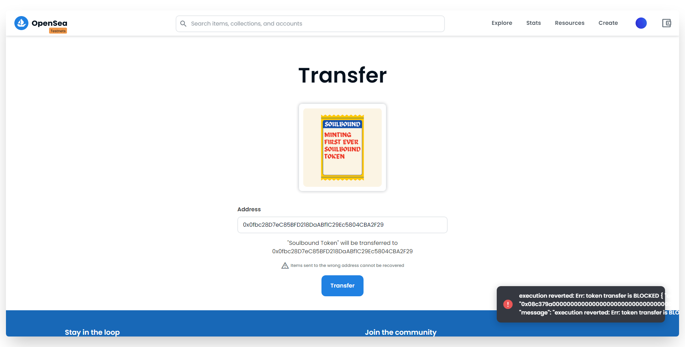

import { Code } from "../../../components";
import { Bleed } from "nextra-theme-docs";
import { Callout } from "nextra-theme-docs";
import Image from 'next/image';

# A Step-by-step Guide To Creating And Deploying A Non-Transferable (Soulbound) NFT Smart Contract

**By** [**Krinza Momin**](https://twitter.com/kayprasla)
____________________________________

We laud NFTs for their transferability but Vitalik's extended idea in a blog post titled "Soulbound"↗, over the long haul is showing up in literally every conversation happening around identity, reputation, and individuation in web3. If you haven't checked it out yet, go give it a read. If you've already and need a refresher, here's a TLDR:

> Soulbound Tokens (SBT) are just non-fungible tokens (NFTs) that, "once picked up, cannot be transferred or sold to anyone else."


Provoking name and the Kardashian clan's shenanigans aside, there are (IRL) some things you just cannot sell. Think of your driver’s license, university degree, and formal identification. What if all of it could be encoded on the blockchain and verified by the token, coined as soulbound?

Sounds interesting? Let’s SHIPPPPP one!

_______________________________

## Building a Soulbound NFT

In this tutorial, we will learn how to:
1. Create a non-transferable NFT smart contract on Solidity
2. Deploy it on Ethereum Rinkeby Testnet
3. and display the minted Soulbound token on Opensea




If you followed along the tutorial I published about building an [ERC721 Smart Contract](https://www.youtube.com/watch?v=-kcrQKA-ZLk)↗, then you already know most of the code necessary to build them. If not, you can always refer to that video to explore more. So, let's get building!

### Step 1: Writing NFT Smart Contract

Before we implement the non-transferring logic in our smart contract, we would need a base ERC-721 code for NFTs. To start, we’ll navigate to the [OpenZeppelin Wizard](https://docs.openzeppelin.com/contracts/4.x/wizard)↗, select “ERC721” as our contract type and opt for a few features like "Mintable", "Auto-increment IDs" and "Base URI" from the sidebar as shown. 



### Step 2: Customizing Code to Make it Soulbound

Now that we have the base code ready, let's head over to [Remix Solidity Compiler](https://remix.ethereum.org/?#code=Ly8gU1BEWC1MaWNlbnNlLUlkZW50aWZpZXI6IE1JVApwcmFnbWEgc29saWRpdHkgXjAuOC40OwoKaW1wb3J0ICJAb3BlbnplcHBlbGluL2NvbnRyYWN0c0A0LjcuMC90b2tlbi9FUkM3MjEvRVJDNzIxLnNvbCI7CmltcG9ydCAiQG9wZW56ZXBwZWxpbi9jb250cmFjdHNANC43LjAvdG9rZW4vRVJDNzIxL2V4dGVuc2lvbnMvRVJDNzIxVVJJU3RvcmFnZS5zb2wiOwppbXBvcnQgIkBvcGVuemVwcGVsaW4vY29udHJhY3RzQDQuNy4wL2FjY2Vzcy9Pd25hYmxlLnNvbCI7CmltcG9ydCAiQG9wZW56ZXBwZWxpbi9jb250cmFjdHNANC43LjAvdXRpbHMvQ291bnRlcnMuc29sIjsKCmNvbnRyYWN0IFNvdWxCb3VuZFRlc3QgaXMgRVJDNzIxLCBFUkM3MjFVUklTdG9yYWdlLCBPd25hYmxlIHsKICAgIHVzaW5nIENvdW50ZXJzIGZvciBDb3VudGVycy5Db3VudGVyOwoKICAgIENvdW50ZXJzLkNvdW50ZXIgcHJpdmF0ZSBfdG9rZW5JZENvdW50ZXI7CgogICAgY29uc3RydWN0b3IoKSBFUkM3MjEoIlNvdWxCb3VuZFRlc3QiLCAiU0JUIikge30KCiAgICBmdW5jdGlvbiBzYWZlTWludChhZGRyZXNzIHRvLCBzdHJpbmcgbWVtb3J5IHVyaSkgcHVibGljIG9ubHlPd25lciB7CiAgICAgICAgdWludDI1NiB0b2tlbklkID0gX3Rva2VuSWRDb3VudGVyLmN1cnJlbnQoKTsKICAgICAgICBfdG9rZW5JZENvdW50ZXIuaW5jcmVtZW50KCk7CiAgICAgICAgX3NhZmVNaW50KHRvLCB0b2tlbklkKTsKICAgICAgICBfc2V0VG9rZW5VUkkodG9rZW5JZCwgdXJpKTsKICAgIH0KCiAgICAvLyBUaGUgZm9sbG93aW5nIGZ1bmN0aW9ucyBhcmUgb3ZlcnJpZGVzIHJlcXVpcmVkIGJ5IFNvbGlkaXR5LgoKICAgIGZ1bmN0aW9uIF9idXJuKHVpbnQyNTYgdG9rZW5JZCkgaW50ZXJuYWwgb3ZlcnJpZGUoRVJDNzIxLCBFUkM3MjFVUklTdG9yYWdlKSB7CiAgICAgICAgc3VwZXIuX2J1cm4odG9rZW5JZCk7CiAgICB9CgogICAgZnVuY3Rpb24gdG9rZW5VUkkodWludDI1NiB0b2tlbklkKQogICAgICAgIHB1YmxpYwogICAgICAgIHZpZXcKICAgICAgICBvdmVycmlkZShFUkM3MjEsIEVSQzcyMVVSSVN0b3JhZ2UpCiAgICAgICAgcmV0dXJucyAoc3RyaW5nIG1lbW9yeSkKICAgIHsKICAgICAgICByZXR1cm4gc3VwZXIudG9rZW5VUkkodG9rZW5JZCk7CiAgICB9Cn0K&optimize=false&runs=200&evmVersion=null&version=soljson-v0.8.7+commit.e28d00a7.js)↗ by clicking, "Open in Remix". 




Once we're on Remix, you should be able to see the following code:


```javascript
// SPDX-License-Identifier: MIT
pragma solidity ^0.8.4;

import "@openzeppelin/contracts@4.7.0/token/ERC721/ERC721.sol";
import "@openzeppelin/contracts@4.7.0/token/ERC721/extensions/ERC721URIStorage.sol";
import "@openzeppelin/contracts@4.7.0/access/Ownable.sol";
import "@openzeppelin/contracts@4.7.0/utils/Counters.sol"; 

contract SoulBoundTest is ERC721, ERC721URIStorage, Ownable {
    using Counters for Counters.Counter;

    Counters.Counter private _tokenIdCounter;

    constructor() ERC721("SoulBoundTest", "SBT") {}

    function safeMint(address to, string memory uri) public onlyOwner {
        uint256 tokenId = _tokenIdCounter.current();
        _tokenIdCounter.increment();
        _safeMint(to, tokenId);
        _setTokenURI(tokenId, uri);
    }

    // The following functions are overrides required by Solidity.

    function _burn(uint256 tokenId) internal override(ERC721, ERC721URIStorage) {
        super._burn(tokenId);
    }

    function tokenURI(uint256 tokenId)
        public
        view
        override(ERC721, ERC721URIStorage)
        returns (string memory)
    {
        return super.tokenURI(tokenId);
    }
}

```
Now let's go ahead and add a new code snippet to the existing smart contract in order for us to block the transfer of NFT and eventually making it "Soulbound." There already exist an API in the OpenZeppelin's ERC721 Contract, using which we can actually control the transferability of our tokens. 

If you navigate to the OpenZeppelin API Docs, you will find the following functions: 

- **_beforeTokenTransfer**(**address** from, **address** to, **uint256** tokenId)

To block token transfers, add the following to your code:

**File:** [`openzeppelin-contracts/contracts/token/ERC721/ERC721.sol`](https://github.com/OpenZeppelin/openzeppelin-contracts)
```bash
function _beforeTokenTransfer(
address from, 
address to, 
uint256 tokenId
) internal override virtual {
require(from == address(0), "Err: token transfer is BLOCKED");   
super._beforeTokenTransfer(from, to, tokenId);  
}
```

Now let's understand the logic behind this [code](https://gist.github.com/kaymomin/7daf2175496bdaefcd3924c3d7657e14)↗. 

Every time this code will run, the require statement will check:  if the `from address`  parameter in the function is set to zero. If yes, it will allow the action to happen and block all the other transfers to make it a non-transferable token. 

> ℹ️ **Note:** When the `address from == 0`, it means the token is being issued or minted and not transferred.

### Step 3: Deploying The Soulbound NFT Smart Contract

To deploy the smart contract directly from remix, head over to side bar and select "**Deploy and Run Transaction**" from the tab. Set Environment to **Injected Web3**, select the Soulbound smart contract we just created from contracts dropdown and click **Deploy**.

- **Injected Provider - Provider Name**: For connecting Remix to an injected web3 provider. The most common injected provider is Metamask.

Make sure your MetaMask is connected to the Ethereum Rinkeby Testnet and you've some test ether to make transactions happen.




### Step 4: Adding NFT Asset To IPFS Via Pinata

Once the contract is successfully [deployed](https://rinkeby.etherscan.io/tx/0xd601de5af7afd11df07059edc19207cfd0b26df9832c272b312ea693aed8922c)↗, the next thing we will need to do is minting a Soulbound NFT. To do so, we are going to first set the NFT asset and metadata using Pinata. 

If you don’t have a Pinata account, sign up for a free account here and complete the steps to verify your email.

- Once you have verified your account on the Pinata, navigate to the "**My Files**" page and click the "**Upload**" button
- Upload your NFT art and you'll see your image asset file under the **Files** page along with the CID column



Copy the CID by clicking the copy button next to it and use it as a postfix to this URL "**gateway.pinata.cloud/ipfs**" to view your NFT art.

Here's the [image](https://gateway.pinata.cloud/ipfs/QmTY1jMAqabHUZFCj91ckwnCu3CPtJChpg345jdkxzj3ac)↗ that I used.


Now, we’re going to upload one more document to Pinata - JSON metadata. To do that, create a JSON file and add the following code. 

```json
{
    "attributes" : [ {
      "trait_type" : "NFT",
      "value" : "Soulbound"
    }, {
      "trait_type" : "Asset",
      "value" : "Non-transferable Badge"
    }, {
        "trait_type" : "Badge",
        "value" : "Minting First Soulbound Token"
      }, {
        "trait_type" : "Type",
        "value" : "Demo"
      }   ],
    "description" : "This is a demo soulbound token mint",
    "image" : "https://gateway.pinata.cloud/ipfs/QmTY1jMAqabHUZFCj91ckwnCu3CPtJChpg345jdkxzj3ac",
    "name" : "Soulbound Token"
}
``` 

Feel free to add or remove the attributes. Also, make sure you are providing your own IPFS image URL!

Once you’re done editing the JSON file, save it and upload it to Pinata, following the same steps we followed for uploading the image and copy the CID for the JSON file (we will need that in the next step).



### Step 5:   Minting The Soulbound NFT

In this step, we are finally going to mint the NFT and display it on Opensea. To mint the NFT, head back to Remix IDE, find "**Deployed Contracts**" button, and click on the "**SafeMint**" function.



Under SafeMint, input your wallet address in **to** and set the JSON file's URL in URI, following the format as "**gateway.pinata.cloud/ipfs/CID_of_JSON_file**". Here's the IPFS [link](https://gateway.pinata.cloud/ipfs/QmUcCgfVb1wc8ngLY6LJ9rT85hyWkFe4SABfxX18VyAYmF)↗ to the Metadata I uploaded to the Pinata.

Once the configurations is set, hit **transact**, confirm the transaction and wait a few seconds for the NFT to be minted.



Now, we are going to head to [Opensea](https://testnets.opensea.io/)↗ (Testnet) to view the minted [Soulbound NFT](https://testnets.opensea.io/assets/rinkeby/0x9ebc13c372384356c9686c541364e04c54ccd32d/0)↗. 




Since we have blocked all the transfer action, if you try to send this NFT to some other wallet it will prompt you an error. This way, we can confirm that the NFT we just minted is now bounded to our souls (realistically, to our wallet address) and can never be transferred or sold to anyone else.



__________________________________

### Full Code Repository

Wohoo! We’ve finally deployed our very first Soulbound NFT on Rinkeyby Testnet. If you want to take a look at the full source code, here's the [repo](https://github.com/kaymomin/soulbound-nft-token-smart-contract/blob/main/soulbound.sol).

_______________________

### What’s Next?

A fun project would be to create a platform that lets course creators issue a Soulbound NFT as a credential for students who complete the course.
